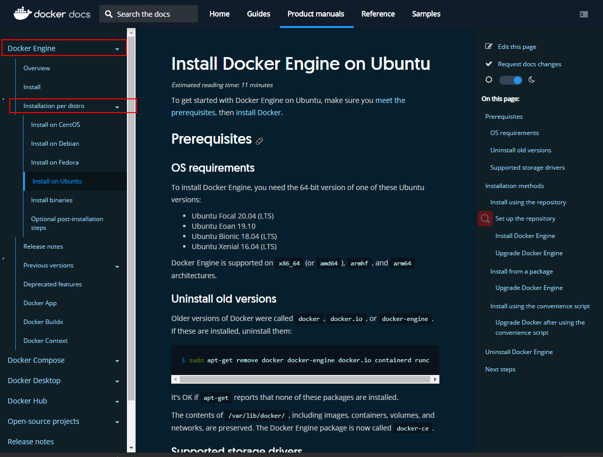
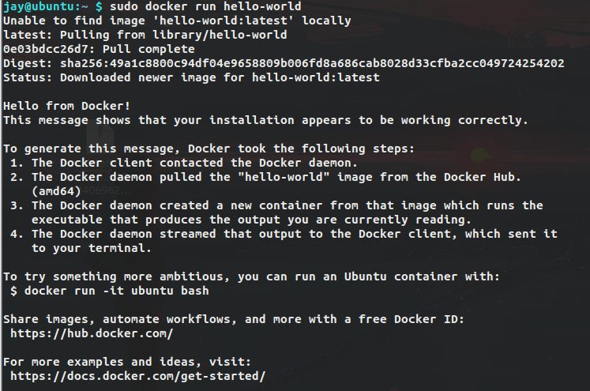
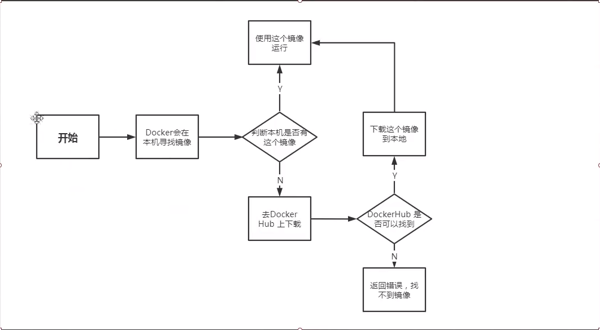
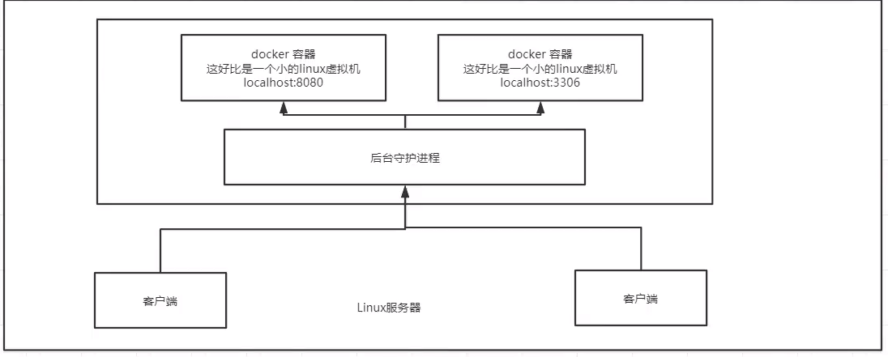

[TOC]


# 1.0Docker 概述  

## 1.1Dockers为什么会出现?

问题:在我的电脑上可以运行! 软件的版本更新,导致服务不可用!对于运维来说,考验十分的大?

环境配置是十分的麻烦,每一个机器都要部署环境,费时费力。

 传统：开发jar，运维来做！

 现在：开发打包部署上线，一套流程做完！

 Java –- apk – 发布（应用商店） ---- 张三使用apk -- 安装即可用！

 Java – jar（环境） ----打包项目带上环境（镜像） ----（Docker仓库：商店）

下载我们的镜像----直接的运行。

Docker 给以上问题提出了解决方案！  

  Dockers的思想就是来自于集装箱！ 


  JRE -- 多个应用（端口冲突） --- 原来都是交叉的！

  隔离：Dockers核心西乡！打包装箱！每个箱子相互隔离的。

  一个集箱装箱装水果， 一个装生化武器，不会有用问，因为他们之间被集装箱隔离了。
 Dockers通过隔离机制，可以将服务器利用到极致。

 本质：所有的技术都是因为出现了一些问题，我们需要去解决，才去学习。

## 1.2Dockers 的历史

  2010年，几个搞IT的年轻人，就在美国成立一家公司“dotcloud”做一些pass的云计算服务。 LXC有关的容器技术。

  他们将自己的容器化技术命名就是Dockers！

  Docker 刚刚诞生的时候没有引起行业的注意！dotcloud就活不下去！他们决定开源。

  2013年，创始人将Dockers开源！越来越多人发现了docker的优点。火了。之后Dockers每个月都会更新个版本。

  2014年4月9日，Docker1.0发布！

Docker 为什么这么火？ 因为相当于虚拟机十分的轻巧。在容器技术出来之前，我们都是使用虚拟机技术！

虚拟机：在windows中装一个VMware，通过这个软件我们可以虚拟出来一台或者堕胎电脑！但是很笨重。

虚拟机也是须臾虚拟化技术，Dockers容器技术，也是一种虚拟化技术。

```c
 Vm： linux centos 原生镜像（一个电脑！） 隔离，需要开启多个虚拟机
 Dockers： 隔离，镜像（最核心的环境 4MB + jdk + mysql）十分的轻巧，运行镜像就可以了。    
```


## 1.3聊聊Docker

  Docker是基于go语言开发的

 

  Docker文档https://docs.docker.com/

  Docker 的文档是超级详细的！

## 1.4Docker能干吗

**虚拟机技术缺点：**

​     1、  资源占用多

​     2、  冗余步骤多

​     3、  启动很慢

**容器化技术：**

   容器化技术不是模拟的一个完整的操作系统

 

  比较Dockers和虚拟机技术的不同：

  ·传统虚拟机，虚拟出一条硬件，运行一个完整的操作系统，然后在这个系统上安装和运行软件

  ·容器内的应用直接运行在宿主机的内容，容器没有自己的内核，也没有虚拟我们的硬件。

  ·每个容器间是互相隔离的，每个容器间互不影响。

  

DevOps（开发、运维）

  应用更快速的交付和部署

  传统：一堆帮助文档，安装程序

  Docker：一键运行发布测试，一键运行

  更便捷的升级和扩容

  使用了Dockers只有，我们部署应用就和搭积木一样！

  更简单的系统运维

  在容器化之后，我们开发，测试化境都是高度一致的。

  更高效的集算资源利用：

  Docker是内核级别的虚拟化，可以在一个物理机上可以运行很多的容器实例，服务器的性能可以被压榨到极致。


# 2.0Docker安裝


**镜像(image):**

docker镜像就好比是一个模板,可以通过这个模板来创建容器服务;tomcat镜像--->run--->tomcat01容器(提供服务器)。

**容器(container):**

Dockers利用容器技术，独立运行一个或者一组应用，通过镜像来创建。

启动，停止，删除，基本命令。

目前就可以把这个容器理解为就是一个简易的Linux系统。

**仓库(repostory):**

仓库就是存放镜像的地方。

仓库分为共有长裤和私有仓库。

仓库Docker Hub默认是国外的， 可以用阿里云来加速。

# 3.0安装Dock

## 3.1环境准备

1、需要会一点点Linux的基础

2、Ubuntu18.04安装

​	进入官网，拉到最底端，点击docs，看帮助文档的download and install,选择合适自己的版本。



https://docs.docker.com/engine/install/ubuntu/

### 1、Uninstall old versions

Older versions of Docker were called `docker`, `docker.io`, or `docker-engine`. If these are installed, uninstall them:

```
$ sudo apt-get remove docker docker-engine docker.io containerd runc
```

### 2、SET UP THE REPOSITORY

1. Update the `apt` package index and install packages to allow `apt` to use a repository over HTTPS:

   ```shell
   $ sudo apt-get update
   
   $ sudo apt-get install \
       apt-transport-https \
       ca-certificates \
       curl \
       gnupg-agent \
       software-properties-common
   ```

2.Add Docker’s official GPG key:

```shell
  $ curl -fsSL https://download.docker.com/linux/ubuntu/gpg | sudo apt-key add -
```

 Verify that you now have the key with the fingerprint `9DC8 5822 9FC7 DD38 854A E2D8 8D81 803C 0EBF CD88`, by searching for the last 8 characters of the fingerprint.

```shell
$ sudo apt-key fingerprint 0EBFCD88
    
  -----------------------
    		输出
  -----------------------

pub   rsa4096 2017-02-22 [SCEA]
      9DC8 5822 9FC7 DD38 854A  E2D8 8D81 803C 0EBF CD88
uid           [ unknown] Docker Release (CE deb) <docker@docker.com>
sub   rsa4096 2017-02-22 [S]
```

3.Use the following command to set up the **stable** repository. To add the **nightly** or **test** repository, add the word `nightly` or `test` (or both) after the word `stable` in the commands below. [Learn about **nightly** and **test** channels](https://docs.docker.com/engine/install/).

```shell

$ sudo add-apt-repository \
   "deb [arch=amd64] https://download.docker.com/linux/ubuntu \
   $(lsb_release -cs) \
   stable"
```

## 3.2安装

1.Update the `apt` package index, and install the *latest version* of Docker Engine and containerd, or go to the next step to install a specific version:

```shell
 $ sudo apt-get update
 $ sudo apt-get install docker-ce docker-ce-cli containerd.io
```

Verify that Docker Engine is installed correctly by running the `hello-world` image.

```shell
$ sudo docker run hello-world
```

Terminal display after running 



Query version 

```
$ sudo docker version
```


## 3.3dockers运行流程图




## 3.4底层原理

**Dockers是怎么工作的？**

​	Dockers是一个Client-Server结构的系统，Docker的守护进程运行在主机上，通过Socket从客户端访问！

​	DockerServer接收到Docker-Clien他的指令，就会执行这个命令！



**Docker为什么比VM虚拟机快**

1、Docker有着比虚拟机更少的抽象层

2、Docker利用的是宿主机的内核，VM需要是所需要虚拟操作系统的内核

​	所以所，新建一个容器的时候，Docker不需要虚拟机一样重新加载一个系统内核，避免了引导。


# 4.0Docker的常用命令

## 4.1**帮助命令**

```makefile
	docker version   		#显示dockers的版本信息
	docker info  			#显示docker的系统信息，包括镜像和容器的数量
	docker  --help 			#帮助命令
```

帮助文档地址：

​	https://docs.docker.com/engine/reference/run/


## 4.2镜像命令

**docker images 查看所有本地的主机上的镜像**

```sh
jay@ubuntu:~ $ sudo docker images
[sudo] password for jay: 
REPOSITORY          TAG                 IMAGE ID            CREATED             SIZE
hello-world         latest              bf756fb1ae65        7 months ago        13.3kB

#解释
REPOSITORY 	镜像仓库源
TAG			镜像的标签
IMAGE ID	镜像的ID
CREATED		创建时间
SIZE		大小

#可选项
Options:
  -a, --all             Show all images (default hides intermediate images)

  -q, --quiet           Only show numeric IDs   #只显示镜像ID

```

**doecker search 搜索镜像**

```shell
jay@ubuntu:~ $ sudo docker search mysql
NAME                              DESCRIPTION                                     STARS               OFFICIAL            AUTOMATED
mysql                             MySQL is a widely used, open-source relation…   9788                [OK]                
mariadb                           MariaDB is a community-developed fork of MyS…   3571                [OK]                
mysql/mysql-server                Optimized MySQL Server Docker images. Create…   717                                     [OK]

#可选项，通过收藏来过滤
 --filter=STARTS=3000		#搜索出来的镜像就是sTARTS大于3000的

 jay@ubuntu:~ $ sudo docker search mysql --filter=STARS=3000
NAME                DESCRIPTION                                     STARS               OFFICIAL            AUTOMATED
mysql               MySQL is a widely used, open-source relation…   9788                [OK]                
mariadb             MariaDB is a community-developed fork of MyS…   3571                [OK]                
jay@ubuntu:~ $ 

```

**docker pull  下载镜像**

```shell
#下载镜像docker pull 镜像名[:tag]

buntu:~ $ sudo docker pull mysql
Using default tag: latest 	#如果不屑tag，默认就是latest
6ec8c9369e08: Pull complete 	#分层下载，这是docker image的核心，联合文件系统
177e5de89054: Pull complete 
ab6ccb86eb40: Pull complete 
e1ee78841235: Pull complete 
09cd86ccee56: Pull complete 
78bea0594a44: Pull complete 
caf5f529ae89: Pull complete 
cf0fc09f046d: Pull complete 
4ccd5b05a8f6: Pull complete 
76d29d8de5d4: Pull complete 
8077a91f5d16: Pull complete 
922753e827ec: Pull complete 
Digest: sha256:fb6a6a26111ba75f9e8487db639bc5721d4431beba4cd668a4e922b8f8b14acc
Status: Downloaded newer image for mysql:latest
docker.io/library/mysql:latest  #真实地址

#一下两个命令相等
buntu:~ $ sudo docker pull mysql
buntu:~ $ sudo docker pull docker.io/library/mysql:latest

#指定版本下载
jay@ubuntu:~ $ sudo docker pull mysql:5.7
5.7: Pulling from library/mysql
6ec8c9369e08: Already exists  #分层下载的精髓所在，最新版本里有的可以不用下载
177e5de89054: Already exists 
ab6ccb86eb40: Already exists 
e1ee78841235: Already exists 
09cd86ccee56: Already exists 
78bea0594a44: Already exists 
caf5f529ae89: Already exists 
4e54a8bcf566: Pull complete 
50c21ba6527b: Pull complete 
68e74bb27b39: Pull complete 
5f13eadfe747: Pull complete 
Digest: sha256:97869b42772dac5b767f4e4692434fbd5e6b86bcb8695d4feafb52b59fe9ae24
Status: Downloaded newer image for mysql:5.7
docker.io/library/mysql:5.7

```

## 4.3**docker rmi 删除镜像**

```shell
jay@ubuntu:~ $ sudo docker rmi 8679ced16d20   <id号>
Untagged: mysql:5.7
Untagged: mysql@sha256:97869b42772dac5b767f4e4692434fbd5e6b86bcb8695d4feafb52b59fe9ae24
Deleted: sha256:8679ced16d206961b35686895b06cfafefde87ef02b518dfc2133081ebf47cda
Deleted: sha256:355f87dc5125a32cc35898a4dde17fb067585bc0d86704b5a467c0ccc0eea484
Deleted: sha256:8299d5c38042216210125535adb2600e46268a0e2b9ec799d12ea5b770236e79
Deleted: sha256:07311a303b2c7cf2ac6992aaf68e12326fe7255985166939cbab7d18b10e0f47
Deleted: sha256:306c9bc1ce2997d000bb6f1ea4108420d9752df93ce39164b7a2f876b954afc4
jay@ubuntu:~ $ sudo docker images
REPOSITORY          TAG                 IMAGE ID            CREATED             SIZE
mysql               latest              e3fcc9e1cc04        9 days ago          544MB
hello-world         latest              bf756fb1ae65        7 months ago        13.3kB

#删除全部的容器
jay@ubuntu:~ $ sudo docker rmi $(docker images -aq)
```


## 4.4容器命令

​	**说明：我们有的镜像才可以创建容器，linux，下载一个centos来学习**

```shell
	docker pull centos
```

​	

### 4.4.1新建容器并启动

```shell
docker run [可选参数] image
# 参数说明
 --name="Name"    #容器的名字  tomcat01 tomcat02用来区分容器
 -d				  #后台方式运行
 -it			  #使用交互的方式运行，进入容器查看内容
 -P				  #指定容器的端口  -P 8080：8080    <大P>
 				  #使用方法：
 				  -P ip:主机端口：容器端口
 				  -P 主机端口：容器端口（常用）
 				  -P 容器端口
 				  容器端口
 	
 -p				  #随机指定端口
 
 #测试 启动运行容器
jay@ubuntu:~$ sudo docker run -it centos /bin/bash
[sudo] password for jay:
[root@c945bade53aa /]# ls
bin  dev  etc  home  lib  lib64  lost+found  media  mnt  opt  proc  root  run  sbin  srv  sys  tmp  usr  var

#从容器退回到主机
[root@c945bade53aa /]# exit
exit
jay@ubuntu:~$ ls
Desktop  Documents  examples.desktop     Music     Public       Templates  tftpboot  work
DK       Downloads  gparted_details.htm  Pictures  samba_share  test       Videos
jay@ubuntu:~$
```


### 4.4.2列出所有的容器

```shell
# docker ps 命令
		#列出当前正在运行的容器
-a	    #列出当前正在运行的容器+带出历史运行的容器
-n=？   #显示最近创建的容器   ？可以指定格式 ， -n=1 表示显示1个
-q		#只显示容器的编号

#示例
jay@ubuntu:~$ sudo docker ps
CONTAINER ID        IMAGE               COMMAND             CREATED             STATUS              PORTS
NAMES
jay@ubuntu:~$ sudo docker ps -a
CONTAINER ID        IMAGE               COMMAND             CREATED             STATUS                       PORTS               NAMES
c945bade53aa        centos              "/bin/bash"         4 minutes ago       Exited (127) 3 minutes ago
         boring_jang
4e29a9af43ef        hello-world         "/hello"            35 minutes ago      Exited (0) 35 minutes ago
         flamboyant_joliot
List containers
jay@ubuntu:~$ sudo docker ps -n=1
CONTAINER ID        IMAGE               COMMAND             CREATED             STATUS                       PORTS               NAMES
c945bade53aa        centos              "/bin/bash"         4 minutes ago       Exited (127) 4 minutes ago
         boring_ja
```

### 4.4.3退出容器

```shell
exit    #直接容器停止并退出
ctrl + p + Q #容器不停止退出
```


### 4.4.4删除容器

```shell
doker rm   容器id					#删除指定的容器 ，不能删除正在运行的容器，可以加 -rf 来删除
docker rm $(ps -aq)				 #删除所有的容器
```


### 4.4.5启动和停止容器的操作

```shell
docker start 	容器id									#启动容器
docker restart	容器id									#重启容器
docker stop     容器id									#停止当前正在运行的容器
docker kill     容器id									#强制停止当前的容器
```

## 4.5其他常用命令

### 4.5.1后台启动容器

```shell
#命令  docker run -d  <镜像名>
jay@ubuntu:~/samba_share$ sudo docker run -d centos
cd449fd1d30c0ace184606f8ab5b503a6c34e12028aa4ca79dcf2eb7d024961d
jay@ubuntu:~/samba_share$ sudo docker ps
CONTAINER ID        IMAGE               COMMAND             CREATED             STATUS              PORTS
NAMES
jay@ubuntu:~/samba_share$

#问题：docker ps 显示 centos 停止了， 常见的坑，docker的容器必须要用一个前台的进程，docker发现没有应用，就会自动停止

```


### **4.5.2查看日志命令**

```shell
#命令： docker logs  [args] <容器id>
-tf  #显示日志
-tail  + number  显示指定的log条数

jay@ubuntu:~/samba_share$ sudo docker logs -tf --tail 10 d0d870956ce7
2020-09-09T11:13:07.891048224Z [root@d0d870956ce7 /]# docker ps
2020-09-09T11:13:07.891893620Z bash: docker: command not found
```


### **4.5.3查看容器中进程信息 ps**

```shell
#命令 docker top  <容器id>
jay@ubuntu:~/samba_share$ sudo docker top d0d870956ce7
UID                 PID                 PPID                C                   STIME               TTY                 TIME                CMD
root                3552                3530                0                   19:13               pts/0               00:00:00            /bin/bash
jay@ubuntu:~/samba_share$

```


### **4.5.4查看镜像的元素**

```shell
#命令： docker inspect [OPTIONS] <容器id>
  -f, --format string   Format the output using the given Go template
  -s, --size            Display total file sizes if the type is container
      --type string     Return JSON for specified type
      
#示例:
[
    {
        "Id": "d0d870956ce7155fc9653a3cdf5633d592883b108a0d864902fa7c066877f72d",
        "Created": "2020-09-09T11:13:02.905282377Z",
        "Path": "/bin/bash",
        "Args": [],
        "State": {
            "Status": "running",
            "Running": true,
            "Paused": false,
            "Restarting": false,
            "OOMKilled": false,
            "Dead": false,
            "Pid": 3552,
            "ExitCode": 0,
            "Error": "",
            "StartedAt": "2020-09-09T11:13:03.42638085Z",
            "FinishedAt": "0001-01-01T00:00:00Z"
        },
        "Image": "sha256:0d120b6ccaa8c5e149176798b3501d4dd1885f961922497cd0abef155c869566",
        "ResolvConfPath": "/var/lib/docker/containers/d0d870956ce7155fc9653a3cdf5633d592883b108a0d864902fa7c066877f72d/resolv.conf",
        "HostnamePath": "/var/lib/docker/containers/d0d870956ce7155fc9653a3cdf5633d592883b108a0d864902fa7c066877f72d/hostname",
        "HostsPath": "/var/lib/docker/containers/d0d870956ce7155fc9653a3cdf5633d592883b108a0d864902fa7c066877f72d/hosts",
        "LogPath": "/var/lib/docker/containers/d0d870956ce7155fc9653a3cdf5633d592883b108a0d864902fa7c066877f72d/d0d870956ce7155fc9653a3cdf5633d592883b108a0d864902fa7c066877f72d-json.log",
        "Name": "/practical_sinoussi",
        "RestartCount": 0,
        "Driver": "overlay2",
        "Platform": "linux",
        "MountLabel": "",
        "ProcessLabel": "",
        "AppArmorProfile": "docker-default",
        "ExecIDs": null,
        "HostConfig": {
            "Binds": null,
            "ContainerIDFile": "",
            "LogConfig": {
                "Type": "json-file",
                "Config": {}
            },
            "NetworkMode": "default",
            "PortBindings": {},
            "RestartPolicy": {
                "Name": "no",
                "MaximumRetryCount": 0
            },
            "AutoRemove": false,
            "VolumeDriver": "",
            "VolumesFrom": null,
            "CapAdd": null,
            "CapDrop": null,
            "Capabilities": null,
            "Dns": [],
            "DnsOptions": [],
            "DnsSearch": [],
            "ExtraHosts": null,
            "GroupAdd": null,
            "IpcMode": "private",
            "Cgroup": "",
            "Links": null,
            "OomScoreAdj": 0,
            "PidMode": "",
            "Privileged": false,
            "PublishAllPorts": false,
            "ReadonlyRootfs": false,
            "SecurityOpt": null,
            "UTSMode": "",
            "UsernsMode": "",
            "ShmSize": 67108864,
            "Runtime": "runc",
            "ConsoleSize": [
                0,
                0
            ],
            "Isolation": "",
            "CpuShares": 0,
            "Memory": 0,
            "NanoCpus": 0,
            "CgroupParent": "",
            "BlkioWeight": 0,
            "BlkioWeightDevice": [],
            "BlkioDeviceReadBps": null,
            "BlkioDeviceWriteBps": null,
            "BlkioDeviceReadIOps": null,
            "BlkioDeviceWriteIOps": null,
            "CpuPeriod": 0,
            "CpuQuota": 0,
            "CpuRealtimePeriod": 0,
            "CpuRealtimeRuntime": 0,
            "CpusetCpus": "",
            "CpusetMems": "",
            "Devices": [],
            "DeviceCgroupRules": null,
            "DeviceRequests": null,
            "KernelMemory": 0,
            "KernelMemoryTCP": 0,
            "MemoryReservation": 0,
            "MemorySwap": 0,
            "MemorySwappiness": null,
            "OomKillDisable": false,
            "PidsLimit": null,
            "Ulimits": null,
            "CpuCount": 0,
            "CpuPercent": 0,
            "IOMaximumIOps": 0,
            "IOMaximumBandwidth": 0,
            "MaskedPaths": [
                "/proc/asound",
                "/proc/acpi",
                "/proc/kcore",
                "/proc/keys",
                "/proc/latency_stats",
                "/proc/timer_list",
                "/proc/timer_stats",
                "/proc/sched_debug",
                "/proc/scsi",
                "/sys/firmware"
            ],
            "ReadonlyPaths": [
                "/proc/bus",
                "/proc/fs",
                "/proc/irq",
                "/proc/sys",
                "/proc/sysrq-trigger"
            ]
        },
        "GraphDriver": {
            "Data": {
                "LowerDir": "/var/lib/docker/overlay2/75834c58f0e9fe71797f22336e0c51b4d5c56ffbe68b493b31b77d614d0083b3-init/diff:/var/lib/docker/overlay2/3784f91123ae4b0856ae95450e44e72f7616dfbd7d1a983a54cfd5cfc89d36e8/diff",
                "MergedDir": "/var/lib/docker/overlay2/75834c58f0e9fe71797f22336e0c51b4d5c56ffbe68b493b31b77d614d0083b3/merged",
                "UpperDir": "/var/lib/docker/overlay2/75834c58f0e9fe71797f22336e0c51b4d5c56ffbe68b493b31b77d614d0083b3/diff",
                "WorkDir": "/var/lib/docker/overlay2/75834c58f0e9fe71797f22336e0c51b4d5c56ffbe68b493b31b77d614d0083b3/work"
            },
            "Name": "overlay2"
        },
        "Mounts": [],
        "Config": {
            "Hostname": "d0d870956ce7",
            "Domainname": "",
            "User": "",
            "AttachStdin": true,
            "AttachStdout": true,
            "AttachStderr": true,
            "Tty": true,
            "OpenStdin": true,
            "StdinOnce": true,
            "Env": [
                "PATH=/usr/local/sbin:/usr/local/bin:/usr/sbin:/usr/bin:/sbin:/bin"
            ],
            "Cmd": [
                "/bin/bash"
            ],
            "Image": "centos",
            "Volumes": null,
            "WorkingDir": "",
            "Entrypoint": null,
            "OnBuild": null,
            "Labels": {
                "org.label-schema.build-date": "20200809",
                "org.label-schema.license": "GPLv2",
                "org.label-schema.name": "CentOS Base Image",
                "org.label-schema.schema-version": "1.0",
                "org.label-schema.vendor": "CentOS"
            }
        },
        "NetworkSettings": {
            "Bridge": "",
            "SandboxID": "cb7cf7299839f315a132c5cbca469a70c14f5809a6faa1017c20a605f0818c5d",
            "HairpinMode": false,
            "LinkLocalIPv6Address": "",
            "LinkLocalIPv6PrefixLen": 0,
            "Ports": {},
            "SandboxKey": "/var/run/docker/netns/cb7cf7299839",
            "SecondaryIPAddresses": null,
            "SecondaryIPv6Addresses": null,
            "EndpointID": "65eb7255993cba4cd8ce30c84206b7fbc551cff377e1f535a71c450d504ddf3f",
            "Gateway": "172.17.0.1",
            "GlobalIPv6Address": "",
            "GlobalIPv6PrefixLen": 0,
            "IPAddress": "172.17.0.2",
            "IPPrefixLen": 16,
            "IPv6Gateway": "",
            "MacAddress": "02:42:ac:11:00:02",
            "Networks": {
                "bridge": {
                    "IPAMConfig": null,
                    "Links": null,
                    "Aliases": null,
                    "NetworkID": "834b029d1c4f6216ac1e30fbc6a9e587d59bd6587b247d68d9f52fec504cc162",
                    "EndpointID": "65eb7255993cba4cd8ce30c84206b7fbc551cff377e1f535a71c450d504ddf3f",
                    "Gateway": "172.17.0.1",
                    "IPAddress": "172.17.0.2",
                    "IPPrefixLen": 16,
                    "IPv6Gateway": "",
                    "GlobalIPv6Address": "",
                    "GlobalIPv6PrefixLen": 0,
                    "MacAddress": "02:42:ac:11:00:02",
                    "DriverOpts": null
                }
            }
        }
    }
]
```


### **4.5.5进入当前正在运行的容器**

```shell
#我们通常都是要使用后台方式运行的， 需要进入容器， 修改一些配置

#方法1
#命令：
docker exec -it <容器id> /bin/bash

#示例：
jay@ubuntu:~/samba_share$ sudo docker exec -it d0d870956ce7 /bin/bash
[root@d0d870956ce7 /]# ls
bin  dev  etc  home  lib  lib64  lost+found  media  mnt  opt  proc  root  run  sbin  srv  sys  tmp  usr  var

[root@d0d870956ce7 /]# ps -ef
UID         PID   PPID  C STIME TTY          TIME CMD
root          1      0  0 11:13 pts/0    00:00:00 /bin/bash
root         15      0  0 11:46 pts/1    00:00:00 /bin/bash
root         30     15  0 11:46 pts/1    00:00:00 ps -ef
[root@d0d870956ce7 /]#

#方法2
#命令	docker attach  <容器id> 
#进入到当前正在执行的代码...

#区别
docker exec     #进入容器后开启一个新的终端，可以在里面操作（常用）；
docker attach   #进入容器正在执行的终端，不会启动新的进程
```


### **4.5.6从容器内拷贝文件到主机上**

```shell
#docker cp    <容器id>：容器内路径   目的的主机路径

#查看镜像
jay@ubuntu:~$ sudo docker images
[sudo] password for jay:
REPOSITORY          TAG                 IMAGE ID            CREATED             SIZE
centos              latest              0d120b6ccaa8        4 weeks ago         215MB
hello-world         latest              bf756fb1ae65        8 months ago        13.3kB

#启动centos镜像
jay@ubuntu:~$ sudo docker run -it centos /bin/bash
#在home/底下创建test.c
[root@35244b76d74e /] touch /home/test.c
#ctrl+p+q 退出shell控制台
[root@35244b76d74e /]# jay@ubuntu:~$
#从docker的环境中拷贝test.c到主机上；
jay@ubuntu:~$ sudo docker cp 35244b76d74e:/home/test.c ~
jay@ubuntu:~$ ls
Desktop  Documents  examples.desktop     Music     Public       Templates  test.c    Videos
DK       Downloads  gparted_details.htm  Pictures  samba_share  test       tftpboot  work
jay@ubuntu:~$

```


## 4.6命令小结


 

```shell
$：attach  	attach to a running container   				#在当前的shell运行指定的运行中的镜像
$：build     Build an image from container changes 			#通过dockerfile定制镜像
$：commit 	Create a new image from a container changes     #提交当前的容器作为新的镜像
$：cp		copy file/floders from the containers filesystem to the host path #从容器中拷贝指定的文件或文件夹到指															宿主机
$：create  	create a new docker 							#创建一个新的容器，通run，但不是启动容器
$：diff 		Inspect changes on a container's filesystem     #查看docker容器的变化
$：events  	Get ral time events from the server 			#从doker服务器获取容器的事实时间
$：ecec		Run a commod in an existing container 			#在已存在的容器上运行命令
$：export    Sterm the contents of a conainer as a tar archive #导出容器的内容作为一个tar的归档文件，归档文件[对应																										improt]
$：history	 show the history of an image 					#展示镜像形成的历史
$：images     list imgase									#列出当前的系统镜像
$：info		 display system-wide information 				#显示系统的相关信息
$：inspect	 return low-level information on a container    #查看容器的详细信息
$：kill		 kill a runing docker 							#kill 指定的docker容器
$：load 		 Load an image form a tar archive 				#从一个tar包中加载一个镜像[对应 save]
$：login		 register or login to the docker registery server #注册或登录一个docker 源服务器
$：logout	 logout from a Docker registry server 			#从当前docker register 退出
$：port		 lookup the public-facing port which is NAT-ed to PRIVTE_PORT 	#查看映射端口的容器内部源端口
$：logs		 Fetch the logs of a container			 #输出当前容器的日志信息
$：pause		 Pause all processes within a container  #暂停容器
$：ps		 List containers						#列出容器列表
$：pull		 Pull an image or a repos itory from the docker registry server Docker 
													#从docker服务器拉去指定的镜像或者库镜像
$：push		 Push an image or a repository to the docker registry server
													 #推送只能的镜像或者库镜像到docker的源服务器
$：restart	 Restart a running container			#重启一个正在运行的镜像
$：rmi		 Remove one or more lmages				#删除一个或多个镜像
$：rm		 Remove one or more containers  		#删除一个或多个容器
$：run		 Run a command in a new container		#创建一个新的容器并运行一行命令
$：save		 Save an image to a tar archive			#保存一个容器作为tar包对应[load]
$：search 	 Search for an image on the Docker Hub  #在dockerhub上搜索容器
$：start		 Start a stopped containers			#开始停止掉的容器
$：stop		 stop a running containers			#停止容器
$：tag        Tag an Image into a reposT tory	#给源中的镜像打log
$：top		 Lookup the runn ing processes of a container #查看容器中运行的进程信息
$：unpase     unpase a paused container 		#取消暂停容器
$：version    show the docker version information  #查看docker的版本号 					
$：wait 		 Block until a container stops, then print its exit code #截取容器停止时退出的状态


```

