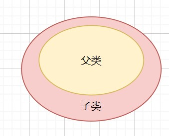

[TOC]

------


# 第一部分一章  为什么会有C++这门语言

## 1.1.0章节概要

**1.1.1.朱老师C++课程整体介绍**

  本节整体介绍C++课程的内容规划，C++课程的前导课程和后续相关拓展的课程。

**1.1.2.为什么有了C还需要C++**

  本节讲C++和C的区别和联系，让大家理解为什么学了C之后还要继续学习C++。

**1.1.3.C++究竟是个怎样的语言**

  本节从一些宏观角度讲解C语言的特征，力求让大家对C++有个直观轮廓性的认识。

**1.1.4.C++的典型项目和优势领域**

  本节介绍几个C++写的典型项目，并且分析下C++的优势应用领域。 

**1.1.5.C++程序员发展前景分析**

  本节帮大家分析C++语言以及C++程序员的当下及未来发展前景。


## 1.1.1.朱老师C++课程整体介绍

### 1.1.1.1、为什么要讲C++

​	(1)C++很重要, C/C++不分家，面试开发都需要。

​	(2)为继续学习opencv、qt（图形界面）、android（中间层）等打基础。

​	(3)基于C高级，进一步提升自己大脑复杂度，建立面向对象和泛型等概念。


### 1.1.1.2、整套课程规划

​	(1)全套C++课程共分为5部分

​	(2)C++课程聚焦于C++语言及其标准库本身，而不延伸到C++的行业应用

​	(3)课程并非零基础，而是基于《嵌入式linux核心课程》的第4部分C语言高级专题


### 1.1.1.3、课程特点和录制风格

​	(1)系列课程，注重：全、深、实、透

​	(2)讲解和练习结合，用实战结果说话，注重理解和运用而不是记忆

​	(3)随堂写代码，现场调试

​	(4)单节10-30分钟，不再强调单节时长，短了就短了


### 1.1.1.4、相关课程和拓展课程

​	(1)前置基础：C高级专题     

​	(2)同级扩展：《朱有鹏老师热门编程语言全解》里的其他语言

​	(3)横向拓展：《朱有鹏老师数据结构与算法全解》中C++实现部分

​	(4)后置拓展：《朱有鹏老师GUI与HMI专题》中的QT和其他

​	(5)后置拓展：《朱有鹏老师opencv和AI人工智能专题》中的opencv等


### 1.1.1.5、学习成本和收益

​	(1)理念：任何学习都是一场投资，投资的关键是投入产出比

​	(2)投入：时间150+小时，成本人民币1000元左右（预售期有折扣）

​	(3)产出1：C++和面向对象技能提升，面试优势，继续学习qt和opencv等的基础

​	(4)产出2：大脑复杂度进一步增加，进一步培养架构思想，深挖个人潜力

 

## 1.1.2.为什么有了C还需要C++

### 1.1.2.1、C++是由C进化而来

​	(1)C++最早叫：带类的C，最开始只是在C上扩展了class等少量特性，后来不停发展；

​	(2)C++比C语法上复杂很多，语言特性多很多，用好C++比用好C要难；

​	(3)C++和C面向的场景不同。C更多是OS内核、底层硬件驱动等，C++是功能中间层；


### 1.1.2.2、C++为什么没有完全取代C

​	(1)C语言有大量成熟代码和成熟开发者，历史优势大；

​	(2)C++的编译器效率比C编译器低；

​	(3)C在很多场景下完全够用，没必要用C++，譬如MCU软件开发；


### 1.1.2.3、C++并不是为了取代C

​	(1)C++并不是“更好的C”，而是基于C的另一种编程语言和周边生态；

​	(2)C和C++都能很好的操作硬件，因为他们都支持指针；

​	(3)C更适合小规模控制型程序，而C++更适合大规模结构性逻辑型程序；

​	(4)C++的出现不是C推动的，而是硬件性能增强和软件要解决的功能复杂性提升推动的；

  

## 1.1.3.C++究竟是个怎样的语言

### 1.1.3.1、C++是面向对象的

​	(1)C++与C最大的不同就是面向对象；

​	(2)C++并不是纯面向对象语言；C++保留了许多C的特性，所以C++不完全是面向对象的；


### 1.1.3.2、C++兼容C语言的全部特性

​	(1)C++有指针，所以很方便直接操作硬件；

​	(2)C++是编译性语言，最终得到可执行程序是**架构相关**的二进制机器码；

​	(3)C++在语法和编程风格上和C非常类似；

​	(4)C++代码也分头文件和代码文件，只是后缀名和C有不同；

​	(5)C++比C扩展了很多特性，譬如泛型、引用等；


### 1.1.3.3、C++比C更适合复杂项目

​	(1)linux kernel如果改用C++写会更容易写，也更容易看懂；

​	(2)C++的语法很复杂，学习难度比C和java都要大；

​	(3)C++没有GC机制，对象创建和销毁要程序员管理，因此容易出错 (没有内存回收机制)；

​	(4)总结：C++适合**高手**使用在**强调性能**的**复杂**项目中；

 

## 1.1.4.C++的典型项目和优势领域

### 1.1.4.1、C++典型项目

​	(1)qt库及qtcreator （IDE）本身就那qt开发的；

​	(2)opencv（视觉）、opengl（显卡）、directX（显卡）；

​	(3)Windows和Office；

​	(4)Android中间层；


### 1.1.4.2、C++的劣势和优势分析

​	(1)C++比C更适合开发规模大、业务复杂的大型项目；

​	(2)C++比Java、python更适合开发在意性能的大型项目；

​	(3)C++适合开发后台业务逻辑而不是前台界面；

​	(4)C++当前最优势领域有：视觉和AI分析，游戏和图像引擎，网络服务引擎等；


## 1.1.5.C++程序员发展前景分析

### 1.1.5.1、C++程序员的不一样之处

​	(1)能做得下去的C++程序员工资都不低，不管做哪个方向；

​	(2)C++学习难度大，通过率极低；

​	(3)C++程序员生命周期长，中年危机不明显；

​	(4)相较java和python，C++程序员核心技能几乎不变化，更舒服；

​	(5)相较java和python，C++程序员需求量要少，但是高手一直稀缺；


### 1.1.5.2、C++在当前及以后的江湖地位

​	(1)理念：语言没有好坏之分，不同场景适合不同语言，活下来的主流语言都有过人之处

​	(2)云计算和边缘计算技术大发展，未来的软件运行场景分三种：

​		云平台：没有c++；

​		瘦客户端：MCU主要用C；

​		富客户端；个人手机，个人电脑，车载中控，在中间层用C++；

​	(3)云端开发分前后台，前台用html等，后台用java php python等，还有些全栈的； 

​	(4)瘦客户端用C为主，还有少量非主流用js、micropython、lua等；

​	(5)富客户端不管OS层和HMI层用什么，主体中间层肯定是C++最有优势；

# 第一部分二章 C++开发环境搭建

## 1.2.0章节概要

**1.2.1.如何选择合适的开发环境**

  本节讲开发环境的主要要素，以及选择合适的开发环境的策略和考虑点。

**1.2.2.常用C++开发环境介绍**

  本节讲解当前主流的各种C++开发环境，最后告诉大家本课程使用哪种环境以及原因。

**1.2.3.Linux命令行下C++编程初体验**

  本节在虚拟机ubuntu下使用命令行工具来编译简单C++项目，这种是最简单纯粹的开发方式

**1.2.4.Linux下使用cmake管理C++工程**

  本节介绍了cmake工具，并手把手讲了如何使用cmake管理C++工程并编译。

**1.2.5.Windows下qtcreator安装和使用**

  本节讲了如何在windows系统下安装qtcreator软件并选择合适Kits组件。

**1.2.6.使用qtcreator开发纯C++项目**

  本节讲了在windows下qtcreator中使用qmake和cmake这2种方式来构建项目并编译调试。

**1.2.7.Linux下qtcreator安装和使用**

  本节讲了如何在linux下安装qtcreator并且使用qmake和cmake来开发C++项目。


## 1.2.1.如何选择合适的开发环境

### 1.2.1.1、开发环境要素

​	(1)编辑器 

​		notepad++

​		vscode

​	(2)编译器 

​		MSVC:

​			微软 MicroSoft visual C/C++

​		 MinGW:

​			windows化的GNU GNU(gcc g++)：

​		Linux底下的 其他类别

​			Clang, LLVM , 苹果底下用得比较多；

​	(3)辅助（调试器、反编译、代码提示与补全等）；


### 1.2.1.2、选择IDE的考量因素

​	(1)是否能用（满足需求），是否可用（能拿到），是否好用（顺手舒服）

​	(2)是否可跨平台

​	(3)是否需要版权和付费

​	(4)目标项目是大项目还是小项目


### 1.2.1.3、选择IDE的策略

​	(1)学习时，选最主流的，其他的最好也试试用一下体验体验

​	(2)工作时，随公司项目组

​	(3)项目规划时，根据公司惯例和项目情况、团队情况综合决策


## 1.2.2.常用C++开发环境介绍

### 1.2.2.1、命令行CommandLine

​	(1)Linux命令行：GNU g++ + Makefile/CMake 

​	(2)Windows命令行：MinGW


### 1.2.2.2、不建议使用的老旧IDE

​	(1)VC++6.0

​	(2)DevC++


### 1.2.2.3、市面主流可选C++开发IDE

​	(1)CodeBlocks        小巧、开源免费、跨平台，初学可试试

​	(2)eclipse + CDT + MinGW  推荐本来就熟悉eclipse的人偶尔开发C++使用

​	(3)VisualStudio201X    庞大、好用、不跨平台，推荐Windows上做大项目使用

​	(4)QtCreator        中等、开源免费、跨平台，推荐嵌入式开发者首选

​	(5)VSCode         扩展性强、漂亮好用、跨平台，推荐web开发者做C++    


### 1.2.2.4、对开发环境的正确心态

​	(1)不要执着于新版本，也不要执迷于很多年前的老东西

​	(2)没有最好，甚至没有最适合，工具而已，够用即可

​	(3)不要产生过度依赖，实际开发中可能会需要切换


### 1.2.2.5、本课程开发环境选择

​	(1)前期简单程序Linux命令行

​	(2)后期复杂程序Windows qtcreator

​	(3)需要开发板运行Linux qtcreator交叉编译

 

## 1.2.3.Linux命令行下C++编程初体验

### 1.2.3.1、源码编辑

​	(1)vim或gedit等

​	(2)共享文件夹或samba服务器，到windows下编辑


### 1.2.3.2、编译器基本使用

​	(1)g++ -v查看C++编译器版本号

​	(2)-std=c++xx指定编译时使用的C++标准

​	  列: g++ hello.c -std=c++11

​	(3)简单文件直接编译，复杂项目用makefile管理


### 1.2.3.3、编译和运行C++程序

​	(1)g++ hello.cpp -o hello

​	(2)写Makefile编译C++程序

 

## 1.2.4.Linux下使用cmake管理C++工程

### 1.2.4.1、cmake介绍

### 1.2.4.2、cmake安装

​	(1)https://cmake.org/download/下载源码

​	(2)解压编译安装


### 1.2.4.3、cmake初步使用

(1)安装cmake

​		进入解压得文件夹下执行：

```shell
./bootstrap
#安装出错：缺少openssl库， 下载安装opensslku
#继续执行
./bootstrap
#然后, 需要加sudo, 不然可能因为没有权限失败
sudo make install   
```


(2)创建文件名为：CMakeLists.txt

```shell
touch CMakeLists.txt
```

​	

(3)内容示例：

```cmake
CMAKE_MINIMUM_REQUIRED(VERSION 2.8)      		#最低版本要求
SET(CMAKE_CXX_COMPILER "g++")         			#设置g++编译器
PROJECT(Hello)                				    #设置工程名
MESSAGE(STATUS "test project hello world")       #打印消息
ADD_EXECUTABLE(hello hello.cpp)                  #生成可执行文件
```

(4)执行：

```shell
cmake CMakeLists.txt
```

就会自动生成Makefile；


## 1.2.5.Windows下qtcreator安装和使用

### 1.2.5.1、qtcreator安装

​	(1)qtcreator是专为qt开发而生的，但本身也是个独立的IDE

​	(2)qtcreator可以开发qt gui项目，也可以开发非qt的纯C++项目

​	(3)qtcreator完整运行需要Kits（构建套件），包括编译器、调试器、工程管理器等

​	(4)基于qtcreator的搭建可以独立搭建，也可以整体一次性搭建


### 1.2.5.2、整体搭建qtcreator开发环境

(1)下载：http://download.qt.io/official_releases

(2)安装，注意选择合适控件

 	qtcreator 这个只是个IDE，没有各种构建套件；

​	 qt 这个包含各种构建套件，我们需要用这个；


## 1.2.6.使用qtcreator开发纯C++项目

### 1.2.6.1、基于qmake

(1)创建非qt的C++项目

(2)工程管理选择qmake

(3)构建套件根据需要选择

(4)工程创建后直接编译、运行


### 1.2.6.2、qtcreator基本使用

(1)编译程序

(2)查看编译信息

(3)运行程序并查看运行信息

(4)调试程序


### 1.2.6.3、基于cmake

(1)下载并安装cmake

(2)创建cmake管理的程序

(3)编译运行测试

 

## 1.2.7.Linux下qtcreator安装和使用

### 1.2.7.1、安装linux下qt

环境：ubuntu16.04 X64的

### 1.2.7.2、创建工程并测试


# 第一部分三章 C++基本编程体验

## 1.3.0 章节概要

**1.3.1.何为命名空间**
	本节引入命名空间的概念并且由此引入了语言特性的概念。

**1.3.2.namespace的初级定义和使用**
	本节讲了namespace的定义方法和三种使用方法，这些是C++命名空间的基础运用技巧。

**1.3.3.C++默认命名空间**
	本节重点讲了如何跨文件声明命名空间以及C++的默认/全局命令空间。

**1.3.4.C++匿名命名空间**
	本节主要讲匿名命名空间及其主要用途。

**1.3.5.嵌套命名空间**
	本节讲解C++中如何定义嵌套命名空间以及如何在内外部来引用。

**1.3.6.C++标准库介绍**
	本节介绍C++标准库的来源和概念、学习方法以及重要性。

**1.3.7.iostream的cout使用1**
	本节讲解C++标准库中的iostream的cout，主要是如何输出信息到标准输出。

**1.3.8.iostream的cout使用2**
	本节接上节继续讲解cout的使用技巧并且编程实战。

**1.3.9.iostream的cin使用**
	本节讲解C++标准库中的iostream的cin，并且编程实战cin做命令行交互。

**1.3.10.C++用fstream读写文件**
	本节讲解C++标准库的stream类及其常用方法。

**1.3.11.fstream读写文件编程实战**
	本节使用fstream类的方法手把手写代码来进行文件的创建和读写实验。

**1.3.12.C++字符串string类使用**
	本节讲解string类的常用方法，并且实际写了代码来演示和验证。

**1.3.13.C与C++混合编程1**
	本节分析C和C++混合编程的场景、原因、根本原理并通过反汇编手段来验证

**1.3.14.C与C++混合编程2**
	本节通过手写代码来实战演示C和C++混合编程中C++调用C库的情况。

**1.3.15.C调用C++库的方法**
	本节手写代码并实战演示C和C++混合编程中C调用C++库的情况。


## 1.3.1.何为命名空间

### 1.3.1.1、命名空间的引入

​	(1)命名空间namespace，是C++引入的一种解决全局变量和函数名冲突的机制;

​		在C语言中全局变量或者函数名相同会冲突；

​	(2)C语言没有namespace，但是C++及之后的java python等都有;

​	(3)namespace的关键点有2个：

​		(1)如何解决名称冲突;

​		(2)如何合法访问变量;

### 1.3.1.2、C语言如何解决名称冲突

​	(1)大项目中会有很多C文件，全局变量和函数都是extern链接属性，因此名称冲突是客观存在;

​	(2)一个项目是一个单体程序，项目中的全局变量和函数理应能互相访问，因此名称冲突是客观存在;

​	(3)C中解决名称冲突的办法是：

​		第一，同一个C文件不要太大，由一个人写；

​		第二，每个C文件（或几个C文件构成的一个模块）中所有全局变量和函数前加统一的唯一前缀；

​		第三，不需要文件外访问的全局变量和函数前面都加static;

​	(4)C语言的解决方案可行，C++早期就是这样做的，但这种方法太low;


### 1.3.1.3、命名空间如何解决问题

​	(1)为实现命名空间机制，C++引入了namespace关键字，定义格式为namespace xx{};

​	(2)一个特定名称的namespace的一对大括号内部定义的变量、函数、类等均属于该命名空间内;

​	(3)在命名空间内部互相引用时可以直接使用变量名、函数名等;

​	(4)跨命名空间互相引用时必须同时指定被引用方的命名空间名和变量名函数名才可以找到;

​	(5)命名空间看起来就好像一种前缀;

​	(6)命名空间本质上其实是对全局变量和函数在一定范围内链接属性的更改和控制;


### 1.3.1.4、关于语言特性的思考

​	(1)语言特性是语言通过关键字或符号所支持的一种功能特性，如namespace、template、运算符重载、面向对象等;

​	(2)语言特性必定对应解决某种问题，必定在某方面对程序员有帮助;

​	(3)语言特性越多或者设计越复杂，则语言本身就越难使用，但语言就越厉害;

​	(4)语言特性体现为某种语法，本质上靠编译工具链提供支持;

​	(5)C++11/14/17/20的版本变迁，无非是新增或修正某些细节语言特性;

​	(6)就事论事讨论编程语言，其实难点都在掌握和熟练运用语言特性上;


## 1.3.2.namespace的初级定义和使用

### 1.3.2.1、同一文件内定义namespace

```c++
/*定义一个名叫NS1的命名空间，这个空间里面有一个func2的函数*/
namespace NS1
{
    void func1(void)
    {
		printf("hello world!\n");
    }
}
```


### 1.3.2.2、同一文件内使用namespace

(1)namespace的三种引用方法

```c++

// 方式一： 不做任何声明直接使用
ace::Mutex;
/*示例*/
int main(void)
{
    NS1::func1();
    return 0;
}

// 方式二, 声明的方式使用，相当于把需要使用的命名空间的函数声明到当前空间，然后再使用该函数
using ace::Mutex;
Mutex mutex;
/*示例*/
using NS1::func1();
int main(void)
{
    func1();
    return 0;
}

// 方式三, 声明的方式使用，可以使用这个namespace中的任何成员
using namespace ace;
Mutex mutex;
/*示例*/
using namespace NS1;
int main(void)
{
    func1();
    return 0;
}

//实际编程当中，我们用方法一和方法二比较多
```


### 1.3.2.2、不同C文件间定义和使用namespace

​	(1)如何声明一个namespace？

```c++
/*file: 2.cpp*/
namespace NS2
{
    void func1(void)
    {
        
    }
}

/*file: 1.cpp*/
//需要先声明命名空间, 两种都可以
namespace NS2{void func1(void);}
namespace NS2{extern void func1(void);}
int main(void)
{
    NS2::func1();
    return 0;
}
```

​	(2)注意： namespace 可以定义重复相同的名字，在同意文件内，就相当于在这个命名空间内继续填充成员；在不同的文件中定义相同名字的命名空间，调用它时需要事先声明。

```c++
/*在同一个文件内*/
namespace NS1
{
  void func2(void)
  {
  }  
}

namespace NS1
{
  void func3(void)
  {
  }  
}

/*在不同的文件内*/
/**/
```

​	(3)**注意：**体会这种学习方法，核心是：第一步明确问题，第二步自我分析，第三步实验验证，总纲是形成自我知识体系，本质上站在和语言特性设计者一样的高度来看待和学习研究语言。


## 1.3.3.C++默认命名空间

### 1.3.3.1、默认命名空间

​	(1)又叫全局命名空间，没有放入namespace 中的成员，都叫默认命名空间；

​		main()函数必须放在默认命名空间；

​	(2)默认命名空间引用其他命名空间方法；

​	(3)默认命名空间引用自己的方法；

​	(4)其他命名空间引用默认命名空间中的方法

```c++
/*其他命名空间引用默认命名空间中的方法*/
::f();  		//正规做法
f();			//省略:: ，不确定，不太正规
```


## 1.3.4.C++匿名命名空间

### 1.3.4.1、std和cout的引入

​	(1)std是C++标准库定义好的一个namespace

​			这个namespace 的名字就叫 std，这个就是C++ 的标准库；

​	(2)cout是std这个namespace下的一个标准输出工具，类似于C中的printf

​	(3)用法示例

```c++
#include <iostream>

using namespace std;

int main(void)
{
    cout << "hello world!\n" << endl;
    //或者使用这种方法：std::cout << "hello world!\n" << std::endl; 

    return 0;
}
```


### 1.3.4.2、匿名命名空间的定义和使用

​	(1)定义

```c++
namespace
{
    void func1(void)
    {
        
    }
}
```

​	(2)匿名命名空间中引用其他命名空间中的方法  

```c++
namespace NS1
{
  void func(void);  
}

namespace
{
    void func1(void)
    {
        NS1::func();
    }
}
```

​	(3)匿名命名空间中引用自己命名空间中的方法

```c++
namespace
{
    void func1(void)
    {
        void func(void);
        func();
    }
} 
```

​	(4)其他命名空间中引用匿名命名空间中的方法

```c++

namespace
{
    void func1(void)
    {
        printf("func1\n");
    }
}

namespace NS1
{
    void func2(void)
    {
        func1();
    }
 // func1(); 直接使用会出错，这相当于声明了；
}
//注意：只能当前文件内使用
```


### 1.3.4.3、匿名命名空间的价值

​	(1)匿名命名空间中的符号纯文件内部使用，不需要被外部引用;

​	(2)匿名命名空间效果类似于全局变量和函数加static，但是比C中的static使用范围广;

​	(3)匿名命名空间的用法逻辑上符合整个命名空间的一贯原则;


## 1.3.5.嵌套命名空间

### 1.3.5.1、嵌套namespace的定义和使用

```c++
#include <iostream>
using namespace std;
/*定义*/
namespace NS1
{
    void func2(void)
    {
         cout << "NS1::func2." << endl;
    }
  
    namespace NS2{
        /*NS1 和NS2中的函数可以重名,优先执行NS2的func2, 近水楼台先得月*/
        void func2(void)
        {
            cout << "NS1::NS2::func2." << endl;
        }
        void func1(void)
        {
            func2();
            cout << "NS1::NS2::func1." << endl;
        }
    }
	
    /*引用嵌套命名空间内的符号*/
    void func3(void)
    {
        NS2::func1();
    }
}

int main()
{
    NS1::NS2::func1();  /*输出结果: NS1::NS2::func2.  NS1::NS2::func1.*/
    NS1::func2();		/*输出结果: NS1::func2.*/
    NS1::NS2::func2(); /*输出结果: NS1::NS2::func2. 说明优先执行NS2的func2*/
    NS1::func3();  	   /*输出结果: NS1::NS2::func2.  NS1::NS2::func1*/

    return 0;
}

```


### 1.3.5.2、namespace的总结

​	(1)记住最终目标：解决全局名称冲突，同时提供合法互相访问的机制;

​	(2)直接用法（语法），记住如何定义、如何声明、三种使用方法;

​	(3)特殊情况有默认/全局命名空间和匿名命名空间，均为符合一贯原则的特例用法;

​	(4)再次体会"语言特性"的含义;

​	(5)C++的语言特性多而复杂，因此学习和使用难度高，关键在于掌握方法，从本质上学;


## 1.3.6.C++标准库介绍

### 1.3.6.1、C++是C的超集

​	(1)一个典型C程序（后缀名.c）可以完全被视为C++程序来编译;

​	(2)C程序可以通过__cplusplus符号是否预定义来判断当前是gcc还是g++编译 ;__

​		__cplusplus的值是long int类型的，值表示当前编译程序的C++编译器的版本号。

​	(3)一个典型C++程序（后缀名.cpp）只能当C++程序来编译，可见C++是C的超集;

​	(4)C++文件名的常用后缀：源文件（.cpp .cxx .cc .c .c++），头文件（.hpp .hxx .h);


### 1.3.6.2、C++完全接收并兼容了C库

​	(1)典型C++程序中可以支持C的形式包含C库头文件，并直接使用C库API;

​	(2)C++更建议的头文件包含形式不是<stdio.h>这样，而是<cstdio>这样;

​		要点：C++的标准库的头文件是没有后缀名的;

​	(3)ubuntu中gcc工具链的头文件在/usr/include中，可以实际看看;


### 1.3.6.3、C++标准库介绍

​	(1)C标准库即为C++标准库的一部分，完全继承并以C++方式重写，位于std命名空间中;

​	(2)C++面向对象库，如string、iostream等，位于std命名空间中;

​	(3)C++ STL标准模板库，如vector、map等，位于std命名空间中;


### 1.3.6.4、C++标准库的地位和学习安排

​	(1)C++比C在实际工作中更依赖于库，所以学好C++标准库很重要;

​	(2)C++标准库蕴含了C++的各种语言特性的典型用法，学标准库就顺便学好了C++;

​	(3)继承C标准库的部分兼容C的玩法，不用讲了;

​	(4)C++面向对象库难度不大，本次先讲iostream和string等初步用法;

​	(5)STL部分是重难点，在《朱老师C++第3部分-STL等高阶话题》中再讲;

 

## 1.3.7_8.iostream的cout使用1_2

### 1.3.7.1、基本使用

​	(1)cout即标准输出，对应stdout;

​	(2)cout定义在std命名空间中，要按三种使用方法来用;

​	(3)结合<<(流操作符)符号进行输出，可多节连接;

​	(4)cout涉及的头文件有

```C++
<iostream> <iomanip> <bits/ios_base.h>;
```

​	(5)cout本质上是ostream（iostream的派生类）的一个对象;

​	(6)流操作符<<本质上是左移运算符在iostream中的运算符重载;


### 1.3.7.2、流操作符的格式化细节

​	(1)网络搜索C++ cout使用，大把文档详细讲;

​	(2)cout现在主要用来输出调试信息，掌握主要用法和细节查询即可，不必去记;

```c
#include <iostream>
#include <iomanip>

using namespace std;
int main()
{
    int value = 18;

    cout << "hello word" << 8 << endl;  /*输出:hello word8*/

    /*hex 算子,标志数字以16进制输出*/
    cout << "hello word" << hex << value << endl;  /*输出:hello word12*/
    
    /*设置浮点精度*/
    double value1 = 12.12345;
    cout << setprecision(7) << value1 << endl;  /*12.12345*/

    return 0;
}
```


## 1.3.9.iostream的cin使用

### 1.3.9.1、基本使用

```c++
#include <iostream>

using namespace std;

int main(void)
{
    int val, val2;

    cout << "please input a num:" << endl;
    cin >> hex >> val >> val2;
    cout << "num:" << val << "num2:" << val2 << endl;

    return 0;
}
```


### 1.3.9.2、注意点

(1)输入的时候不要使用引用符&				scanf("%d", &val);

(2)cin的输入会以空格为分隔


## 1.3.10.C++用fstream读写文件

### 1.3.10.1、fstream介绍

​	(1)fstream是C++标准库中面向对象库的一个，用于操作流式文件;

​	(2)fstream本质上是一个class，提供file操作的一众方法;

​	(3)有核心课程中应用编程里文件操作的基础，fstream的使用很简单;


### 1.3.10.2、C++标准库查询参考

​	(1)man手册：https://blog.csdn.net/u012675539/article/details/50257343

​	(2)http://www.cplusplus.com/reference/

​	(3)https://zh.cppreference.com/w/%E9%A6%96%E9%A1%B5


### 1.3.10.3、fstream使用举例

(1)打开/创建文件，并写入内容，保存关闭;

```c++
#include <fstream>
#include <iostream>

using namespace std;

fs.open("1.txt");
    if(fs.is_open())
    {
        cout << "open_success" << endl;
    }
```


(2)打开文件，并读取内容显示，最后关闭;

```c++
#include <fstream>
#include <iostream>

using namespace std;

int main(void)
{
    fstream fs;     //定义了一个fs对象用来后续操作
    char rstr[16] = {0};

    fs.open("1.txt");
    if(fs.is_open())
    {
        cout << "open_success" << endl;
    }
    else
    {
        cout << "open_failed" << endl;
    }

    //文件写入
    //fs.write("iii", 3);
    //fs << "yyy" << endl;

    //文件读出
    //fs.read(rstr, sizeof(rstr));
    fs >> rstr;

    cout << "rstr = " << rstr << endl;
    
    //关闭
    fs.close();
    

    return 0;
}
```


### 1.3.11.fstream读写文件编程实战

不要只听课不动手，拓展做练习


## 1.3.12.C++字符串string类使用

### 1.3.12.1、C++式字符串的使用

​	(1)参考手册文档

​	(2)代码实践


### 1.3.12.2、C++字符串和C字符串的对比

```c++
#include <iostream>
#include <string>

using namespace std;

int main(void)
{
    string s1, s2, s3;
    s1 = "abc";
    s2 = "def";

    s3  = s1 + s2;

    cout << s3 << endl;             /*abcdef*/
    cout << s3.size() << endl;      /*6*/
    cout << s3.capacity() << endl;  /*15*/
    
    return 0;
}
```

​	(1)C语言严格说没有字符串的概念，C字符串其实就是字符数组或字符指针;

​	(2)C++和之后的java等都有字符串，本质是一个class;

​	(3)C++字符串的优势是标准库自带可用于字符串的各种处理算法和方法;

​	(4)C++实际开发中建议使用C++字符串而不是沿用C式字符串;


## 1.3.13.C与C++混合编程1

### 1.3.13.1、为什么需要混合编程

​	(1)C有很多优秀成熟项目和库，丢了可惜，重写没必要，C++程序里要调用;

​	(2)庞大项目划分后一部分适合用C，一部分适合用C++;

​	(3)其他情况，如项目组一部分人习惯用C，一部分习惯用C++;


### 1.3.13.2、为什么不同语言可以混合编程

​	(1)程序编译过程：源文件 -> 目标（库）文件 -> 可执行程序 -> 镜像文件;

​	(2)任何编程语言执行时都必须是可执行程序，所以都必须先被编译成目标文件;

​	(3)混合编程的“混合”操作发生在链接这一步;


### 1.3.13.3、C++和C混合编程的困难所在

​	(1)C++和C都是编译型语言，互相混合相对容易; 

​	(2)难点：C++支持函数名重载，而C不支持，因此编译器生成目标文件时，函数名在目标文件中的临时内部名称规则不同。导致链接时符号对不上;

```C++
//C
int add_char(char a, char b);
int add_int (int a, int b);
//编译后生成的中间名字:
add_int
add_char

//C++
//函数名重载机制: 允许函数名一样, 参数不一样的函数存在
int add(char a, char b);
int add(int a, int b);
//编译后生成的中间名字:
add_cc
add_ii

```

​	(3)解决方案：使用extern "C"{}; 让C++在对接的局部向C妥协兼容;


### 1.3.13.4、使用objdump工具来研究函数编译后的符号

​	(1)写个典型的C语言库mylib.c和mylib.h，提供add和sub等几个函数;

​	(2)使用gcc -c -o编译得到库文件，再objdump -d反汇编得到.i文件;

​	(3)对比加不加extern "C"这2种情况下得到的.i文件的符号差异;

```c++
/*file: 1.h*/
int add(int a, int b);

/*file: 1.c*/
#include "1.h"
int add(int a, int b)
{
    return a + b;
}

/*********************************************************/
/*file: 1.hpp*/
int add(int a, int b);

/*file: 1.cpp*/
#include "1.hpp"
int add(int a, int b)
{
    return a + b;
}
```

​	实验第1步：证明了C语言中名称为add的函数，编译后符号表中就叫add;

​	实验第2步：证明了C++语言中名称为add的函数，编译后符号表中叫_Z3addii;

```c++
//g++ -c 1.c -o 1.o
//objdump  -d 1.o > 1.i
1.o:     file format elf64-x86-64


Disassembly of section .text:

0000000000000000 <add>:
   0:	55                   	push   %rbp
   1:	48 89 e5             	mov    %rsp,%rbp
   4:	89 7d fc             	mov    %edi,-0x4(%rbp)
   7:	89 75 f8             	mov    %esi,-0x8(%rbp)
   a:	8b 55 fc             	mov    -0x4(%rbp),%edx
   d:	8b 45 f8             	mov    -0x8(%rbp),%eax
  10:	01 d0                	add    %edx,%eax
  12:	5d                   	pop    %rbp
  13:	c3                   	retq   

```

​	分析：同样的源码，编译后生成的二进制代码其实是一样的，所以功能其实也是一样的;

```c++
//g++ -c 1.cpp -o 1.o
//objdump  -d 1.o > 1.i

1.o:     file format elf64-x86-64


Disassembly of section .text:

0000000000000000 <_Z3addii>:
   0:	55                   	push   %rbp
   1:	48 89 e5             	mov    %rsp,%rbp
   4:	89 7d fc             	mov    %edi,-0x4(%rbp)
   7:	89 75 f8             	mov    %esi,-0x8(%rbp)
   a:	8b 55 fc             	mov    -0x4(%rbp),%edx
   d:	8b 45 f8             	mov    -0x8(%rbp),%eax
  10:	01 d0                	add    %edx,%eax
  12:	5d                   	pop    %rbp
  13:	c3                   	retq   

```

​	所以本质上是可以混合编程的，但是生成的中间符号名称不同，所以链接器难受;

​	实验第3步：证明了在C++的头文件中，只要把C++的函数的声明放在extern "C"{}的大括号范围之内，就可以让g++在编译这个函数时生成中间符号名时按照C的规则而不是按照C++的规则，所以这样的函数就可以和C的库进行共同链接。

```c++
/*file: 2.hpp*/
//extern "c"表示,在这声明以内的函数编译的时候生成的符号名是以c文件的方式来命令的.
extern "c"
{
    int add(int a, int b);
}

/*file: 2.cpp*/
#include "2.hpp"
int add(int a, int b)
{
    return a + b;
}

/****************************************************************/
//g++ -c 2.cpp -o 2.o
//objdump -d 2.o > 2.i

2.o:     file format elf64-x86-64


Disassembly of section .text:

0000000000000000 <add>:
   0:	55                   	push   %rbp
   1:	48 89 e5             	mov    %rsp,%rbp
   4:	89 7d fc             	mov    %edi,-0x4(%rbp)
   7:	89 75 f8             	mov    %esi,-0x8(%rbp)
   a:	8b 55 fc             	mov    -0x4(%rbp),%edx
   d:	8b 45 f8             	mov    -0x8(%rbp),%eax
  10:	01 d0                	add    %edx,%eax
  12:	5d                   	pop    %rbp
  13:	c3                   	retq   

```


## 1.3.14.C与C++混合编程2

### 1.3.14.1、C与C++混合编程的可能情况分析

​	(1)同一个项目全部有源码，一次编译链接;

​	(2)同一个项目中C是库，C++是源码，C++调用C;

```c++
/*clib.h*/
#ifndef __CLIB_H__
#define __CLIB_H__

#ifdef __cplusplus
extern "C"
{
#endif

int add(int a, int b);

#ifdef __cplusplus
}
#endif

#endif /*__CLIB_H__*/


/*clib.c*/
#include "clib.h"

int add(int a, int b)
{
    return (a + b);
}


/*main.cpp*/
#include "clib.h"
#include <stdio.h>
int main()
{
    printf("%d\n", add(10, 12));

    return 0;
}

/*编译*/
//gcc -c clib.c -o clib.o
//gcc -r clib.a clib.o
//g++ main.cpp clib.a -o add

/*输出*/
//22

/**********************方法二*****************************/
/*在头文件中不添加 extern "C", 在调用的主函数头文件声明的时候加 extern "C"*/
/*main.cpp*/

#ifdef __cplusplus
extern "C"
{
#endif
    
#include "clib.h"
    
#ifdef __cplusplus
}
#endif

#include <stdio.h>
int main()
{
    printf("%d\n", add(10, 12));

    return 0;
}

//clib.a因为使用gcc编译的,所以编译后的函数名是add, 而mian.cpp编译后的add是_Z3addii, 所以找不到库中的add名的函数,
//这时候 extern "C" 后以C的方式编译就可以连接到了。

```

(3)同一个项目中C++是库，C是源码，C调用C++;

**第一种情况**

​		(1)可能性1：全部使用g++编译。不推荐;

​		(2)可能性2：在C的头文件中加extern "C"声明;

**第二种情况**

​	(1)这种是最典型的常见情况;

​	(2)通用解决方案：在C的头文件中加extern "C"声明，在C++中直接包含头文件调用即可;


## 1.3.15.C调用C++库的方法

### 1.3.15.1、C调用C++的麻烦

​	(1)g++和gcc的编译时符号差异;

​	(2)c++支持很多c并不支持的特性，如函数重载;

​	(3)解决方案：添加一层封装层;

 **一般情况下不会有这样奇特的要求，直接用C++编译不就完了？**

### 1.3.15.2、代码实战：C调用C++库中的函数

​	(1)用cpp写一个库，mylib.cpp mylib.hpp，用g++编译成静态库;

​	(2)objdump反编译库，查看确认符号;

​	(3)用cpp写一个封装层，用上extern "C"，cmylib.cpp和cmylib.hpp，用g++编译成静态库;

​	(4)objdump反编译库，查看确认符号;

​	(5)用c写一个main.c，调用wrapper库，用gcc编译链接，运行查看结果;

```c++
/*libcpp.cpp*/
#include "libcpp.hpp"

int add(int a, int b)
{
    return (a + b);
}

/**********************************/
/*libcpp.hpp*/
#ifndef __LIBCPP_HPP__
#define __LIBCPP_HPP__

int add(int a, int b);
#endif /*__LIBCPP_HPP__*/
/**********************************/
/*libcppw.cpp*/
#include "libcpp.hpp"
#include "libcppw.hpp"		//必须包含这个头文件,否则编译的时候仍然是以C++的方式进行的。
int addw(int a, int b)
{
    return add(a, b);
}

/**********************************/
/*libcppw.cpp*/
#ifndef __LIBCPPW_H__
#define __LIBCPPW_H__

/**********************************/
/*libcppw.hpp*/
#ifdef __cplusplus
extern "C"
{
#endif

int addw(int a, int b);

#ifdef __cplusplus
}
#endif

#endif /*__LIBCPPW_H__*/

#endif

/**********************************/
/*编译*/
//jay@ubuntu:~$ g++ -c libcpp.cpp -o libcpp.o
//jay@ubuntu:~$ ar -r libcpp.a libcpp.o
//jay@ubuntu:~$ g++ -c libcppw.cpp  libcpp.a -o libcppw.a
//jay@ubuntu:~$ gcc libcppw.a libcpp.a  main.c


```

# 第一部分四章 C++新增和有变化的关键字

## 1.4.0.章节介绍

**1.4.1.本课程介绍和bool关键字**

​	本节介绍本课程的主要内容并讲了C++的bool关键字

**1.4.2.C++的字符类型char**

​	本节详细讲了C++的char关键字，相比C语言还是多了很多新特性的

**1.4.3.C++中无变化关键字和运算符代用关键字**

​	本节讲了C++中和C语言比无变化的关键字，以及C++的运算符代用关键字如and等

**1.4.4.C++新增的引用介绍**

​	本节讲解了C++的引用，这是C++新增的一种类似指针的新特性

**1.4.5.引用的本质剖析**

​	本节对应用进行了深入介绍，尤其是引用和指针的内部关联

**1.4.6.C++的enum枚举**

​	本节讲解C++的枚举类型，重点是C++中枚举新增的特性

**1.4.7.C++的共用体union**

​	本节讲解C++的union类型，重点是C++中共用体新增的特性

**1.4.8.inline关键字**

​	本节讲解C++的inline关键字，重点是inline在class中新增的特性

**1.4.9.C++11引入的nullptr**

​	本节讲解C++中引入的nullptr关键字的用法和内涵

**1.4.10.使用静态断言**

​	本节讲解静态断言static_assert

**1.4.11.C++内存对齐**

​	本节讲解C++的内存对齐规则，重点是alignof关键字的用法和特性

**1.4.12.alignas和typeid**

​	本节讲完上节遗留的alignas关键字并重点讲了typeid关键字的用法和含义

**1.4.13.C++的4种cast转换1**

​	本节讲解C++的static_cast和reinterpret_cast这2种转换

**1.4.14.C++的4种cast转换2**

​	本节继续讲解了const_cast和dynamic_cast这2种转换

**1.4.15.C++的自动类型推导**

​	本节讲解了C++的自动类型推导机制，主要涉及auto和decltype这2个关键字

**1.4.16.C++类与面向对象**

​	本节讲了class和面向对象的权限管理的几个关键字，简单讲了面向对象编程基础

**1.4.17.C++中static和this关键字**

​	本节重点讲解static关键字和this关键字，重点是在class中的静态方法和非静态方法

**1.4.18.C++面向对象的其他关键字**

​	本节讲了C++面向对象的其他几个关键字

**1.4.19.C++的const关键字**

​	本节讲解const关键字，重点是C++新增的const引用和const成员函数等新特性

**1.4.20.const有关的其他几个关键字**

​	本节主要讲解mutable和constexpr等几个const有关的关键字

**1.4.21.模板编程的几个关键字**

​	本节简单讲了C++的模板编程，涉及template和typename这2个关键字

**1.4.22.C++的异常处理机制1**

​	本节讲解C++的异常处理机制，引入了try、catch、throw这几个关键字。

**1.4.23.C++的异常处理机制2**

​	本节继续讲了函数抛出异常和throw列表，还有noexcep等C++11引入的新关键字

**1.4.24.剩余关键字和总结**

​	本节把剩余的关键字做了盘点并最终总结了C++关键字的学习方法。


## 1.4.1.本课程介绍和bool关键字

### 1.4.1.1、本课程介绍

​	(1)研究编程语言从关键字出发不适合学习，但是适合查漏补缺;

​	(2)C++全部关键字列表查阅;

​	(3)C++关键字相对C有几种情况：新增关键字、新增语义、语义变化、完全无变化;

​	(4)限于面向对象和STL没学，因此本课程不追求全面讲解关键字，重点是从一些核心关键字出发学习C++语法特性，体

会C++与C的不同，熟悉C++;


### 1.4.1.2、C++的bool关键字

​	(1)bool类型也叫逻辑类型，是个2值enum，值为true或false（这2个也是C++关键字）;

​	(2)C语言没有bool关键字，不源生支持bool类型，一般用typedef int bool;这样来自定义;

​	(3)C++语言源生支持bool类型，一般占1字节（平台相关），用法没什么差异;

​	(4)bool内建和自定义至少有一个差别：函数重载机制认为bool是不同类型;


## 1.4.2.C++的字符类型char

### 1.4.2.1、char

​	(1)字符类型，一般占1字节，表示字符（ASCI或unicode字符）;

​	(2)从C++14开始char默认是unsigned还是signed取决于目标平台，如arm默认unsigned，而X64默认是signed，建议如

果在意符号最好显式使用unsigned char或signed char;

​	(3)char类型cout输出默认为字符，而int类型cout输出默认为数字;

​	(4)1 == sizeof(char) <= sizeof(short) <= sizeof(int) <= sizeof(long) <= sizeof(long long);

 

### 1.4.2.2、wchar_t

​	(1)宽字符，用于应对一个字符编码超过1字节的Unicode编码;

​	(2)wchar_t和char的数组都能存下unicode码，区别是需要几个单元才能存一个字;

​	(3)wchar_t占几个字节取决于具体实现，可能是unsigned short也可能是int;

​	(4)wchar_t要用wcin和wcout来输入输出，对应字符串为wstring;


### 1.4.2.3、指定具体字节数的字符类型

​	(1)char8_t (C++20 起)   char16_t (C++11 起)    char32_t (C++11 起);

​	(2)这三个类型一个套路，最大特征就是明确指定占用字节数，且都是无符号的;

​	(3)char8_t很大程度上等同于unsigned char;

​	(4)关于char8_t可以参考：https://stackoverflow.com/questions/57402464/is-c20-char8-t-the-same-as-our-old-char;

​	(5)C++20起，新增字符串类u8string, u16string, u32string;


## 1.4.3.C++中无变化关键字和运算符代用关键字

### 1.4.3.1、C++中无明显变化的关键字

```c++
if
else
for 
do
while
break
continue
switch
case
default
goto
return
unsigned
signed
float
double
short
int
long
void
sizeof
register
volatile
extern
typedef
asm
```


### 1.4.3.2、C++中新增的运算符代用关键字

​	(1)逻辑运算代用关键字

```c++
and			&&
or			||		
not			!
```

​	(2)位运算代用关键字

```c++
bitand		&
bitor		|
xor			^
and_eq		&=
or_eq		|=
xor_eq		^=
compl		~
```

​	(3)不等判断运算符代用关键字

```c++
not_eq		!=
```

(4)运算符代用关键字的优势：有些人认为这样便于理解和阅读


## 1.4.4.C++新增的引用介绍

### 1.4.4.1、引用介绍

​	(1)引用的经典案例：实现swap函数实战;

​	(2)引用定义和识别的关键：&符号，注意这里和取地址一毛钱关系都没有;

​	(3)**引用符号（注意我没说变量）在定义时必须同时初始化，以后不能再另外赋值，只能使用;**

```c++
#include <iostream>

using namespace std;

//传变量, 不成功
void swap1(int a, int b)
{
    int tmp;
    tmp = a;
    a = b;
    b = tmp;
}

//传指针, 成功
void swap2(int *pa, int *pb)
{
    int tmp;
    tmp = *pa;
    *pa = *pb;
    *pb = tmp;
}

//用引用,成功; &在这里是引用
void swap3(int &a, int &b)
{
    int tmp;
    tmp = a;
    a = b;
    b = tmp;
}

int main()
{
    int a = 1, b = 2;
    int c;
    int &b1 = c; 		//定义了一个引用符号叫b1, 关联到c; 定义的时候必须初始化。
    b1 = 44;
    cout << "b1 =" << c << endl;
     
    swap2(&a, &b);      //& 符号在这里是取地址符
    swap3( , b);
    cout << "a = " << a << endl;
    cout << "b = " << b << endl;

    return 0;
}
```


### 1.4.4.2、引用和指针的对比

​	(1)指针在C和C++中都有，且使用方法和实现本质完全相同；引用只有C++可用;

​	(2)引用可以理解为功能弱化、安全性增强的低配版指针;

​	(3)引用能做的事指针都能做，但指针能做的事儿引用不一定能做;

​	(4)引用是它指向变量的“别名”，这个是从引用的使用效果角度讲的，对熟悉指针的人反而不好理解“别名”这个词;

​	(5)引用比指针弱的地方就是一个引用定义时绑定了一个变量，后面没法改了;

​	(6)引用比指针强的地方也是没法改，所以不存在"野指针"问题，更安全;

​	(7)**引用主要用在函数传参和返回值;**


## 1.4.5.引用的本质剖析

### 1.4.5.1、引用可以加const修饰

​	(1)const int &b = a; 表示b是a的const别名，无法通过b修改a了；

```c++
int main()
{
    int a = 1, b = 2;
    int c;
    const int &b1 = c; 		//定义了一个引用符号叫b1, 关联到x; 定义的时候必须初始化。
    b1 = 44;				//编译时报错
    c = 44;					//可以编译，可以更改
    cout << "b1 =" << c << endl;
    
    return 0;
}
```

​	(2)主要用在函数形参中，告诉大家该函数内部不会修改实参的值。用在某些时候我们有一个非const类型的变量，但是

我们在某个函数调用的过程中，不希望变量的值在函数内部被修改，这时候就可以用const引用来传参；


### 1.4.5.2、引用和sizeof运算符

​	(1)sizeof引用得到的不是引用本身的大小，而是引用指向的目标变量的大小；

​	(2)在struct或class中定义一个引用，再sizeof整个struct或class就会不一样；

```c++
#include <iostream>

using namespace std;

struct st1
{
    int a;
    int &rb;
};

int main()
{
    char a = 1;
    int b = 2;
    double c = 3;
    char &ra = a;
    int &rb = b;
    double &rc = c;
    
    cout << "sizeof(ra)" << sizeof(ra) << endl;
    cout << "sizeof(rb)" << sizeof(rb) << endl;
    cout << "sizeof(rc)" << sizeof(rc) << endl;
    cout << "sizeof(st1)" << sizeof(st1) << endl;
    return 0;
}

/*输出*/
//sizeof(ra)1
//sizeof(rb)4
//sizeof(rc)8
//sizeof(st1)16

```


### 1.4.5.3、引用的本质是const指针

​	(1)int &b = a;	类似于 int * const b = &a;

​	(2)C++标准并没有规定引用是否占用内存空间，但是大多数编译器都把引用实现为const指针，所以大部分编译器中引用也是要占内存空间的；

​	(3)引用是天然const的，所以定义时必须初始化指向变量，否则就没意义了；

​	(4)引用本质是指针，是地址，所以才能实现传址调用的效果；

​	 **总结：**引用就是指针在定义时增加了把指针变量本身const化；


## 1.4.6.C++的enum枚举

### 1.4.6.1、C++继承C的枚举用法

​		(1)典型枚举类型定义，枚举变量定义和使用;

​		(2)枚举类型中的枚举值常量不能和其他外部常量名称冲突：举例1宏定义，举例2另一个枚举;

```c++
#incluse <iostream>

using namespace std;

enum day{MON, THU, WEN};

int main (void)
{
    enum day d1; //定义了一个day类型的变量，变量名是d1;
    day d2;		//C++中定义时可以省略enum；
    
    return 0;
}
```


### 1.4.6.2、C++11中扩展的枚举

​	(1)enum class enumType:valueType{one=xx, two, three};

​	(2)两种简写;

​	(3)**解决2个枚举中的重名问题，但是宏定义仍然不能重名**;

```C++
/*c和c++ 98*/
enum day{MON, THU, WEN};
enum day1{MON, TUE, FIR};
/*这样写会出错， 编译的时候显示 MON重复定义*/

/*c++ 11*/
enum class day:unsigned int {MON, TUE, WEN};  //声明；
enum class day {MON, TUE, WEN};  //声明；,不指定枚举类型； 简写一
enum day {MON, TUE, WEN};  //声明；,不指定枚举类型； 简写二
day d1;
d1 = day::MON;
```


### 1.3.6.3、关于枚举的3个小细节

​	(1)枚举类型和值类型的互相转换，枚举类型是否可以++;

​	(2)枚举类型的前置声明;

​	(3)枚举类型超出范围访问是否会编译时或运行时报错;

​			不会报错；


## 1.4.7.C++的共用体union

### 1.4.7.1、C语言中union回顾

​	(1)union翻译成共用体更合适，而不是联合、联合体；

​	(2)union中所有成员是多选一的关系，这是union和struct的最大差别；

​	(3)union的典型用法是测试大小端，面试笔试常考，必须掌握；


### 1.4.7.2、C++中union和C中不同

​	(1)C++中union类型定义后使用时可以省去union（和上节enum时一样）；

​	(2)C++中union里成员除了普通的，还可以是对象，但是对象不能包含自定义构造函数、析构函数，简单说就是不能太

​	复杂；

​	(3)C++中经常用到匿名union，一般是内置在class内部做成员变量；


### 1.4.7.3、总结

​	(1)union在C++中没有突出变化，主要还是沿用C中使用

```c++

union myu			// union类型的定义
{
	char *p;
	函数指针p1;		
};
p1();				// 通过p1函数指针来调用函数
union myu m1;		// C中定义了一个myu类型的变量
myu m1;				// C++中定义了一个myu类型的变量

//匿名union定义
union 
{
	char *p1; 
	int *p2;
}m1;				// 直接定义了union变量m1
```


## 1.4.8.inline关键字

### 1.4.8.1、C中inline使用关键点强调

​	(1)inline是一种“用于实现的关键字”，而不是一种“用于声明的关键字”，所以关键字 inline 必须与函数定义体放在一起，

而不是和声明放在一起;

​	(2)如果希望在多个c文件中使用，则inline函数应该定义在h文件中（不需要额外声明）；如果只在一个c文件中使用，则

inline函数可以定义在c文件或h文件中（若定义在c文件时可以声明到h文件中去，声明时可以不加inline）;

​	(3)inline函数在项目中可以多次定义，只要函数体完全相同且在一个c文件范围只定义一次;

​	(4)inline只是一种对编译器的建议而不是强制，所以inline函数不一定真被inline;

​	(5)递归函数不应该被声明为inline，超过一定长度（通常是10行）的函数不应该被inline，内含循环的函数不建议被

inline;


### 1.4.8.2、C++中inline新增的特性

​	(1)定义在**类声明**之中的成员函数将自动地成为内联函数，例如如下代码:

```c++
/*类声明中定义函数将自动地生成内联函数*/
class A
{ 
	public:
	 void Foo(int x, int y) { ... }   // 自动地成为内联函数，即使没有inline关键字 
}

/*类声明中只有函数的声明, 要将函数定义成inline函数,需要在函数定义初加inline*/
class B
{
    int a;
    int b;
    int add(int a, int b);
}

inline int add(int a, int b)
{
    return (a + b);
}
```

​	(2)如果在类中未给出成员函数定义，而又想内联该函数的话，那在类外要加上 inline，否则就认为不是内联的。

**值得注意的是：如果在类体外定义inline函数，则心须将类定义和成员函数的定义都放在同一个头文件中，否则编译时无法进行置换**。


## 1.4.9.C++11引入的nullptr

### 1.4.9.1、C语言中的NULL

​	(1)NULL用来标记野指针；

​	(2)NULL在C和C++中的定义为什么不同？

​		因为C++不允许void * 隐式转为int  *等类型；

```c++
#include <iostream>
using namespace std;

//C语言中NULL就是(void *)0
int main(void)
{
    int *p = (void *)0; //g++ 编译会出错；
    return 0;
}

```

​	(3)C++中也可以继续用NULL，但是因为函数重载的引入，NULL传参会带来歧义；

```c++
#include <iostream>
using namespace std;

int func(int b)
{
    cout << "func(int b)" << endl;
}

int func(char *p)
{
    cout << "func(char *p)" << endl;
}

int main(void)
{
    int a;
    char *p;
	func(a);
    func(b);
    func(NULL);		//这种情况有歧义， 到底一调用func(int b) ，还是func(char *p);
	func(nullptr);  //nullptr本身就是个指针类型，所以会调用func(char *p); ,编译时需要加 -std=c++11
  
    return 0;
}
```

​	（4）NULL和nullptr到底有什么区别？

​		1.NULL是一个宏定义， 而nullPTR是个关键字

​		2.NULL本质是一个数字0；

​		3.nullptrb本质是个指针；

​		4.nullptr就是一个可以绕过C++严格的类型检查的NULL， 就是因为C++不允许 int *p = (void*)0这样，所以才有了nullptr。


### 1.4.9.2、nullptr如何工作

​	(1)nullptr传参，表示真正的空指针;

​	(2)nullptr的本质;

```c++
const class nullptr_t{
public:
	template<class T> inline operator T*()const {return 0;}
	template<class C, class T> inline operator T C::*() const {return 0;}
private:
	void operator&() const;
} nullptr={};
```


### 1.4.9.3、nullptr的评价

​	(1)C++11开始可用，注意版本要求;

​	(2)实践中在判断野指针时很多人还是喜欢if (!p)这样···;

​	(3)nullptr无法解决char *p和int *p这样的传参重载问题，所以还是有点不完美;

​	(4)nullptr不属于任何一种对象指针，但是却可以表示任何类型的空指针;


## 1.4.10.使用静态断言

### 1.4.10.1、C中的断言assert

​	(1)直接参考：https://www.cnblogs.com/lvchaoshun/p/7816288.html；

​	(2)C的assert是运行时检测发现错误，而不是编译时；

​	(3)C在编译时错误用#error来输出；

### 1.4.10.2、C++静态断言

​	(1)C++引入static_assert(表达式, "提示字符串")来实现编译时的静态断言；

​	(2)实例演示

```c++
#include <iostream>

using namespace std;

int main(void)
{
    static_assert(5 == 6, "test");
 
    return 0;
}

//编译
//1.cpp:7:5: error: static assertion failed: test
//static_assert(5 == 6, "test");

```


### 1.4.10.3、静态断言主要用途

​	(1)static_assert主要用于检查模板参数是否符合期望;

​	( 2)C++20中引入了concept来进一步更好的实现模板参数的编译时类型匹配检查;


## 1.4.11.C++内存对齐

### 1.4.11.1、C语言中内存对齐关键点

```C++
#pragma pack();
__attribute__((packed))
__attribute__((aligned(n)));
```

​	(1)学习内存对齐的正确姿势;

​		学习分析方法，不要局限于结论；


### 1.4.11.2、C++中内存对齐新增关键字

​	(1)alignof (C++11 起);

​	(2)alignas (C++11 起);


### 1.4.11.3、实战演示

```c++
#include <iostream>

using  namespace std;

struct s1
{
    char a;
    int b;
    double c;
};

int main(void)
{
    cout << "alignof XXX " << alignof(s1) << endl;
    cout << "sizeof XXX " << sizeof(s1) << endl;
        
    
    return 0;
}

//输出：
//alignof XXX 8
//sizeof XXX 16

```


### 1.4.11.4、什么情况下需要人为改变/指定对齐方式

​	(1)往大去对齐。有时候会有一些硬件特殊要求，譬如MMU，cache等。用__attribute__((aligned(n)))实测ok，用#pragma实

测不ok

```c++
struct s1
{
    char a;
    int b;
    double c;
}__attribute__((aligned(16)));
```

​	(2)往下去对齐。有时候需要节省内存而浪费效率，所以希望忽略内存对齐，紧密排放。用#pramgma实测ok，用

__attribute__((aligned(n)))实测不ok

```c++

#pramgma pack(1)
struct s1
{
    char a;
    int b;
    double c;
};
#pramgma pack()
```


## 1.4.12.alignas和typeid

### 1.4.12.1、alignas的用法补讲

​	(1)使用方法：一般在类型定义时，放在名称前;

```c++
struct alignas(32) s1
{
    char a;
    int b;
    double c;
};
```

​	(2)效果：和__attribute__((aligned(n)))效果一样, 往上走可以,往下走不行。


### 1.4.12.2、typeid

​	(1)typeid是一个运算符，类似于sizeof;

​	(2)typeid定义在头文件typeinfo中，必须包含该头文件;

​	(3)typeid用来返回一个变量（表达式）（对象）的类型;

​	(4)typeid使用实战;

```c++
#include <iostream>
#include <typeinfo>
using  namespace std;

struct s1
{
    char a;
    int b;
    double c;
};

int main(void)
{
    int a;
    s1 t;
    
    cout << "a type = " << typeid(a).name() << endl;
	cout << "a type = " << typeid(t).name() << endl;
    
    return 0;
}
	//GCC编译器环境添加typeid打印全部信息而不是首字母
	//#include <cxxabi.h> //使用abi
	//cout<<abi::__cxa_demangle(typeid(int).name(),0,0,0 )<<endl;
```


### 1.4.12.3、typeid的深层次说明

​	(1)一个表达式的类型分静态类型和动态类型，分别对应编译期和运行时类型决策系统;

​	(2)typeid可用来返回静态类型，也可用来返回动态类型;

​	(3)typeid是C++语言本身的特性，由编译器和库函数共同支撑;

​	(4)typeid真正大用在引入class和继承后，并结合指针和引用后才能显现出来;


## 1.4.13.C++的4种cast转换1

### 1.4.13.1、static_cast

​	(1)源生类型之间的隐式类型转换，可以用static_cast来明确告知编译器，避免警告，转换后可能丢失精度，正确性需要

程序员自己保证;

```c++
#include <iostream>
using namespace std;

int main()
{
    int a = 5222;
    char b = a; 	//有可能会出错
   	char c = static_cast<char>(a); //明确告诉编译器我就要这么转换，你不用管了。 
    return 0;
}
```

​	(2)用来将void *p转为具体的指针类型，取回原有的指针类型;

```c++
#include <iostream>
using namespace std;

int main()
{
	int a = 5;
    int *p = &a;
    void *p1 = p;					//丢掉了类型
    int *p2 = static_cast<int *>(p1);	//找回来类型
    int *p3 = (int *)p1				//c语言的强转
    char *p4 = static_cast<char *>(p1); //void * 转成 char * 编译器认为是可以的
    char * p5 = static_cast<char *>(p); //编译器报错， 编译器认为 int * 转成 char * 是不可以的。
    char *p6 = char * p;	// OK的；
    return 0;
}
```

​	(3)用于类层次结构中父类和子类之间指针和引用的转换。其中上行转换时安全的，而下行转换时不安全的;

​	(4)总结：static_cast<>()是编译时静态类型检查，使用static_cast可以尽量发挥编译器的静态类型检查功能，但是并不

能保证代码一定“正确”（譬如可能会丢失精度导致错误，可能经过void *之后导致指针类型错误，可能下行转换导致访问错

误。）
	(5)评价：static_cast必须会用，见了必须认识，能理解使用static_cast的意义，但是实际上只能解决很初级的编程问

题，属于初级语法特性;


### 1.4.13.2、reinterpret_cast

​	(1)用于明确告知编译器该类型转换在编译时放行，正确性由程序员自己负责;

```c++
   char * p5 = static_cast<char *>(p); //编译器报错， 编译器认为 int * 转成 char * 是不可以的。
   char * p5 = reinterpret_cast<char *>(p); //OK 
```

​	(2)reintepret_cast转换前后对象的二进制未发生任何变化，只是对这些二进制位的编译器类型标识发生了变化，或者说

是编译器看待这些二进制位的结论不同了;

​	(3)reintepret_cast一般用于将指针转成int或者回转，将A类型指针转为B类型指针等;

​	(4)reintepret_cast其实就是让C++在本次转换中放弃严苛的编译器类型检查;


## 1.4.14.C++的4种cast转换2

### 1.4.14.1、const_cast

​	(1)用来修改类型的const或volatile属性;

​	(2)格式为：const_cast<type_id> (expression);

​	(3)思考：const_cast为什么能修改const为非const？;

```C++
#include <iostream>

using namespace std;

int main(void)
{
    const int a = 5;
 //   a = 6;			//编译时候报错， a是const类型
    int * p = (int *)&a;  //老式也是可以的，但是不推荐
    //int *p = const_cast<int *>(&a);
    *p = 14;
    
    cout << "&a = " << &a << endl;
    cout << "p = " << p << endl;
    cout << "a = " << a << endl;
    cout << "*p = " << *p << endl;
    
    
    return 0;
}

/*输出*/
//&a = 0x7ffdd890ef9c
//p = 0x7ffdd890ef9c
//a = 5
//*p = 14
//两个地址都是一样，但是g++编译器会把 a的值替换成 5;

/*使用案例*/
int strcmp(const char *p1, const char *p2);
char a[] ="123";
char *pa = a;
char b[64] = {0};
char *pb = b;
strcmp(const_cast<char *>(pb), const_cast<char *>(pa));

```


### 1.4.14.2、dynamic_cast

​	(1)只用在父子class的指针和引用访问时的转换中，尤其是下行转换时;

​	(2)属于一种运行时转换机制，运行时才能知道转换结果是NULL还是有效对象;

​	(3)运行时确定对象类型RTTI（run time type indentification）是一种需求，C++有一套机制来实现;


### 1.4.14.3、4种cast转换总结

​	(1)C中一般都用隐式转换或强制类型转换解决，本质上是一种一刀切方案，全靠程序员自己把控;

​	(2)C++中4种cast转换实际上是细分了具体场景，让程序员在具体情况下显式的使用相应的cast来转换，让编译器和运

行时尽可能帮程序员把关;


## 1.4.15.C++的自动类型推导

### 1.4.15.1、auto关键字

​	(1)auto在C中修饰局部变量，可以省略，完全无用。C++中的auto完全是一个新关键字;

​	(2)auto要求至少不低于C++11标准来支撑;

​	(3)auto在编译器由编译器帮我们自动推导出变量（对象）类型，所以定义时必须初始化;

​	(4)auto可以一次定义多个同类型的变量，但是不能一次定义多个类型不同的变量，这是auto的类型推导机制决定的;


```c++
#include <iostream>
#include <typeinfo>

using namespace std;

int main(void)
{
    auto i = 5;		//编译器在编译时自动帮我们导出i的类型是int
    cout << "typeid(i) =" << typeid(i).name() << endl;
    return 0;
}
```
​	(5)auto 一般会忽略顶层的const, 同时底层的const会保留下来， 比如初始值是指向一个常量指针时;
​	
```c++	
#include <iostream>
#include <typeinfo>
#include <cxxabi.h>
using namespace std;

int main()
{

        const int i = 42;
        cout << "i = " << abi::__cxa_demangle(typeid(i).name(), 0, 0, 0) <<endl;
        auto j = i;
        cout << "j = " << abi::__cxa_demangle(typeid(j).name(), 0, 0, 0)  << endl;
        const auto &k = i;
        cout << "&k = " << abi::__cxa_demangle(typeid(k).name(), 0, 0, 0)  << endl;
        auto *p = &i;
        cout << "*p = " << abi::__cxa_demangle(typeid(p).name(), 0, 0, 0)  << endl;
        const auto j2 = i, &k2 = i;
        cout << "j2 =" << abi::__cxa_demangle(typeid(j2).name(), 0, 0, 0)  << endl;
        cout << "k2 =" << abi::__cxa_demangle(typeid(k2).name(), 0, 0, 0)  << endl;
//输出：
/*
start test
i = int  ,去掉了定成的const
j = int
&k = int
*p = int const* ,保留了底层的const
j2 =int
k2 =int	
*/
	
```
### 1.4.15.2、decltype关键字

​	(1)C++11新增关键字;

​	(2)decltype可以让编译器推导目标表达式的类型作为一种类型符使用;

​	(3)decltype(表达式)作为类型定义变量不要求初始化;

```c++
#include <iostream>
#include <typeinfo>

using namespace std;

int main(void)
{
    int i = 5;
    decltype(i) j;		//定义了变量j,类型和i相同;
    cout << "typeid(i) =" << typeid(i).name() << endl;
    return 0;
}


```
​	(4)decltype 的结果可以是引用类型;
```c++
	int i = 42, *p = &i, &r = i;
	decltype(r) x = i;    //x为引用类型
	decltype(r + 0) y;    //decltype(r)时引用类型， 此时r作为表达式，将指向具体的值， 所以为引用指向的类型；
	decltype(*p);         //错误 *P指向引用(解引用了)，所以是个引用类型，所以定义变量时需要初始化；
	//值得注意的是：
	decltype((i))       //如果将变量加上括号， 那么将变成引用类型；
	//简单记忆：双重括号一定是引用， 单括号本身是引用才是引用类型；
```
​	(5) 问题:c++中,decltype(a=b)和if(a=b),前者a不会被b赋值,后者a会被b赋值,为什么?
```c++
	int a = 3, b = 4,d=0;
	decltype(a = b)c = a;
	cout << a <<c; //结果是3 3
	a = b;
	cout << a << c;//结果是4 4
	if (a = d);
	cout << a << d;//结果是0 0


```
​	decltype的作用是要求编译器推导表达式类型，但是并不会对表达式求值。在样例代码中，C++表达式a=b的返回值是int&型，
​	也就是产生一个int引用c，c=a就是说引用c绑定到了a上。这个过程其实没有任何求值。所以 c 是int& 类型的;

### 1.4.15.3、auto和decltype的对比

​	(1)auto忽略顶层const，而decltype则保留const;

​	(2)auto作为类型占用符，而decltype用法类似于sizeof运算符;

​	(3)对引用操作，auto推断出原有类型，decltype推断出引用;

​	(4)对解引用操作，auto推断出原有类型，decltype推断出引用;

​	(5)auto推断时会实际执行，decltype不会执行，只做分析;

```c++
#include <iostream>
#include <typeinfo>

using namespace std;

int func(void)
{
    cout << "func" << endl;
}


int main(void)
{
	auto a = func();
    cout << "typeid(a) = " << typeid(a).name() << endl;

    decltype(func()) b;
    cout << "decltype(b) = " << typeid(b).name() << endl; 
    cout << "decltype(func()) = " << typeid(func()).name() << endl; 

    return 0;
}
//输出结果:
//func
//typeid(a) = i
//decltype(b) = i
//decltype(func()) = i
//auto 的func函数被执行了, decltype的func函数没有被执行
```


## 1.4.16.C++类与面向对象

### 1.4.16.1、struct和class

​	(1)struct是C中用户自定义类型，主要功能是对功能相关数据的封装;

​	(2)struct不能直接封装函数，但可以通过封装函数指针来间接封装函数;

​	(3)struct就是class的初级阶段，class在struct基础上做了很多扩展，便有了面向对象;


### 1.4.16.2、访问权限

​	(1)类是对数据（成员变量）和方法（成员函数）的封装;

​	(2)封装的一个重要特征就是访问权限管控，本质是为了隐藏实现细节，避免意外篡改;

​	(3)C++支持三个访问管控级别：private、protected、public;


### 1.4.16.3、C++的对象创建和销毁

​	(1)对象的本质等同于C中的变量，对象的创建和销毁也就是变量的产生和销毁，本质上是变量对应的内存地址的分配和

释放归还;

​	(2)C中全局变量和局部变量都是自动分配和回收内存的，堆内存需要用户手工申请和释放（malloc和free调用）;

​	(3)C++中因为变量升级成了对象，设计到构造函数和析构函数，因此**malloc和free升级为了new和delete**;

​	(4)C++中仍然大量使用全局变量和局部变量，但是动态分配占比例越来越多。这是业务特点决定的，不是C++语言决定

的。**语言只是提供机制，业务才决定策略**;


## 1.4.17.C++中static和this关键字

### 1.4.17.1、static在C中的用法

​	(1)静态全局变量和函数，限制链接属性。C++中建议优先使用命名空间机制替代;

​	(2)静态局部变量，更改地址域和生命周期。C++中继续沿用;


### 1.4.17.2、static在C++中新增用法

​	(1)用在class中，有静态数据成员和静态成员函数;

​	(2)简单理解：静态成员和方法是属于class的，而非静态是属于对象的;

```c++
#include <iostream>

using namespace std;

class A
{
    public:
        int i;//成员变量
        void func1(void);//成员函数 方法;
    	static int j;//静态的成员变量
    	static void func2(void);//静态成员函数 方法;
};

void A::func1(void)
{
    cout << "A::func1, i= " << i << endl;
}

void A::func2(void)
{
    cout << "A::func2, i= " << i << endl;
}

int main()
{
    A a;
    a.i = 34;	//在外部访问class中的普通变量的方法
    a.func1(); //在外部访问class中的普通函数的方法
    A::func2();//静态成员属于class,不用定义变量可以直接使用
    return 0;
}
```

​	(3)静态类往往用在单例模式中，实际上和面向对象的思想有所差异;

​	(4)要真正理解静态类，得先学习面向对象和普通非静态类后才可以;


### 1.4.17.3、this关键字

​	(1)本质是个指针，指向当前对象;

​	(2)this的主要作用是让我们在未定义对象前可以在方法中调用对象里的成员;

​	(3)this的深度讲解在第2部分，包括具体使用和实现原理;

```c++
class A
{
    public:
        int i;//成员变量
        void func1(void);//成员函数 方法;
    	static int j;//静态的成员变量
    	static void func2(void);//静态成员函数 方法;
};

void A::func1(void)
{
    cout << "A::func1, i= " << i << endl;1		//简写
    cout << "A::func1, i= " << this->i << endl;  //全写
}
```


## 1.4.18.C++面向对象的其他关键字

### 1.4.18.1、面向对象允许类的继承机制

​	(1)C++中用:来表示继承关系，有些编程语言有extends关键字表示继承关系;

​	(2**)virtual**修饰class的成员函数为虚函数，一般在基类中，只有接口声明没有实体定义;

​	(3)基类的virtual成员可以在派生类中**override**重写，以实现面向对象的多态特性;

​	(4)注意区分重写override与重载overload;

​	(5)override关键字是C++11引入，用来在派生类中成员函数声明时明确表明需要派生类去重写的那些成员方法，这样如

果程序员在成员方法实体定义中做的不对编译器可以报错提醒;


### 1.4.18.2、继承的终止final

​	(1)一个class不希望被继承（不想做父类），可以定义时用final修饰;

​	(2)一个成员方法不希望被子类override，可以声明时用final修饰;

​	(3)final是C++11引入的; 

​	(4)很多其他面向对象语言如java中也有final关键字，也是这个作用;


### 1.4.18.3、using关键字

​	(1)用法1就是using namespace std;这种;

​	(2)用法2与class的继承和访问权限限制有关，属于一个声明，能够让private继承的子类去声明并访问父类中本来无权限访问的成员;


### 1.4.18.4、operator

​	(1)用于运算符重载，也就是为一个class重定义某种运算符;


### 1.4.18.5、friend

​	(1)让不属于一个class的外部函数也能访问class内受保护的成员变量;

​	(2)实际上是对面向对象的一种扩展或者说破坏，在面向对象深入理解之后再来学习更好;


### 1.4.18.6、explicit

​	(1)本意为显式的，对应implicit隐式的(不是关键字);

​	(2)用来修饰只有一个参数的构造函数，以阻值构造函数不合时宜的类型转换;

​	(3)很简单一个特性，第2部分再详解;


## 1.4.19.C++的const关键字

### 1.4.19.1、C语言中const用法回顾

(1)const变量，比宏定义的优势是带数据类型，可以让编译器帮我们做类型检查;

(2)const数组，和常量变量类似;

(3)const指针，三种情况：const int *p,  int * const p,  const int *const p;


### 1.4.19.2、C++中const新增用法

(1)const引用，主要用于函数传参，限制函数内部对实参进行修改;

```c++
#inclue <iostream>

using namespace std;

int func1(int a)
{
    if(a > 100)
        return 0;
    else 
        return -1;
}

//要求传地址: 形参定义时加const是为了告诉所有人(包括负责实现函数的,调用该函数的人还有编译器),func1
//函数内部不会修改传参ps所指向的实际值(实参);
//调用 int i; func2(&i);
int func2(const int *pa)
{
    if(*pa > 100)
        return 0;
    else 
        return -1;
}

//C++中更倾向使用引用而不是指针
//调用 int i; func(i);
int func3(const int &a)
{
    if(a > 100)
        return 0;
    else 
        return -1;
}

int main()
{
     
    
    return 0;
}
```

(2)const成员函数，限制函数内部对类的成员变量的修改;

```c++
class A
{
    int a;
    int j;
    int func8(int &a); //func8 内部可能会修改a的值
    int func9(const int &a); //func8 内部不会修改a的值
    int func10(int a) const ;//func10 内部不会修改class A 成员变量的值, 比如a, j
};

int A::func10(int a) const
{
    return 0;
}


/*******************************测试代码************************************/
#include <iostream>

using namespace std;

class A
{
    public:
        int a;
        int j;

        int func10(int a) const ;//func10 内部不会修改class A 成员变量的值, 比如a, j

};


int A::func10(int a) const
{
    this->a = a;
    cout << "this->a = " << this->a << endl;
    return 0;
}

int main()
{
    A a;
    a.a = 5;
    a.func10(10);

    return 0;
}

//输出:
//1.cpp: In member function ‘int A::func10(int) const’:
//1.cpp:18:15: error: assignment of member ‘A::a’ in read-only object
//     this->a = a;

```


## 1.4.20.const有关的其他几个关键字

## 1.4.20.1、mutable

​	(1)mutable用来突破const成员函数的限制，让其可以修改特定的成员变量;

​	(2)案例参考：https://www.cnblogs.com/yongdaimi/p/9565996.html;

```c++
#include <iostream>

class Person {
public:
    Person();
	~person();
    int getAge() const; /*调用方法*/
    int getCallingTimes() const; /*获取上面的getAge()方法被调用了多少次*/
private:
    int age;
    char *name;
    float score;
    mutable int m_nums;            /*用于统计次数*/
};

Person::Person()
{
    m_nums = 0;
}

Person::~Person(){}

int Person::getAge() const
{
    std::cout << "Calling the method" << std::endl;
    m_nums++;
    // age = 4; 仍然无法修改该成员变量
    return age;
}

int Person::getCallingTimes()const
{
    return m_nums;
}

int main()
{
    Person *person = new Person();
    for (int i = 0; i < 10; i++) {
        person->getAge();
    }
    std::cout << "getAge()方法被调用了" << person->getCallingTimes() << "次" << std::endl;
    delete person;

    getchar();
    return 0;
}
```


## 1.4.20.2、constexpr

​	(1)用法如下：

```c++
constexpr int multiply (int x, int y)
{
    return x * y;
}
const int val = multiply( 10, 10 );		// 将在编译时计算
const int val = 100;                    //编译器直接优化成这句话
```

​		(2)本质上是让程序利用编译时的计算能力，增加运行时效率;

​		(3)由C++11引入，但是实际有一些编译器并不支持，需实际测试;


### 1.4.20.3、C++20新引入的2个

​	(1)constinit  https://zh.cppreference.com/w/cpp/language/constinit;

​	(2)consteval  https://zh.cppreference.com/w/cpp/language/consteval;


## 1.4.21.模板编程的几个关键字

### 1.4.21.1、模(mu)板编程初体验

​	(1)template和typename;

​	(2)模板实际上是一种抽象，C++的高级编程特性就是不断向抽象化发展;

```c++
#include <iostream>

using namespace std;
 
//写一个函数add, 完成两个数字的加和, 加入有10中数据类型要考虑,就要写10个重载函数,非常低效。
int add(int a, int b)
{
    return (a + b);
}

double add(double a, double b)
{
    return (a + b);
}

//解决上面问题：模板编程。
//定义一个抽象类型，比如说T， 编程时用T编程，T的具体类型在调用函数的时候有实参的类型来确定；
template <typename T>		//T是一个泛型
T add(T a, T b)
{
    return (a + b);
}

int main()
{
    
    return 0;
}
```


### 1.4.21.2、export

​	(1)用来在cpp文件中定义一个模板类或模板函数，而它的声明在对应的h文件中;

​	(2)export专用于模板，类似于extern之于简单类型;

​	(3)实际很多环境不支持，暂不必细究，看到代码时能认出即可;


### 1.4.21.3、requires

​	(1)C++20引入，用于表示模板的参数约束;

​	(2)了解即可，暂时不用管;


## 1.4.22.C++的异常处理机制1

### 1.4.22.1、何为异常处理

​	(1)异常exception，即运行时错误;

​	(2)C中没有异常机制，所以运行时遇到错误只能终止程序;

​	(3)C++中新增了异常处理机制，允许程序在运行时拦截错误并处理，这样程序就不用终止;

​	(4)异常机制的一个典型案例就是：由用户输入2个数字然后相除中的除0异常;


### 1.4.22.2、异常处理编程实践

​	(1)try, catch, throw ; 

```c++
#include <iostream>

using namespace std;

int main()
{
    int a, b;
    cin >> a >> b;
    //cout << "a / b = " << a/b << endl; 	//b = 0, 程序挂掉了。
    //C++处理异常解决
    try
    {
        //try括号里的代码就是有可能触发异常的代码;
        if(b == 0)
        {
            throw (-4); //抛出异常， 抛出什么类型，catch就会去抓到什么类型，比如-4会被 int e那个catcch抓到
        }
        cout << "a / b = " << a/b << endl;
    }
    catch(int e)	//catch的括号里写要抓取异常的类型
    {
        cout << "catch int e " << endl;
    }
     catch(double e)//catch的括号里写要抓取异常的类型
    {
        cout << "catch double e " << endl;
    }
    
    return 0;
}
```

​	(2)异常处理机制为什么优于出错条件判断：https://www.cnblogs.com/wkfvawl/p/10816156.html;


## 1.4.23.C++的异常处理机制2

### 1.4.23.1、异常和函数

​	(1)throw一个异常后如果没有catch会层层向外传递直到被catch为止；

​	(2)函数可以用throw列表来标识自己会抛出的异常；

```c++
void func(void) throw(A, B, C);//这种声明就是告诉调用者func有可能抛出3中异常
```


### 1.4.23.2、标准库中的exception类

​	(1)标准库中定义的异常类及其派生类，很多内置代码的错误会抛出这些异常；

​	(2)譬如bad_typeid，使用 typeid 运算符时，如果其操作数是一个多态类的指针，而该指针的值为 NULL，则会拋出此异

常；

​	(3)譬如bad_cast，用 dynamic_cast 进行从多态基类对象（或引用）到派生类的引用的强制类型转换时，如果转换是不

安全的，则会拋出此异常；


### 1.4.23.3、noexcept关键字

​	(1)throw(int, double, A, B, C)表示函数可能会抛出这5种类型的exception；

​	(2)throw() 表示函数不会抛出任何异常；

​	(3)C++11中引入noexcept关键字替代throw()表示函数不会抛出任何异常noexcept(bool)；

​	(4)没有throw列表的函数，表示函数可能会抛出任意类型的异常；


## 1.4.24.剩余关键字和总结

### 1.4.24.1、剩余一些关键字

​	(1)线程相关：thread_local (C++11 起)

​	(2)import和module (C++20)

​	(3)协程相关：

```C++
co_await (C++20 起)
co_return (C++20 起)
co_yield (C++20 起)
```

​	(4)并发相关：synchronized (TM TS)

​	(5)反射相关：reflexpr (反射 TS)

​	(6)其他：

```C++
transaction_safe (TM TS)
transaction_safe_dynamic (TM TS)
atomic_cancel (TM TS)
atomic_commit (TM TS)
atomic_noexcept (TM TS)
```


### 1.4.24.2、总结

​	(1)C++关键字和复杂度远超过C语言，语言特性较多;

​	(2)面向对象编程相关特性是C++的基础核心，占比非常大;

​	(3)模板泛型和抽象化编程是C++的重要特征，甚至可以说是精髓所在;

​	(4)和java、python相比，C++的语法细节过多，这也是C++较难学习的重要原因;

​	(5)不要试图去记，以理解为主，配合代码实验去消化吸收，形成自己对C++的认知;

​	(6)经典C++与C++11、14、17、20的差异其实就是相应增加的关键字带来的新语言特性;


# 第一部分五章 C++的内存管理

## 1.5.0.章节概要

**1.5.1.为什么要研究内存管理**
	本节从计算机设计原理上讲解内存管理的核心问题点。

**1.5.2.C++可用内存区域**
	本节讲解C++语言可用的各种内存区域，及其主要特征。

**1.5.3.new和malloc的区别**
	本节总结new和malloc关键字的区别，重点是引入new关键字分配内存。

**1.5.4.智能指针的引入**
	本节介绍C++的智能指针的实现原理。

**1.5.5.Java的垃圾回收机制**
	本节介绍Java语言的垃圾回收机制。


## 1.5.1.为什么要研究内存管理

### 1.5.1.1、程序就是数据加算法

​	(1)写程序是为了解决某个问题，生活中的问题最终被计算机抽象为控制或运算；

​	(2)CPU中的主要构件就是运算器和控制器，本质上是一堆组合逻辑电路，表现为机器指令集；

​	(3)一个问题对应一个程序，一个程序分为多个函数，一个函数分为多个机器指令；

​	(4)存储机器指令需要内存，机器指令的执行过程需要内存参与，这是内存的2大作用；

​	(5)算法对应机器指令（ROM内存），数据对应RAM内存，CPU对应工作机器；

​	(6)越是偏底层的语言，越对内存管理具体化，效率也越高，同时对编程者要求也越高； 


### 1.5.1.2、计算机中如何管理内存

​	(1)C++项目大多数对应在操作系统中运行，很少有裸机的；

​	(2)OS提供最基本的内存管理体系，OS直接管理物理内存，并向应用层提供一套内存接口；

​	(3)C++语言对OS的内存接口进行封装，提供给编程者一套内存使用方法；

​	(4)编程人员写的代码在编译工具链、运行时、OS等体系的帮助下最终在计算机物理层运行；


### 1.5.1.3、总结

​	(1)内存管理的原理虽然庞大而复杂，然而程序员只需要掌握好C++语言的内存管理语言特性即可；

​	(2)C++程序容易出bug，主要就是因为内存管理部分的复杂性；

​	(3)Java,python等语言提供了更多的封装，所以降低了程序员操作难度和犯错可能性；


## 1.5.2.C++可用内存区域

### 1.5.2.1、C语言可用内存区域

​	(1)栈，对应局部变量；

​	(2)全局数据区/静态数据区，对应全局变量，静态局部变量；

​	(3)const数据区，在内存层面是不存在的，是C编译器营造出来的；

​	(4)代码段，放可执行程序的，性质是rom；

​	(5)堆heap，由malloc和free来管理的一块内存；


### 1.5.2.2、C++新增内存区域

​	(1)自由存储区，由new申请得到的动态内存区域；

​	(2)new操作符使用举例；

```c++
#include <iostream>

using namespace std;

int main(void)
{
    //c的申请堆内存
    //*pa分配在heap中， 指针pa自身是分配在栈上的
    int *pa = (int *)malloc(sizeof(int)); 
    *pa = 5;
    free(pa);
    
    //c++
    int *p = new int; //p本身分配在栈上， p指向的是一个int类型的数， 占4个字节，分配在自由存储区
    *pa = 5;
    delete pa;
    
    return 0;
}

```


### 1.5.2.3、总结

​	(1)代码段只会读不会写，一般不会出任何问题；

​	(2)全局数据区和栈区都是自动管理的，只要可用内存足够不会出问题；

​	(3)const数据区实际上是由编译器来保证只读的，本质就是普通的内存区域；

​	(4)灵活性和风险都集中在heap区域，常见问题如内存泄漏、内存碎片等；


## 1.5.3.new和malloc的区别

### 1.5.3.1、简单区别

​	(1)malloc是C库函数，new是C++运算符关键字;

​	(2)malloc申请空间大小靠传参确定，而new不需要传参，对象本身大小由编译器自动计算给出;

​	(3)malloc返回值为void *因此需要强转，而new返回值类型为确定的对象指针类型;

​	(4)malloc对应free释放，new对应delete和delete[]释放;


### 1.5.3.2、深度区别

​	(1)malloc只能申请内存不能带初始化，而new可以带初始化;

​	(2)new会执**行类的构造函数**而malloc不会;

​	(3)malloc失败返回NULL，而new失败引发bad_alloc异常;

​	(4)申请和释放数组类型时不同;


### 1.5.3.3、总结

​	(1)linux平台中new内部是通过malloc实现的，new比malloc多一个**调用构造函数**;

​	(2)malloc只是返回一块荒地给你，而new会给你修好路盖好房子规划好田地等;


## 1.5.4.智能指针的引入

### 1.5.4.1、指针的优势和劣势

​	(1)指针的本质是一个变量，变量的值是其他对象的地址，因此可以解引用；

​	(2)指针本质上对应CPU指令中的间接寻址，所以指针是天然存在的，是CPU设计决定了的；

​	(3)指针的优势就是灵活、代码效率高；

​	(4)指针的劣势是太灵活，尤其结合动态内存和构造、析构后，在复杂业务中容易出错；


### 1.5.4.2、如何解决

​	(1)底层不用指针是不可能的，因此这个问题是绕不开的；

​	(2)解决方案1：由程序员来自主把控，C/C++典型编程就是这样；

​	(3)解决方案2：由程序员和专门设计的自动管理机制共同把控，典型代表是智能指针；

​	(4)解决方案3：由自动管理机制全权把控，程序员不用管，典型代表是Java的垃圾回收机制；


### 1.5.4.3、智能指针如何实现

​	(1)将普通的简单纯指针封装为栈式**复合指针对象**，即**智能指针对象**；

​	(2)智能指针本身定义为局部变量，分配在栈内存上，因此本身是自动回收的；

​	(3)智能指针内部设计为当智能指针本身要被弹栈释放时，执行事先挂接好的清理函数；

​	(4)智能指针的正常使用通过一些提供的方法和运算符重载来使用；


### 1.5.4.4、智能指针总结

​	(1)智能指针是普通指针的升级版，封装版，本身具备指针的功能，且多出一些自动释放资源机制。

​	(2)智能指针进行动态内存管理，要比普通指针多出很多（内存和性能上的）开销。

​	(3)智能指针的实现不是唯一的，C++有很多智能指针，各有优劣和适用场景，如：std::auto_ptr、boost::scoped_ptr、

​	boost::shared_ptr、boost::scoped_array、boost::shared_array、boost::weak_ptr、boost::intrusive_ptr。

​	(4)智能指针也要按照设计去正确使用，否则也会出问题。具体用法后续课程再讲。


## 1.5.5.Java的垃圾回收机制

### 1.5.5.1、Java语言整体框架

​	(1)CPU->操作系统内核->应用层框架->JVM（java虚拟机）->Java字节码->Java源代码；

​	(2)Java是解释型语言，而非编译型语言；

​	(3)Java虚拟机是Java语言的运行时环境，也是Java语言跨平台的关键；


### 1.5.5.2、Java的垃圾回收机制介绍

​	(1)什么是垃圾？待回收的内存资源，本质是生命周期结束了的变量对象等；

​	(2)谁来回收？GC线程，Java虚拟机中的守护线程；

​	(3)什么时候回收？GC机制和算法来决定，程序员不用管；

​	(4)如何确定谁是垃圾？引用计数法和可达性分析法；

​    介绍见：https://www.cnblogs.com/jiangtunan/p/11025521.html


### 1.5.5.3、垃圾回收机制点评

​	(1)不止java，其他语言如C#也是类似设计理念，典型特征就是语言没有指针的概念；

​	(2)垃圾回收机制让程序员免于考虑对象的生命周期和资源的申请与释放，编程难度大减；

​	(3)垃圾回收机制的稳定性和效率取决于运行时环境(JVM等)设计和实现的好坏；

​	 (4)垃圾回收机制用效率和内存资源成本，换来了更简单不易错的语言特性；


### 1.5.5.4、最后的总结

​	(1)本课程主要讲了C/C++/Java等语言的内存管理策略，尤其是动态内存管理策略；

​	(2)机制本身有优点就有缺点，没有绝对好坏，适合的场景使用适合的机制才是上策；

​	(3)C++掌握好以后再学习Java、py等就简单多了；


# 第二部分一章 C++和面向对象

### 2.1.0.从高处看面向对象

**2.1.1.从高处看面向对象**
	本节高屋建瓴的先讲一下究竟什么是面向对象。

**2.1.2纯C语言传统方式实现流水灯**
	本节用C语言且非面向对象的方式来实现一个流水灯效果的程序，作为原始参考。

**2.1.3.升级版纯C实现流水灯**
	本节升级上节程序，用传参和结构体封装的方式来逐渐向面向对象靠拢。

**2.1.4.面向对象方式纯C实现流水灯1**
	本节用C语言且纯面向对象的思路来分析流水灯应该怎么写。

**2.1.5.面向对象方式纯C实现流水灯2**
	本节按照上节思路来实现整个程序，并且做分析对比。

**2.1.6.用C++实现流水灯**
	本节用C++的struct和class来实现流水灯，并且与C语言版本作对比，让大家理解什么是面向对象。

**2.1.7.拓展分析和总结**
	本节拓展讲解linux驱动、LiteOS osal和STM32 HAL库这三个面向对象思想写的实例程序，让大家对面向对象思想的理解和使用更加深刻。


## 2.1.1.从高处看面向对象

### 2.1.1.1、面向对象是一种编程思想

​	(1)面向对象并不是C++特有的，所有编程语言都可以面向对象；

​	(2)面向对象语言就是设计语言特性时充分考虑并且原生支持面向对象特征的那些编程语言；

​	(3)面向对象之于编程，就好像比喻修辞法之于写作；

​	(4)面向对象只是编程语言语法层面的东西，不影响最终生成的二进制程序，也不关CPU的事儿；

​	(5)深度装x：面向对象是一种哲学；


### 2.1.1.2、面向对象并不是一个单一概念

​	(1)面向对象三大特征：**封装、继承、多态**；

​	(2)面向对象还会延伸出很多细节，而不同编程语言会选择不同的应对方法；

​	(3)C++的语法细节很多，而Java的语法细节少，但都是面向对象的；

​	(4)面向对象是设计模式的基础，凡事从简单到复杂其实学起来顺理成章；


### 2.1.1.3、如何学习面向对象

​	(1)高屋建瓴，先理解理论和需求，再关注语法细节；

​	(2)要先有一定框架思想，先有一定（写或者至少是读）代码量积累；

​	(3)要从已知到未知，从案例中去领会，才能有真正的感受，才能真正学会；  


### 2.1.1.4、本课程如何讲面向对象

​	(1)先提出一个简单问题，譬如单片机或嵌入式编程中最简单的流水灯问题；

​	(2)第一步：用C语言常规方法实现，理解；

​	(3)第二步：用C语言面向对象方法实现，边分析边讲解边实现，再理解；

​	(3)第三步：用C++面向对象方式实现，对比第二步，再理解；

​	(4)第四步：逐一详解面向对象的各特征，并且用C++来实例讲解实现；

​	(5)第五步（未来自己做）：碰到其他语言如Java等，用本课程讲的思路结合具体语言语法往进套即可；


## 2.1.2纯C语言传统方式实现流水灯

### 2.1.2.1、问题描述和分析

(1)假设有2个LED，分别是led1和led2；

(2)流水灯延时设置为1s；


### 2.1.2.2、用C语言实现

​	(1)用printf打印信息表示LED亮灭；

​	(2)用sleep来延时；

​	(3)编写各个LED亮灭的函数；

​	(4)循环形成流水灯效果；

```c
void led1off2on3off(void);
void led1off2off3on(void);

int main(void)
{
	while (1)
	{
		led1on2off3off();			// 第一种状态
		sleep(1);
		
		led1off2on3off();			// 第二种状态
		sleep(1);
		
		led1off2off3on();			// 第三种状态
		sleep(1);
	}
	
	return 0;
}

void led1on2off3off(void)
{
	printf("led1_on\r\n");			// 表示led1亮
	printf("led2_off\r\n");			// 表示led2灭
	printf("led3_off\r\n");			// 表示led3灭
}

void led1off2on3off(void)
{
	printf("led1_off\r\n");			// 表示led1灭
	printf("led2_on\r\n");			// 表示led2亮
	printf("led3_off\r\n");			// 表示led3灭
}

void led1off2off3on(void)
{
	printf("led1_off\r\n");			// 表示led1灭
	printf("led2_off\r\n");			// 表示led2灭
	printf("led3_on\r\n");			// 表示led3亮
}
```


## 2.1.3.升级版纯C实现流水灯

### 2.1.3.1、使用函数传参简化

​	(1)设计2个参数，分别是led编码和亮灭编码;


### 2.1.3.2、封装参数为结构体

​	(1)设计1个结构体类型，包含2个参数;
​	(2)用结构体变量来实现传参;


### 2.1.3.3、对比分析

​	(1)升级版和原始版效果完全一样;

​	(2)升级版对代码量有简化;

​	(3)升级版对编程难度和组织结构性有改善;

​	(4)升级版具备极强的扩展性;

​	(5)问题越复杂，升级版的优势会越显现出来;

```c
#include <stdio.h>
#include <unistd.h>

/*
void led1on(void);
void led2on(void);
void led3on(void);
*/

void ledon(int k);

int main(void)
{
	while (1)
	{
		ledon(1);			// 第一种状态
		sleep(1);
		
		ledon(2);			// 第二种状态
		sleep(1);
		
		ledon(3);			// 第三种状态
		sleep(1);
	}
	
	return 0;
}


void ledonoff(int led_no, int led_sta)
{
	printf("led%d_%s\r\n", led_no, ((led_sta == 0)?("off"):("on")));
}

struct led_control
{
	int i;
	int j;
};


// k表示led编号，分别是1-3
void ledon(int k)
{
	/*
	ledonoff(1, 0);			// 表示led1亮
	ledonoff(2, 0);			// 表示led2灭
	ledonoff(3, 1);			// 表示led3灭
	*/
	/*
	int i = 0, j = 0;
	for (i=1; i<4; i++)
	{
		if (i == k)
			j = 1;
		else
			j = 0;
		
		ledonoff(i, j);	
	}
	*/
	struct led_control lc1;
	for (lc1.i=1; lc1.i<4; lc1.i++)
	{
		if (lc1.i == k)
			lc1.j = 1;
		else
			lc1.j = 0;
		
		ledonoff(lc1.i, lc1.j);	
	}
	
}

#if 0
void led1on(void)
{
	/*
	ledonoff(1, 1);			// 表示led1亮
	ledonoff(2, 0);			// 表示led2灭
	ledonoff(3, 0);			// 表示led3灭
	*/
	int i = 0, j = 0;
	for (i=1; i<4; i++)
	{
		if (i == 1)
			j = 1;
		else
			j = 0;
		
		ledonoff(i, j);	
	}
}

void led2on(void)
{
	/*
	ledonoff(1, 0);			// 表示led1亮
	ledonoff(2, 1);			// 表示led2灭
	ledonoff(3, 0);			// 表示led3灭
	*/
	
	int i = 0, j = 0;
	for (i=1; i<4; i++)
	{
		if (i == 2)
			j = 1;
		else
			j = 0;
		
		ledonoff(i, j);	
	}
}

void led3on(void)
{
	/*
	ledonoff(1, 0);			// 表示led1亮
	ledonoff(2, 0);			// 表示led2灭
	ledonoff(3, 1);			// 表示led3灭
	*/
	
	int i = 0, j = 0;
	for (i=1; i<4; i++)
	{
		if (i == 3)
			j = 1;
		else
			j = 0;
		
		ledonoff(i, j);	
	}
}
#endif 
```


## 2.1.4.面向对象方式纯C实现流水灯1

### 2.1.4.1、分析

​	(1)面向对象编程的第1步，是从理念上把你要处理的任务当成一个对象;

​	(2)第2步，将你的“任务完成”分解成“对象”的多个方法（function）的依次完成;

​	(3)第3步，抽象出你的“对象”的模型（类，class）来，用struct来表示，对象的功能方法用函数指针;

​	(4)第4步，方法中需要用到的变量（variable）定义为属性（property），用struct内包含的变量来实现;

​	(5)第5步，实现你的“对象”抽象出的struct的全套数据结构和函数实体;

​	(5)第6步，顺理成章的完成项目;

### 2.1.4.2、分析和实战

​	(1)分析出本案的对象“led”;

​	(2)分析出对象的方法：led.on, led.off, led.delay;

​	(3)抽象出对象的模型：struct led{};


## 2.1.5.面向对象方式纯C实现流水灯2

### 2.1.5.1、编程实现

​	(1)实现struct led的全部数据结构和方法;

​	(2)用面向对象的思路实现整个程序;


### 2.1.5.2、拓展要求和实现1

​	(1)拓展要求：要求将延时从1s延长到2s;

​	(2)分析回顾传统的做法;

​	(3)分析并实现面向对象的做法：增加一个属性sDelay;


### 2.1.5.3、拓展要求2

​	(1)拓展要求：将整个N颗LED视为一个对象来实现;

​	(2)分析;


### 2.1.5.4、总结

​	(1)本案实现并不难，有一定C功底的可以很容易看懂，关键是体会这种思路;

​	(2)函数指针只是手段，并不是关键点;

​	(3)面向对象认为：万物皆是对象，所有操作全是对象的方法，所有变量全是对象的属性;

​	(4)面向对象和面向过程是共存的，或者说面向对象是基于面向过程的，而不是替代;

```c
#include <stdio.h>
#include <unistd.h>

typedef void (*pFuncLed)(void);
typedef void (*pFuncdelay)(int ts);

//第一步:第一对象
struct led
{
    //属性

    //方法
    pFuncLed   ledOn;
    pFuncLed   ledOff;
    pFuncdelay  delay;
};

void ledOn(void)
{
    printf("ledOn\n");
}

void ledOff(void)
{
    printf("ledOff\n");
}

void delay(int ts)
{
    sleep(ts);
}

int main()
{
    struct led led1;  //创建变量, 实际就是实例化
    led1.ledOn = ledOn;
    led1.ledOff = ledOff;
    led1.delay = delay;

    for(int i = 0; i < 20; i++)
    {
        led1.ledOn();
        led1.delay(1);
        led1.ledOff();
    }

    return 0;
}
```


## 2.1.6.用C++实现流水灯

### 2.1.6.1、C++中用struct实现

### 2.1.6.2、升级用class实现

### 2.1.6.3、体会C++比C的差异

​	(1)C++源生支持面向对象的语法特性，所以实现起来舒服一些;

​	(2)目前为止其实感受不到C++比C太大的优势和差别，因为还没用到更多更复杂的特性;

​	(3)C++最早叫C with class，可以认为C++就是在C的基础上增加了很多面向对象的实现特性;

```c++
#include <iostream>
#include <unistd.h>

using namespace std;

class led
{

public:
    int index;
    void ledOn(void);
    void ledOff(void);
    
};

void led::ledOn(void)
{
    cout << "led on" << index << endl;
}

void led::ledOff(void)
{
    cout << "led off" << index << endl;
}

int main()
{
    struct led led1, led2, led3;

    while(1)
    {
        led1.index = 1;
        led2.index = 2;
        led3.index = 3;

        led1.ledOn();
        led2.ledOff();
        led3.ledOff();
        sleep(2);
        led1.ledOff();
        led2.ledOn();
        led3.ledOff();
        sleep(2);
        led1.ledOff();
        led2.ledOff();
        led3.ledOn();
        sleep(2);

    }

    return 0;
}
```


## 2.1.7.拓展分析和总结

### 2.1.7.1、Linux中面向对象编程回顾

### 2.1.7.2、华为LiteOS中面向对象编程回顾

### 2.1.7.3、STM32 HAL库中面向对象编程回顾

### 2.1.7.4、总结

​	(1)面向对象是针对面向过程说的，编程时关注对象由“过程”转为“对象”; 

​	(2)面向对象的外部表象就是一种组织代码，写程序的方式;

​	(3)面向对象的本质是一种封装数据和看待问题的更高层次的视角;

​	(4)面向对象是应对越来越复杂问题，是处理越来越庞大程序的更有效的方法;

​	(5)语言由非面向对象升级到面向对象是自然而然的成长，和人一样;


#  第二部分二章 C++的封装和访问权限

## 2.0.章节概要

**2.2.1.典型的C++面向对象编程1**
	本节用一个典型案例来演示典型的C++编程的过程，类的声明，实现，调用等流程。

**2.2.2.典型的C++面向对象编程2**
	本节接上节案例演示调整，添加功能，并且详解整个流程。

**2.2.3.C++的构造函数和析构函数**
	本节引入构造函数和析构函数的概念，让大家知道这两个是用来干嘛的。

**2.2.4.在构造和析构函数中使用动态内存1**
	本节讲解如何在构造函数中动态分配内存，同时在析构函数中再释放回收。

**2.2.5.在构造和析构函数中使用动态内存2**
	本节接上节例程讲解如何在构造函数中动态分配内存，同时在析构函数中再释放回收。

**2.2.6.构造函数与类的成员初始化1**
	本节讲解如何在构造函数中初始化类的成员变量。

**2.2.7.构造函数与类的成员初始化2**
	本节继续讲解构造函数中初始化类的成员，尤其是引入传参默认值的情况下。

**2.2.8.拷贝构造函数的引入1**
	本节引入拷贝构造函数，并详细讲了对象定义时方法不同会导致实际调用不同的构造函数。

**2.2.9.拷贝构造函数的引入2**
	本节继续讲解拷贝构造函数，通过案例来让大家彻底理解拷贝构造函数。

**2.2.10.浅拷贝与深拷贝**
	本节引入浅拷贝和深拷贝的概念，重点讲了如何用深拷贝解决有动态内存分配时的拷贝构造函数实现。

**2.2.11.什么是访问权限问题**
	本节引入访问权限问题，并且用实例验证了public和private下各自4种情况的访问权限。

**2.2.12.C++为什么要设计访问权限**
	本节分析为什么C++要引入访问权限设计，实际上是让大家从需求端理解访问权限的意义。

**2.2.13.访问权限带来的一些新编程理念**
	本节拓展讲解访问权限思维下的新编程理念，着重讲了只读只写变量，以及架构设计思想。

**2.2.14.struct和class的区别**
	本节讲解struct和class的区别，让大家彻底从struct过度到C++面向对象的class。

**2.2.15.const和mutable是干嘛的1**
	本节着重讲了C++使用const实现常函数的原理和过程，通过案例让大家明白这种设计的好处。

**2.2.16.const和mutable是干嘛的2**
	本节引入mutable，让大家彻底理解const常函数和mutable打洞操作的原理和用法。

**2.2.17.扫尾和总结**
	本节扫尾讲了类的前置声明和inline成员函数2个知识点，并最后对整个课程做总结回顾。


## 2.2.1_2.典型的C++面向对象编程1_2

### 2.2.1.1、元素

​	(1)头文件hpp中类的定义；

​	(2)源文件cpp中类的实现（构造函数、析构函数、方法）；

​	(3)主程序；


### 2.2.1.2、案例

​	(1)用C++来编程“人一天的生活”

​	(2)“人”的属性：name、age、male

​	(3)“人”的方法：eat、work(coding/shopping)、sleep

​	(4)人的生活：eat1->work->eat2->work->sleep

实战中，一般一个cpp和一个hpp文件配对，描述一个class，class的名字和文件名相同的。

```c++
//flie: person.hpp
#ifndef __PERSON_H__
#define __PERSON_H__

#include <string>
using namespace std;

namespace  MAN
{
    class person
    {
    //访问权限
    public:
        //属性
        string name;    //名字
        int    age;     //年龄
        bool   male;    //性别 男为ture, 女为false;

        //方法
        void eat(void);
        void work(void);
        void sleep(void);

    };
};

#endif /* __PERSON_H__*/

/**********************************************************/
//flie: person.cpp
#include <iostream>
#include "person.hpp"

using namespace std;

void MAN::person::eat(void)
{
    cout << this->name << " eat" << endl;
}

void MAN::person::work(void)
{
    if(this->male)
    {
        cout << this->name << " coding"  << endl;
    }
    else
    {
        cout << this->name << "shopping"  << endl;
    }
}

void MAN::person::sleep(void)
{
    cout << this->name << " sleep" << endl;
}


/**********************************************************/
//flie: main.cpp
#include <iostream>
#include "person.hpp"

using namespace std;

int main()
{
    MAN::person zhangsan;    //创建一个person的对象, 分配栈上
    zhangsan.name = "zhangsan";
    zhangsan.age = 25;
    zhangsan.male = 1;

    zhangsan.eat();
    zhangsan.sleep();
    zhangsan.work();

    return 0;
}
```


### 2.2.1.3、C++面向对象式编程总结

​	(1)整个工作分为2大块：一个是**建模**和**编写类库**，一个是使用类库来编写主程序完成任务;

​			建模: 简单理解为写一个类,里面有属性有方法;

​			编写类库: 编写实现类库的函数;

​	(2)有些人只负责建模和编写类库，譬如开发opencv的人;

​	(3)有些人直接调用现成类库来编写自己的主任务程序，譬如使用opencv分析一张图片中有没有电动车;

​	(4)难度上不确定，2个都可能很难或者很简单;


### 2.2.1.4、C++学习的三重境界

​	(1)学习C++第一重境界就是语法层面，先学会如何利用C++来建模、来编程，学习语法时先别解决难度大问题;

​	(2)学习C++第二重境界是解决问题层面，学习如果理解并调用现成类库来编写主程序解决问题;

​	(3)学习C++第三重境界是编写类库和sample给别人用，需要基础好且有一定架构思维;


## 2.2.3.C++的构造函数和析构函数

### 2.2.3.1、什么是构造函数

​	(1)**constructor**: 字面意思是用来**构造对象的函数**；**destructor**: 字面意思是用来**析构对象的函数**;

​	(2)可以理解为语言自带的一种hook函数（回调函数);

​	(3)当对象产生时constructor会自动被调用，一般用于初始化class的属性、分配class内部需要的动态内存;

​	(4)对对象消亡时destructor会自动被调用，一般用于回收constructor中分配的动态内存，避免内存丢失;


### 2.2.3.2、构造和析构一般用法

​	(1)不写时C++会自动提供默认的构造和析构，也可以显式提供默认构造和析构函数;

​	(2)构造和析构函数不需要返回值类型，构造函数可以带参或不带参，析构函数不带参;

​	(3)构造函数可以重载（overload），析构函数不需要重载;

```c++
//file: person.hpp
#ifndef __PERSON_H__
#define __PERSON_H__

#include <string>
using namespace std;

namespace  MAN
{
    class person
    {
    //访问权限
    public:
        //属性
        string name;    //名字
        int    age;     //年龄
        bool   male;    //性别 男为ture, 女为false;
        
        //构造函数
        person(){};       //默认构造函数
        person(string name);       //可以重载
        ~person();      //默认析构函数
 
        //方法
        void eat(void);
        void work(void);
        void sleep(void);

    };
};

#endif /* __PERSON_H__*/

/********************************************/
//person.cpp
#include <iostream>
#include "person.hpp"

using namespace std;

void MAN::person::eat(void)
{
    cout << this->name << " eat" << endl;
}

void MAN::person::work(void)
{
    if(this->male)
    {
        cout << this->name << " coding"  << endl;
    }
    else
    {
        cout << this->name << "shopping"  << endl;
    }
}

void MAN::person::sleep(void)
{
    cout << this->name << " sleep" << endl;
}

MAN::person::person(string name)
{
    //默认构造函数是空的
    this->name = name;
}
MAN::person::~person()
{
    //默认析构函数是空的
}


/********************************************/
//main.cpp
#include <iostream>
#include "person.hpp"

using namespace std;
using namespace MAN;

int main()
{ 
    person *pPerson = new person("linux");

    //pPerson->name = "zhangsan";
    pPerson->age = 25;
    pPerson->male = 1;

    pPerson->eat();
    pPerson->sleep();
    pPerson->work();

    return 0;
}
```


### 2.2.3.4、为什么需要构造函数和析构函数

(1)构造函数可以看作是对象的初始化式，注意对比对象和变量的初始化区别;

(2)构造函数可以为对象完成动态内存申请，同时在析构函数中再释放，形成动态内存的完整使用循环;

(3)C语言中struct无构造函数概念，所以struct中需要用到动态内存时必须在定义struct变量后再次单独申请和释放，而这些操作都需要程序员手工完成;

(4)C++ class的构造和析构特性，是C++支持面向对象编程的一大语言特性;


## 2.2.4_5.在构造和析构函数中使用动态内存1_2

### 2.2.4.1、析构函数的使用

​	(1)析构函数在对象对销毁时**自动**调用，一般有2种情况;

​		1.用new分配的对象，用delete显式析构; 也就是说用delete 来调用析构函数;

```c++
person *pPerson = new person(s1);
delete pPerson;		//显示析构
```

​		2.分配在栈上的对象，当栈释放时自动析构;

```c++
person p1;
delete p1;
```

​	(2)普通情况下析构函数都是空的，因为不必做什么特别的事情;


### 2.2.4.2、在class中使用动态内存变量

​	(1)什么情况下用动态内存？需要大块内存，且需要按需灵活的申请和释放，用栈怕爆、用全局怕浪费和死板时;

​	(2)在class person中增加一个int *指针，用于指向一个int类型元素的内存空间;

​	(3)在构造函数中分配动态内存;

​	(4)在析构函数中回收动态内存;

​	(5)将动态内存从int变量升级到int数组变量;

​	(6)实战中C++常用的动态内存往往是容器vector那些，课程第3部分会讲到;

```c++
//file: person.hpp
#ifndef __PERSON_H__
#define __PERSON_H__

#include <string>
using namespace std;

namespace  MAN
{
    class person
    {
    //访问权限
    public:
        //属性
        string name;    //名字
        int    age;     //年龄
        bool   male;    //性别 男为ture, 女为false;
        int    *pInt;   //测试动内存分配
        
        //构造函数
        person(){};       //默认构造函数
        person(string name);       //可以重载
        ~person();      //默认析构函数
 
        //方法
        void eat(void);
        void work(void);
        void sleep(void);

    };
};

#endif /* __PERSON_H__*/

/***********************************************/
//file: person.cpp
#include <iostream>
#include "person.hpp"

using namespace std;

void MAN::person::eat(void)
{
    cout << this->name << " eat" << endl;
}

void MAN::person::work(void)
{
    if(this->male)
    {
        cout << this->name << " coding"  << endl;
    }
    else
    {
        cout << this->name << "shopping"  << endl;
    }
}

void MAN::person::sleep(void)
{
    cout << this->name << " sleep" << *this->pInt << "min" << endl;
}


MAN::person::person(string name)
{
    this->name = name;
    this->pInt = new int(10);
}

MAN::person::~person()
{
    delete this->pInt;
    cout << "delete pInt" << endl;
}

/*************************************************/
//mian.cpp
#include <iostream>
#include "person.hpp"

using namespace std;
using namespace MAN;

int main()
{
    person *pPerson = new person("linux");

    pPerson->sleep();

    delete pPerson;

    return 0;
}
```


### 2.2.4.3、用valgrind工具查看内存泄漏

​	(1)valgrind工具介绍：参考：https://blog.csdn.net/u012662731/article/details/78652651;

​	(2)安装：

```shell
sudo apt-get install valgrind（ubuntu16.04 X64）
```

​	(3)编译程序：主要是添加-g参数便于调试时有行号  

```makefile
g++ person.cpp main.cpp -g -o apptest
```

​	(4)使用：

```shell
valgrind --tool=memcheck --leak-check=full --show-reachable=yes --trace-children=yes ./app;
```


## 2.2.6_7.构造函数与类的成员初始化1_2

### 2.2.6.1、构造函数一大功能就是初始化成员变量 

​	(1)默认构造函数不带参，无初始化功能;

​	(2)若无其他构造函数，则默认构造函数可以省略。但若有哪怕1个其他构造函数，则默认构造函数不能省，必须写上;

```c++
namespace MAN
{
        class person
    {
        public:
        string name;
        int age;
        bool male;

        person(){};          //默认构造函数
        person(string myname int myage, bool mymale); //有了其他的构造函数, 默认构造不能省略;
    }

}

int main()
{
	person p1; //省略了默认构造函数, 初始化变量时使用默认构造函数,编译会出错;
    
    return 0;
}
//编译出错******************************************************

jay@ubuntu:~/learn/cpp/2.2/2.2.6$ make
g++ person.cpp main.cpp -o person
main.cpp: In function ‘int main()’:
main.cpp:10:12: error: no matching function for call to ‘MAN::person::person()’
     person p1;
            ^~
In file included from main.cpp:2:0:
person.hpp:21:9: note: candidate: MAN::person::person(std::__cxx11::string)
         person(string name);       //可以重载
         ^~~~~~
person.hpp:21:9: note:   candidate expects 1 argument, 0 provided
person.hpp:9:11: note: candidate: MAN::person::person(const MAN::person&)
     class person
           ^~~~~~
person.hpp:9:11: note:   candidate expects 1 argument, 0 provided
Makefile:2: recipe for target 'all' failed
make: *** [all] Error 1

```

​	

(3)栈上分配对象时，若使用默认构造函数，则对象变量后面不加空的()，若用带参构造才需要加(初始化参数);

```c++
person p1(); //不能这样定义, 如果这个写以为你在调用函数
person p1;   //可以,使用默认的构造函数
person p1("linux"); //有传参,可以, 使用自己定义的构造函数

```


### 2.2.6.2、C++的成员初始化列表

​	(1)一般用于带参构造函数中，用来给属性传参赋值;

​	(2)成员初始化列表和构造函数之间用冒号间隔，多个列表项之间用逗号间隔;

​	(3)初始化列表可以替代构造函数内的赋值语句，达到同样效果;

```c++
//成员初始化列表示例
MAN::person::person(string myname, int myage, bool mymale):name(myname),age(myage), male(mymale)
{

}
//相当于一下的函数
MAN::person::person(string myname, int myage, bool mymale)
{
    this->name = myname;
    this->age = myage;
    this->male = mymale;
}
```


### 2.2.6.3、构造函数使用参数默认值

​	(1)class声明时可以给函数形参赋值一个默认值，实际调用时若不传参就使用默认值;

```c++
class person
{
 public:
 	person(string name = "Xie");
}
```

​	(2)方法实现时形参可以不写默认值，但是实际是按照声明时的默认值规则的;

​	(3)有默认值情况，要注意实际调用不能有重载歧义，否则编译不能通过;

```c++
class person
{
 public:
 	person(){};
    person(person(string myname = "xie" int mynage = 25, bool mymale = false);
}
 int main()
 {
     person p1;  //出现歧义, public中的两个够着函数都是默认值, 编译器不知道执行哪一个构造函数
 	return 0;                
 }
           
// 出现歧义举例:
     person(string myname);        //1
     person(string myname, int myage);  // 2
     person(string myname, int myage, bool mymale = true)   //3
// 1和3 不会出现歧义
// 2和3 出现歧义,因为申明变量3可以省略第三个mymla参数, 编译器分辨不出执行2,3哪个函数             
```

​	(4)所有参数都带默认值的构造函数，1个可以顶多个构造函数（举例说明);

```c++
class
{
public:
   //  person(){};    //0
   //  person(string myname);        //1
   //  person(string myname, int myage);  // 2
   //  person(string myname, int myage, bool mymale)   //3
     person(string myname = "x", int myage = 25, bool mymale = false)   //4
}
//第四个构造函数可以顶前面4个函数, 
int main()
{
    pserson p0();  //相当与 0类的构造效果
    person p1("Shridan"); //相当与 1类的构造效果
    person p2("Sheridan", 25); //相当与 2类的构造效果
    person p3("Sheridan", 25, true); //相当与 3类的构造效果
    
    return 0;
}
```


## 2.2.8_9.拷贝构造函数的引入1_2

### 2.2.8.1、用对象来初始化对象

​	(1)简单变量定义时，可以直接初始化，也可以用另一个同类型变量来初始化。举例说明;

```c++
int a = 4; // 直接初始化
int b = a; //用另一个同类型变量初始化
```

​    (2)用class来定义对象时，可以直接初始化，也可以用另一个对象来初始化。举例说明;

```c++
namespace  MAN
{
    class person
    {
    //访问权限
    public:
        //属性
        string name;    //名字
        int    age;     //年龄
        bool   male;    //性别 男为ture, 女为false;
        
        //构造函数
        person(){};       //默认构造函数
        person(string myname, int myage, bool mymale);       //可以重载
        ~person();      //默认析构函数
        void print(void);
 

    };
};

void MAN::person::print(void)
{
    cout << this->name << endl;
    cout << this->age << endl;
    cout << this->male << endl;
}

int main()
{
    //对象的两种初始化方式
    //方式1 直接初始化
    person p1("Shridan", 35, true);
    p1.print();
    //方式2 用另一个对象来初始化新定义的对象
    person p2(p1);
    person p3 = p2;  //这两种写法是一样的
    p2.print();
    p3.print();
    return 0;
}

//输出结果
jay@ubuntu:~/learn/cpp/2.2/2.2.8$ make
g++ person.cpp main.cpp -o person
jay@ubuntu:~/learn/cpp/2.2/2.2.8$ ./person
Shridan
35
1
Shridan
35
1
Shridan
35
1

```


### 2.2.8.2、为什么可以

​	(1)**变量的直接初始化** : 是变量在被分配内存之后直接用初始化值去填充赋值完成初始化;

​	(2)**变量用另一个变量来初始化**: 是给变量分配了内存后执行了一个内存复制操作来完成的初始化;

​	(3)**对象的直接初始化**: 是对象在分配内存之后调用了相应constructor来完成的初始化;

​	(4)**对象的用另一个对象来初始化**: 是**对象在分配之后调用了相应的copy constructor来完成初始化**;


### 2.2.8.3、拷贝构造函数

​	(1)拷贝构造函数是构造函数的一种，符合构造函数的一般性规则;

​	(2)拷贝构造函数的引入是为了让对象在初始化时能够像简单变量一样的被直接用=来赋值;

​	(3)拷贝构造函数不需要重载，他的参数列表固定为const classname& xx;

​	(4)拷贝构造函数很合适用初始化列表来实现;	

```c++
namespace  MAN
{
    class person
    {
    //访问权限
    public:
        //属性
        string name;    //名字
        int    age;     //年龄
        bool   male;    //性别 男为ture, 女为false;

        person(const person& pn); //拷贝构造函数, 参数列表固定
        void print(void);
    };
};

//拷贝函数
MAN::person::person(const person& pn)
{
    cout<< "copy constructor" << endl;
    this->name = pn.name;
    this->age  = pn.age;
    this->male = pn.male;
}

//拷贝函数初始化列表形式
MAN::person::person(const person& pn):name(pn.name),age(pn.age),male(pn.male)
{
}

int main()
{
    //对象的两种初始化方式
    //方式1 直接初始化
    person p1("Shridan", 35, true);
    p1.print();
    //方式2 用另一个对象来初始化新定义的对象
    person p2(p1);  //定义了拷贝函数调用拷贝函数
    person p3 = p2;  //定义了拷贝函数调用拷贝函数
    p2.print();
    p3.print();
    return 0;
}
//输出
jay@ubuntu:~/learn/cpp/2.2/2.2.8$ make
g++ person.cpp main.cpp -o person
jay@ubuntu:~/learn/cpp/2.2/2.2.8$ ./person
Shridan
35
1
copy constructor
copy constructor
Shridan
35
1
Shridan
35
1
```


## 2.2.10.浅拷贝与深拷贝

### 2.2.10.1、浅拷贝的缺陷

​	(1)上节讲的只有普通成员变量初始化的拷贝构造函数，就是**浅拷贝**;

​	(2)如果不显式提供，C++会自动提供一个全部普通成员被浅拷贝的默认copy constructor;

​	(3)浅拷贝在遇到有动态内存分配时就会出问题，举例演示:

```c++
namespace  MAN
{
    class person
    {
    //访问权限
    public:
        //属性
        string name;    //名字
        int    age;     //年龄
        bool   male;    //性别 男为ture, 女为false;
        int    *pInt;  
        
        //构造函数
        person(){};       //默认构造函数
        person(string myname, int myage, bool mymale);       
        ~person();      //默认析构函数
        person(const person& pn);  //拷贝函数

 
        //方法
        void print(void);

    };
};

MAN::person::person(string myname, int myage, bool mymale):name(myname),age(myage), male(mymale)
{
    //this->pInt = new int(5);  // 浅拷贝没有分配动态内存,  在这里分配了内存就是深拷贝
}

void MAN::person::print(void)
{
    cout << this->name << endl;
    cout << this->age  << endl;
    cout << this->male << endl;
    cout << *this->pInt << endl;  // 如果使用到了拷贝函数且是浅拷贝不重新分配动态内存的会出错, 再次调用的							  
    							//时候会导致pint 没有被分配动态内存而出现段错误;
    						   // 假如在拷贝构造函数中直接将另一个变量pInt的地址赋值给现在的pInt,
    						   // 那么在析构函数 delete  this->pInt 会出错, 因为 析构函数会被执行两次
    						   // 而我们只是new了一个内存空间;
}

拷贝函数
MAN::person::person(const person& pn)
{
    cout<< "copy constructor" << endl;
    this->name = pn.name;
    this->age  = pn.age;
    this->male = pn.male;
    this->pInt = new int(*pn.pInt);
}


MAN::person::~person()
{
    delete this->pInt;
    cout << "delete pInt" << endl;
}


int main()
{
    //对象的两种初始化方式
    //方式1 直接初始化
    person p1("Shridan", 35, true);
    p1.print();
    //方式2 用另一个对象来初始化新定义的对象
    person p2(p1);
    p2.print();
    return 0;
}

//输出:
jay@ubuntu:~/learn/cpp/2.2/2.2.10$ make
g++ person.cpp main.cpp -o person
jay@ubuntu:~/learn/cpp/2.2/2.2.10$ ./person
Shridan
35
1
5
copy constructor
Shridan
35
1
Segmentation fault
```


### 2.2.10.2、如何解决

​	(1)不要用默认copy constructor，自己显式提供一个copy constructor，并且在其内部再次分配动态内存;

​	(2)这就叫深拷贝，深的意思就是不止给指针变量本身分配内存一份，也给指针指向的空间再分配内存（如果有需要还要复制内存内的值）一份;

​	(3)**一般如果不需要深拷贝，根本就不用显式提供copy constructor，所以提供了的基本都是需要深拷贝的**;

​	(4)拷贝构造函数不需要额外的析构函数来对应，用的还是原来的析构函数;


### 2.2.10.3、如何深度理解浅拷贝和深拷贝

​	(1)这个问题不是C++特有的，Java等语言也会遇到，只是语言给封起来了，而C++需要类作者自己精心处理;

​	(2)从编程语言学角度讲，本质上是值语义(自带值空间)value symatics和引用语义(没有带内容的空间)reference symatics的差别;

​	(3)C学好了有linux内核阅读级别的C功底，理解这些简直太简单了;


## 2.2.11.什么是访问权限问题

### 2.2.11.1、public访问权限是全局的

​	(1)public的成员变量，在类的成员方法中可以直接访问;

```c++
void MAN::person::work(void)
{
    if(this->male)
    {
        cout << this->name << " coding"  << endl;
    }
    else
    {
        cout << this->name << "shopping"  << endl;
    }
}
```

​	(2)public的成员变量，在任何外部代码中可以通过类的对象来直接访问;

```c++
    MAN::person zhangsan;    //创建一个person的对象, 分配栈上
    zhangsan.name = "zhangsan";
```

​	(3)public的成员方法，在类内其他成员方法中可以直接调用;

```c++
void MAN::person::eat(void)
{
    cout << this->name << " eat" << endl;
}

void MAN::person::sleep(void)
{
    eat();
    cout << this->name << " sleep" << endl;
}
```

​	(4)public的成员方法，在任何外部代码中可以通过类的对象来直接访问;

```c++
    zhangsan.eat();
    zhangsan.sleep();
    zhangsan.work();
```

​	(5)public就是完全不设防;


### 2.2.11.2、private访问权限

​	(1)private的成员变量，在类的成员方法中可以直接访问;

​	(2)private的成员变量，在任何外部代码中不可以通过对象来直接访问;

​	(3)private的成员方法，在类内其他成员方法中可以直接调用;

​	(4)private的成员方法，在任何外部代码中不可以通过对象来直接访问;

​	(5)**private就是对内不设防，对外完全设防的**;


### 2.2.11.3、更多关于访问权限问题的问题

​	(1)protected是第三种访问权限修饰符，如果有必要还可以有第4种甚至更多;

​	(2)访问权限叠加类的继承、static、friend等特性后才更加显出复杂性和威力;

​	(3)暂时只先引入这个概念，掌握基本用法和规则即可，后面逐步去深入;


## 2.2.12.C++为什么要设计访问权限

### 2.2.12.1、访问权限作用1：保护内部资源

​	(1)private的成员是class内部使用，外部没必要直接访问（读取或赋值），所以干脆在语法上让你看不见;

​	(2)访问权限的保护是一种语法层面的保护，而非硬件上限制访问，硬件做不了这么细致;

​	(3)最终目的也是为了整个程序更安全;


### 2.2.12.2、访问权限作用2：隐藏外部无需关心的细节

​	(1)将class内部使用而外部绝不会用到的成员变量隐藏起来，以免干扰外部或者不小心被外部修改了;

​	(2)隐藏细节可以降低使用类库的人的难度，调用时只看到对我有用的东西;

​	(3)这个隐藏其实是把class的作者和使用者专业分工，是很有必要的;


### 2.2.12.3、这就是面向对象的封装特性

​	(1)封装特性的体现之一就是抽象，抽象的一层意思就是隐藏掉不必要的细节;

​	(2)封装特性的体现之一就是组织和保护，便于整个整体和外部更合理的交流;


## 2.2.13.访问权限带来的一些新编程理念

### 2.2.13.1、只读或只写变量

​	(1)问题：你的class中需要一个变量，但是希望外部只能读不能写，怎么实现？

```c++
namespace  MAN
{
    class person
    {
    //访问权限
    public:
        //属性
        string name;    //名字
        bool   male;    //性别 男为ture, 女为false;
        void writeAge(int age);
        int readAge(void);
    private:
        int age;

    };
};

void MAN::person::writeAge(int age)
{
    this->age = age;
}
int MAN::person::readAge()
{
    return this->age;
}

```

​	(2)分析：硬件、OS、编程语言都未提供这样的RO或WO的机制，只能间接实现了;

​	(3)解决方案：利用访问权限，将成员变量设计为private，然后再通过封装成员方法来实现;

​	(4)如果只提供read方法那就是只读成员，如果只提供write方法那就是只写成员;

​	(5)这样的成员经常被称为属性（property），C#等高级编程语言中就源生支撑这种新编程思想;

 

### 2.2.13.2、复杂程序架构化

​	(1)简单程序规模小，参与人少，靠人本身的逻辑能力就能保证实现和质量;

​	(2)复杂程序规模大参与人多，协作成本高，水平良莠不齐，必须靠架构式设计才能保证实现和质量;

​	(3)架构化设计中权限管控的思想很重要，每一层的访问权限和主要关注点都不同;


### 2.2.13.3、为什么C语言不需要这些

​	(1)C主要做裸机开发和OS内核开发，都是独立一体化程序，不隔离，所以不需要也没法管控权限;

​	(2)C程序一般规模小，不需要管控权限;

​	(3)C程序强调性能，而权限管控一定程度会牺牲性能。凡事都有两面性;

​	(4)越是高级语言，编程越偏业务逻辑，就越需要权限管控和架构思想这些;


## 2.2.14.struct和class的区别

### 2.2.14.1、C和C++中struct的区别

​	(1)C中不支持成员函数（只能通过函数指针成员变量间接支持），而C++源生支持;

​	(2)C中不支持static成员，而C++中支持。后面会详细讲，C++ static class是一个大知识点;

​	(3)访问权限，C中默认public，C++中默认public，但是可以显式指定public/private/protected三者之一;

​	(4)继承特性上，C中不支持（只能通过结构体包含来间接实现），而C++源生支持，且struct和class可以互相继承;

```c++
struct A
{
    int a;
}
struct B
{
    int b;
    struct B c;
}
//c用结构体包含可以实现类似继承的效果
```

​	(5)初始化方面，C中靠初始化式（gcc扩展了初始化语法），而C++靠构造函数所以初始化更自由可定制化;


### 2.2.14.2、C++中struct和class的区别

​	(1)默认成员权限，struct默认public，class默认private;

​	(2)继承关系的权限管控，struct默认public，class默认private;

​	(3)struct和class交叉继承时，**默认的权限管控取决于子类而不是基类**;

​	(4)模板相关使用都用class，而不用struct了;


### 2.2.14.3、总结

​	(1)C++中struct和class差别不大，大多数情况下都可以直接替换使用而不出错;

​	(2)C++中struct其实有点“人格分裂”，他既要兼容C中struct，又要像C++的class;

​	(3)结论：除非是只需要打包几个变量数据就用C方式的struct，否则如果需要面向对象式编程就用class;


## 2.2.15_16.const和mutable是干嘛的1_2

### 2.2.15.1、const可以实现常函数

​	(1)常函数，就是class的成员函数承诺在函数内部不会修改class的任何成员变量，**注意是任何一个**;

​	(2)常函数演示案例;

```c++
namespace MAN
    class person
    {
        private :
        	int age;
        public:
        	person(){};
        	person(int myage);
        	int ageGet() const;   //常函数
    }
```

​	(3)思考：C++为什么设计常函数？还是为了class的设计者和使用者更好的协作，避免错误的使用类库;

```c++
namespace  MAN
{
    class person
    {
    private:
        int    age;     //年龄
    public:
        //属性
        string name;    //名字
        bool   male;    //性别 男为ture, 女为false;
        person(){};
        person(int age);
        int getAge()const;
        void printAge(const person &pn);
    };
};


MAN::person::person(int age)
{
    this->age = age;
}

void MAN::person::printAge(const person &pn) // 传参加了const, pn中调用的方法也必须是常函数类型的
{
    cout << this->name << pn.getAge() << endl;
}

int MAN::person::getAge()const
{
// this->age++; , 如果加了const的函数,在函数内部改变class中的成员变量会报错
/* jay@ubuntu:~/learn/cpp/2.2/2.2.15$ make
g++ person.cpp main.cpp -o person
person.cpp: In member function ‘int MAN::person::getAge() const’:
person.cpp:19:14: error: increment of member ‘MAN::person::age’ in read-only object
     this->age++;
              ^~
Makefile:2: recipe for target 'all' failed
*/
    return this->age;
}

using namespace std;
int main()
{
    person p1(25);
    p1.printAge(p1);

    return 0;
}
```


### 2.2.15.2、mutable可以局部打破const常函数

​	(1)const常函数承诺在函数内不会修改class的任何一个成员变量;

​	(2)但是有时候个别成员变量，就是需要在const的常函数中也能修改（注意只是个别，其他大部分是不需要修改的）;

​	(3)怎么办？2个解法：要么去掉const，要么使用mutable局部打洞;

​	(4)mutable使用演示;

```c++
namespace  MAN
{
    class person
    {
    private:
       mutable int    age;     //常函数内可以修改这个age成员变量
    public:
        //属性
        string name;    //名字
        bool   male;    //性别 男为ture, 女为false
        person(){};
        person(int age);
        int getAge()const;
        void printAge(const person &pn);
    };
};
```

​	(5)思考：C++为什么设计mutable？和private那里一样，还是“先全部禁了再按需打开”的思路;


## 2.2.17.扫尾和总结

### 2.2.17.1、class的前置声明

​	(1)就是class的声明，安慰编译器的;

​	(2)看到了认识即可;

```c++
namespace  MAN
{
    class person;  //前置申明
    class person   //声明
    {
    private:
       int    age;     
    };
};
```


### 2.2.18.2、inline member function

​	(1)类的声明中直接写函数体，则此函数会被编译器inline化处理;

​	(2)类的声明中正常处理，而成员函数的实现中加inline;

​	(3)**inline的成员函数应该放在hpp中而不是cpp中，这个一定要注意，因为inline是在编译时替换的**;


### 2.2.18.3、本课程总结

​	(1)本课程主要在讲C++的封装特性，以及由此引发的各种细节语法特性;

​	(2)语法上掌握是第一层，会写代码跑起来是第二层，遇到问题能调出来是第三层，理解设计原理是第四层;


# 第二部分三章 C++继承和多态特性

## 2.3.0 章节概要

**2.3.1.什么是面向对象的继承特性1**
	本节讲解面向对象的继承特性，解释继承的概念和效果。

**2.3.2.什么是面向对象的继承特性2**
	本节接上节继续讲解继承的概念和特性。

**2.3.3.C++继承中的权限管控1**
	本节讲解C++继承中的权限管控，public继承中父类的三种成员在子类中会如何。

**2.3.4.C++继承中的权限管控2**
	本节重点讲解父类private成员在子类中为什么存在但却无法被直接访问，以及如何间接访问。

**2.3.5.C++继承中的权限管控3**
	本节继续讲解父类中三种成员在三种继承方式下在子类中会如何确定访问权限。

**2.3.6.继承体系下子类和父类的关系1**
	本节讲解继承体系中站在子类角度如何看待父类，明确子类和父类其实是2个独立的类。

**2.3.7.继承体系下子类和父类的关系2**
	本节讲解在继承体系中为什么子类中还包含父类private成员但又无法直接访问。

**2.3.8.派生类和基类的构造析构关系1**
	本节讲解派生类的构造函数和基类的构造函数之间的隐含调用关系。

**2.3.9.派生类和基类的构造析构关系2**
	本节讲解派生类如何显式调用基类的各个重载的构造函数，以及派生类如何调用基类的析构函数。

**2.3.10.派生类和基类的同名成员问题**
	本节讲解派生类的隐藏规则，即派生类中如何处理和基类的同名成员问题。

**2.3.11.子类和父类的类型兼容规则**
	本节讲解子类和父类的类型兼容规则，这是通过父类指针或引用访问子类对象时的关键语法。

**2.3.12.继承的优势与不良继承**
	本节首先分析继承设计的优势，然后引入不良继承的概念，并分析其解决办法。

**2.3.13.组合介绍以及与继承对比**
	本节首先介绍组合的概念，然后对比继承和组合这2种面相对象中常用的代码复用技术的各自优劣。

**2.3.14.多继承及其二义性问题1**
	本节讲解多继承情况下的二义性问题，主要是多继承时多个父类中凑巧有同名方法时的二义性问题。

**2.3.15.多继承及其二义性问题2**
	本节接着讲解多继承情况下的二义性问题，主要是菱形继承问题，并且分析了几种可能的解决方案，但是都不完美。

**2.3.16.虚继承解决菱形继承的二义性问题**
	本节讲解如何通过虚继承技术解决菱形继承的二义性问题。

**2.3.17.多态和虚函数1**
	本节演示了通过父类指针调用子类对象时的问题并引入了多态和虚函数的概念。

**2.3.18.多态和虚函数2**
	本节重点讲了override覆盖，并且再次详细分析了它与重载overload和隐藏redifning的不同。

**2.3.19.纯虚函数与抽象类1**
	本节讲解纯虚函数的概念和用法，写代码验证了纯虚函数的特性。

**2.3.20.纯虚函数与抽象类2**
	本节重点讲解了纯虚函数、抽象类、抽象基类、接口等面向对象的重要概念和理念。

**2.3.21.虚析构函数**
	本节讲解了虚析构函数的用法和原理，重点是搞清楚什么情况下必须使用虚析构函数。

**2.3.22.using重新定义继承时访问权限**
	本节首先讲了using关键字在非公有继承中找回public权限的用法，然后对本部分课程进行了总结。

​	

## 2.3.1_2.什么是面向对象的继承特性1_2

### 2.3.1.1、类的继承案例

​	(1)基类为：person，派生类为man，所有权限均为public;

​	(2)演示1：派生类“继承”了基类的成员变量;

​	(3)演示2：派生类“继承”了基类的成员方法;

```c++
#include <iostream>
#include <string>
using namespace std;

class person
{
public:
    string name;
    int age;
    void speak(void);
    void print(void);
};
void person::speak(void)
{
    cout << "person speak" << endl;
}

void person::print(void)
{
    cout << this->name << endl;
    cout << this->age << endl;
}

class man:public person     //继承
{

};

int main()
{
    person p1;
    p1.name = "Shridan";
    p1.age = 25;
    p1.speak();
    p1.print();

    man p2;
    p2.name = "man";
    p2.age =23;
    p2.speak();
    p2.print();

    return 0;
}

//输出:
	jay@ubuntu:~/learn/cpp/2.3/2.3.1$ ./person
	person speak
	Shridan
	25
	person speak
	man
	23


```

​	(4)C++类的继承语法如下：

```c++
class 派生类名:访问控制 基类名1,访问控制 基类名2,访问控制 基类名n
{
	// 成员变量和成员方法列表（除了构造和析构之外的成员方法）
};
```


### 2.3.1.2、什么是继承

​	(1)继承是C++源生支持的一种语法特性，是C++面向对象的一种表现;

​	(2)继承特性可以让派生类**“瞬间**”拥有基类的所有（当然还得考虑权限）属性和方法;

​	(3)继承特性本质上是为了代码复用;

​	(4)类在C++编译器的内部可以理解为结构体，派生类是由基类成员叠加派生类新成员得到的;


### 2.3.1.3、继承特性是天然的

​	(1)天然的意思就是：符合现实世界的本质规律，而不是纯粹人为施加的;

​	(2)继承inheritance和组合composition是软件重用的2种有效方式;

​	(3)派生类,范围小,具体。 基类,范围大,抽象;

​	(4)**派生类又叫子类，基类又叫父类**。两种叫法都有人常用，我们后面会混用，锻炼大家瞬间了然的能力;


## 2.3.3_4_5.C++继承中的权限管控1_2_3

### 2.3.3.1、C++类中的访问权限管控回顾

​	(1)public			类内部可以访问，类的外部可以访问;

​	(2)private			类内部可以访问，类的外部不能访问;

​	(3)protected		类内部可以访问，类的外部不能访问;


### 2.3.3.2、继承时的三种权限设置对派生类的影响

​	(1)public继承（公有继承）：父类成员在子类中保持原有访问级别;

```c++
class person{
    public: 
    	int sex;
    private:
    	int age;
    protected:
    	int money;
}

class man: public person{	//public继承
    
}
//那么 sex 还是public 权限; 
//age 还是private权限, 确切来说比private的权限还好小:
        //age不能直接被访问,只能通过子类从父类继承而来的父类里实现了的成员函数(public权限)来间接访问。
//money 还是protected 权限:
		//该成员在子类中是子类内部成员可以访问，子类对象外部不可以访问，子类再次去继承产生孙类中他还是protected的。

```

​	(2)private继承（私有继承）：父类成员在子类中变为private成员;

```c++
class person{
    public: 
    	int sex;
    private:
    	int age;
    protected:
    	int money;
}

class man: private person{	//private继承
    
}
//那么父类中的public成员和protected成员就变成了子类中的private成员，父类中的private成员成了子类中比private还可怜的那种成员。
```

​	(3)protected继承（保护继承）：父类中public成员会变成protected,父类中protected成员仍然为protected,父类中private成员仍然为private;  

```c++
class person{
    public: 
    	int sex;
    private:
    	int age;
    protected:
    	int money;
}

class man: protected person{	//protect继承
    
}
//那么父类中的public成员和protected成员就变成了子类中的protected成员，父类中的private成员成了子类中比private还可怜的那种成员;
```

​	(4)如果继承时不写则默认情况下派生类为class时是private继承，而派生类为struct时是public继承;


### 2.3.3.3、设计类时如何规定成员的访问权限

​	(1)需要被外界访问的成员直接设置为public;

​	(2)只能在当前类中访问的成员设置为private;

​	(3)只能在当前类和子类中访问的成员设置为protected;

**总结：**

**public继承:**

​	1、父类的public成员，经过public继承后，在子类中是public的。

​	2、父类的private成员，经过public继承后，在子类中是比private还可怜的。

​	**意思1**:这个成员在子类中是存在的;

​	**意思2**:它不能被直接访问;

​	**要怎么访问？**

​		只能通过子类从父类继承而来的父类里实现了的成员函数(public权限)来间接访问。

​	3、父类的protected成员，经过public继承后，在子类中是protected的。意思就是该成员在子类中是子类内部成员可以访问，子类对象外部不可以访问，子类再次去继承产生孙类中他还是protected的。

​	4、public继承，对于父类中public和protected成员的权限在子类中，其实是没有增强也没有削弱的；但是对于父类中private成员，其实在子类中是有削弱的（比private还可怜);

**private继承:**

​	1、如果是private继承，那么父类中的public成员和protected成员就变成了子类中的private成员，父类中的private成员成了子类中比private还可怜的那种成员;

**protected继承:**

​	1、如果是protected继承，那么父类中的public成员和protected成员就变成了子类中的protected成员，父类中的private成员成了子类中比private还可怜的那种成员;


**进一步总结：**
	1、父类的private成员，在三种继承下都会被变成在子类中是比private还可怜的这种成员;

​	2、父类的public成员，在public继承下到子类中还是public，在protected继承下到子类中是protected的，在private继承下到子类中是private的;

​	3、父类的protected成员，在public继承下到子类中是protected的，在protected继承下到子类中是protected的，在private继承下到子类中是private的;

​	4、private：如果是父类中的private权限成员，那么在继承时会被降到比private还惨的这种；而如果是private继承，则不会导致父类中public和protected的成员降权到比private还惨的这种，只会降级到private权限;

​	5、在继承中父类中所有的成员（不管哪种权限）都会被继承给子类，而不会丢失任何一个;


## 2.3.6_7.继承体系下子类和父类的关系1_2

### 2.3.6.1、本质上是2个独立的类

​	(1)继承只是通过父类来快速构建子类的一种语法技术，继承后得到的子类和父类是独立的2个类;

​	(2)程序中子类的对象和父类的对象是2个独立的对象，没有任何关系，只是形成对象的模板有部分相同;

​	(3)子类对象中访问的子类从父类继承而来的成员，其实是属于子类自己的，并不是父类（对象）里面的;


### 2.3.6.2、站在子类角度看继承

​	(1)非继承体系下的类，完全是自己“手工”构建的，所有成员根据访问权限不同而分为1个层级3大块;

​	(2)继承体系下的子类，部分直接从父类继承，部分自己手工打造，所有成员分成2个层级（继承来的，自己写的），每个层级3大块（访问权限）;

​	(3)继承就是子类在构建自己的过程中使用的一种快速批量成员获取方法而已;


### 2.3.6.3、为什么父类private成员在子类中还有

​	(1)思考：父类的所有成员在子类中都必须有吗？有没有可能父类有一个成员其实子类没必要具备的？

​	(2)思考：如何做到在继承时让程序员指定父类的哪些成员参与继承，哪些不参与？

​	(3)选择：继承就是父类所有成员全部按分类规则传给子类;


### 2.3.6.4、为什么父类private成员在子类中还有但不能直接访问

​	(1)思考：这个规定是天然的，还是人为规定的？其实是：人为规定的。  因为：访问权限这一套本身就是人为的;

​	(2)为什么这样设计1：如果能直接访问，那就打破了父类private的含义，破坏了class的封装性;

​	(3)为什么这样设计2：父类的private成员在子类中很大可能本来就不需要去访问，所以能直接访问反而有风险，没必要;

​	(4)为什么这样设计3：间接访问合乎一个原则：在哪里定义的成员变量在哪里操作。子类和父类不是一个人写的时尤其要这样，避免问题;

​	(5)这也是一个如何选择的设计哲学问题;


## 2.3.8.派生类和基类的构造析构关系1

### 2.3.8.1、派生类并不继承基类的构造和析构函数，只继承成员变量和普通成员方法

​	(1)不继承，意思是派生类中确实没有，不包含基类的构造和析构函数;

​	(2)派生类自己有自己的构造和析构，规则和之前讲过的完全一样;

​	(3)研究构造和析构函数时，一定要注意默认规则;


### 2.2.8.2、派生类的构造函数一定会调用基类的构造函数，析构也一样

​	(1)代码验证：在基类和派生类中都显示提供“默认构造”并添加打印信息，通过执行结果来验证;

​		**通过代码执行结果看到的现象总结**：派生类的构造函数执行之前，会先调用**基类**(父类)的构造函数，然后再调用自己的构造函数。而在派生类的析构函数之后，会先执行自己的析构函数，再执行**基类**的析构函数;

​	(2)代码验证：派生类的任意构造函数，可以显式指定调用基类的任意一个构造函数，通过参数匹配的方式（类似于函数重载）;

​	(3)思考：为什么派生类的构造函数必须调用基类的1个构造函数，这样设计有什么合理性？


## 2.3.9.派生类和基类的构造析构关系2

### 2.3.9.1、为什么派生类的构造（析构）必须调用基类的某个构造（析构）

​	(1)牢记构造函数的2大作用：**初始化成员，分配动态内存**;

​	(2)派生类和基类各自有各自的构造函数和析构函数，所以是各自管理各自的成员初始化，各自分配和释放各自所需的动态内存;

​	(3)继承的语言特性，允许派生类调用基类的构造和析构函数，以管理派生类从基类继承而来的那些成员;

​	(4)明确：派生类的构造和析构处理的永远是派生类自己的对象，只是派生类对象模板中有一部分是从基类继承而来的而已;

 

### 2.3.9.2、其他几个细节

​	(1)派生类构造函数可以直接全部写在派生类声明的class中，也可以只在class中声明时只写派生类构造函数名和自己的参数列表，不写继承基类的构造函数名和参数列表，而在派生类的cpp文件中再写满整个继承列表，这就是语法要求;

​	(2)派生类析构函数则不用显式调用，直接写即可直接调用基类析构函数。猜测是因为参数列表问题;

​	(3)构造函数的调用顺序是先基类再派生类，而析构函数是先派生类再基类，遵循栈规则;

​	(4)派生类的构造函数可以在调用基类构造函数同时，用逗号间隔同时调用初始化式来初始化派生类自己的成员;


### 2.3.9.3、派生类做的三件事

​	(1)吸收基类成员：除过构造和析构函数以外的所有成员全部吸收进入派生类中；

​	(2)更改继承的成员。1是更改访问控制权限(根据继承类型还有成员在基类中的访问类型决定) 2是同名覆盖(派生类中同名成员覆盖掉基类中)；

​	(3)添加派生类独有的成员；


## 2.3.10.派生类和基类的同名成员问题

### 2.3.10.1、派生类中再实现一个基类中的方法会怎样

​	(1)代码实验：派生类和基类中各自实现一个内容不同但函数原型完全相同的方法，会怎么样;

```C++
class person
{
public:
    string name;
    void speak(void);
};
void person::speak(void)
{
    cout << "person speak" << endl;
}

class man:public person
{
public:
    void speak(void);
};
void man::speak(void)
{
    cout << "man speak" << endl;
}

int main()
{
    man p1;
    p1.speak();
    return 0;
}

//输出：man speak

```

​	(2)结论：**基类对象调用的是基类的方法，派生类对象调用执行的是派生类中重新提供的方法;**

​	(3)这种派生类中同名同参方法替代掉基类方法的现象，叫做：**重定义（redefining）**，也有人叫做**隐藏;**

​	(4)隐藏特性生效时派生类中实际同时存在2份同名同参（但在不同类域名中）的方法，同时都存在，只是一个隐藏了另一个;


### 2.3.10.2、派生类中如何访问被隐藏的基类方法

​	(1)派生类对象直接调用时，隐藏规则生效，直接调用的肯定是派生类中重新实现的那一个;

​	(2)将派生类强制类型转换成基类的类型，再去调用则这时编译器认为是基类在调用，则调用的是基类那一个，隐藏规则被绕过了;

​	(3)在派生类内部，使用父类::方法()的方式，可以强制绕过隐藏规则，调用父类实现的那一个;

```C++
class person
{
public:
    string name;
    void speak(void);
};
void person::speak(void)
{
    cout << "person speak" << endl;
}

class man:public person
{
public:
    void speak(void);
    void shout(void);
};

void man::speak(void)
{
    cout << "man speak" << endl;
}

void shout(void)
{
    speak();  //这句话完整版this->speak(); 那么输出结果是 man speak;
    person::speak(); //调用基类的speak(); 那么输出结果是person speak;
}

int main()
{
    man p1;
    p1.shout();
    return 0;
}
/*输出结果:
	g++ man.cpp person.cpp main.cpp -o person
	jay@ubuntu:~/learn/cpp/2.3/2.3.10$ ./person
	man speak
	person speak
*/	
```


### 2.3.10.3、注意和总结

​	(1)其实不止成员方法，成员变量也遵循隐藏规则;

​	(2)隐藏规则本质上是大小作用域内同名变量的认领规则问题，实际上2个同名成员都存在当前派生类的对象内存中的;

​	(3)**隐藏（重定义，redefining），与重载（overload）、重写（override，又叫覆盖**），这三个概念一定要区分清楚;

​	**1）重载（overload）：**

指函数名相同，但是它的参数表列个数或顺序，类型不同。但是不能靠返回类型来判断。

​     a 相同的范围（在同一个类中）

​     b 函数名字相同、 参数不同

​     c virtual关键字可有可无

​     d 返回值可以不同；

**2） 重写（覆盖override)是指派生类函数覆盖基类函数，特征是：**

​     a 不同的范围，分别位于基类和派生类中

​     b 函数的名字相同、 参数相同

​     c 基类函数必须有virtual关键字，不能有static

​     d 返回值相同（或者协变），否则报错；

​     e 重写函数的访问修饰符可以不同。尽管virtual是private的，派生类中重写改写为public, protected也是可以的

**3） 重定义(隐藏redefine)是指派生类的函数屏蔽了与其同名的基类函数，特征是：**

​      a 不在同一个作用域（分别位于派生类与基类）

​      b 函数名字相同

​      c 返回值可以不同

​      d 规则：

  如果派生类的函数和基类的函数同名，但是参数不同，此时，不管有无virtual，基类的函数被隐藏；

 如果派生类的函数与基类的函数同名，并且参数也相同，但是基类函数没有vitual关键字，此时，基类的函数被隐藏。

   **ps: 多态性可以分为静态多态性（方法的重载，一个类）和动态多态性（方法的覆盖，有继承关系的类之间的行为）。进而多态性可以由重载和覆盖来实现。**

**例子：**

```c++

class Base {
private:
 <span style="color:#ff0000;">virtual</span> void display() { cout<<"Base display()"<<endl; }
 void say(){ cout<<"Base say()"<<endl; }
public:
 void exec(){ display(); say(); }
 void f1(string a) { cout<<"Base f1(string)"<<endl; }
 void f1(int a) { cout<<"Base f1(int)"<<endl; } //<span style="color:#ff0000;">overload，两个f1函数在Base类的内部被重载</span>
};
 
class DeriveA:public Base{
public:
 void display() { cout<<"DeriveA display()"<<endl; } //<span style="color:#ff0000;">override，基类中display为虚函数，故此处为重写</span>
 void f1(int a,int b) { cout<<"DeriveA f1(int,int)"<<endl; } //<span style="color:#ff0000;">redefine，f1函数在Base类中不为虚函数，故此处为重定义</span>
 void say() { cout<<"DeriveA say()"<<endl; } //<span style="color:#ff0000;">redefine，同上</span>
};
 
 
class DeriveB:public Base
{
public:
 void f1(int a) { cout<<"DeriveB f1(int)"<<endl; } //<span style="color:#ff6666;">redefine，重定义</span>
};
 
 
int main(){
 DeriveA a;
 Base *b=&a;
 b->exec(); //display():version of DeriveA call(polymorphism) //say():version of Base called(allways )
 
 <span style="color:#ff0000;">b里边的函数display被A类覆盖，但是say还是自己的</span>。
 
 
 a.exec(); //same result as last statement   
 a.say();
 DeriveB c;
 c.f1(1); //version of DeriveB called
}

//执行结果：
/*
DeriveA display()
Base display()
DeriveA display()
Base display()
DeriveA display()
DeriveB f1(int)
*/


```

————————————————
版权声明：本文为CSDN博主「happywq2009」的原创文章，遵循CC 4.0 BY-SA版权协议，转载请附上原文出处链接及本声明。
原文链接：https://blog.csdn.net/happywq2009/article/details/45014511

## 2.3.11.子类和父类的类型兼容规则

### 2.3.11.1、何为类型兼容规则

​	(1)C和C++都是强类型语言，任何变量和对象，指针，引用等都有类型，编译器根据类型来确定很多事;

​	(2)派生类是基类的超集，基类有的派生类都有(除构造和析构)，派生类有的基类不一定有，所以这2个类型间有关联;

​	(3)派生类对象可以cast后当作基类对象，而基类对象不能放大成派生类对象，否则就可能会出错;

​	(4)考虑到指针和引用与对象指向后，派生类和基类对象的访问规则就是所谓类型兼容规则;


### 2.3.11.2、类型兼容规则的常见情况及演示

子类对象可以当作父类对象使用，也就是说子类对象可以无条件隐式类型转换为一个父类对象;

  (1)父类指针可以直接指向子类对象;

```c++
class person
{
public:
    string name;
    void speak(void);
};
void person::speak(void)
{
    cout << "person speak" << endl;
}

class man:public person
{
public:
    void speak(void);
};

void man::speak(void)
{
    cout << "man speak" << endl;
}

int main()
{
    person pn1;
    man mn1;

    person *p = &mn1; // person* 和man * 是类型兼容的
    p->speak(); //编译器在解析这句话时, 他认为p的类型就是person*, 
                //所以指向一定是一个person对象
    return 0;
}

//输出
//jay@ubuntu:~/learn/cpp/2.3/2.3.11$ ./person
//person speak

```


(2)父类引用可以直接引用子类对象;

```c++
int main()
{
    man mn1;
    person &rp = mn1;
    rp.speak();
    return 0;
}

//输出：
//jay@ubuntu:~/learn/cpp/2.3/2.3.11$ ./person
//person speak
```

 

(3)子类对象可以直接初始化或直接赋值给父类对象;

```c++
int main()
{
    man mn1;
    person pn1;
    mn1.age = 100; 
    pn1 = mn1;  //直接赋值
    cout << mn1.age << endl;
    return 0;
}
//g++ man.cpp person.cpp main.cpp -o person
//jay@ubuntu:~/learn/cpp/2.3/2.3.11$ ./person
//100


int main()
{
    man mn1;
    
    mn1.age = 100; 
   person pn1(mn1);  //直接赋值
    cout << mn1.age << endl;
    return 0;
}
//g++ man.cpp person.cpp main.cpp -o person
//jay@ubuntu:~/learn/cpp/2.3/2.3.11$ ./person
//100
```

但是父类对象不可以当作子类对象使用， 因为父类只是子类的一部分。



### 2.3.11.3、总结

​	(1)派生类对象可以作为基类的对象使用，但是只能使用从基类继承的成员;

​	(2)类型兼容规则是多态性的重要基础之一;

​	(3)总结：子类就是特殊的父类 (base *p = &child;);


## 2.3.12.继承的优势与不良继承

### 2.3.12.1、为什么会有继承

​	(1)本质上为了代码复用;

​	(2)继承方式很适合用来构建复杂框架体系;

​    (3)用继承来设计类进而构建各层级对象，符合现实中的需要。举例：描述人的种群;

   

### 2.3.12.2、何为不良继承

​	(1)鸵鸟不是鸟问题。因为鸵鸟从鸟继承了fly方法但是鸵鸟不会飞;

​	(2)圆不是椭圆问题。因为圆从椭圆继承了长短轴属性然而圆没有长短轴属性;

​	(3)不良继承是天然的，是现实世界和编程的继承特性之间的不完美契合;


### 2.3.12.3、如何解决不良继承

​	(1)修改继承关系设计。既然圆继承椭圆是一种不良类设计就应该杜绝。去掉继承关系，两个类可以继承自同一个共同的父类，不过该类不能执行不对称的setSize计算，然后在圆和椭圆这2个子类中分别再设计以区分;

​	(2)所有不良继承都可以归结为“圆不是椭圆”这一著名具有代表性的问题上。在不良继承中，基类总会有一些额外能力，而派生类却无法满足它。这些额外的能力通常表现为一个或多个成员函数提供的功能。要解决这一问题，要么使基类弱化，要么消除继承关系，需要根据具体情形来选择。


## 2.3.13.组合介绍以及与继承对比

### 2.3.13.1、什么是组合

​	(1)composition，组合，就是在一个class内使用其他多个class的对象作为成员;

​	(2)用class tree做案例讲解；

```C++
class root
{
    
}
class trunk
{
    
}

class branch
{
    
}

class leaf
{
    
}

class tree
{
    root  root_param;
    trunk trunk_param;
    branch branch_param;
    leaf leaf_param;
}

//用继承的方式来实现：
class tree: public class root, public class trunk, public class branch, public class leaf{
    
}
```

​	(3)组合也是一种代码复用方法，本质也是结构体包含；


### 2.3.13.2、继承与组合的特点对比

​	(1)继承是a kind of（is a）关系，具有传递性(它是单向），不具有对称性；

​	(2)组合是a part of（has a）的关系；

​	(3)继承是**白盒复用**。因为类继承允许我们根据自己的实现来覆盖重写父类的实现细节，父类的实现对于子类是可见的；

​	(4)继承的白盒复用特点，一定程度上破坏了类的封装特性，因为这会将父类的实现细节暴露给子类；

​	(5)组合属于**黑盒复用**。被包含对象的内部细节对外是不可见的，所以它的封装性相对较好，实现上相互依赖比较小；

​	(6)组合中被包含类会随着包含类创建而创建，消亡而消亡。组合属于黑盒复用，并且可以通过获取其它具有相同类型的对象引用或指针，在运行期间动态的定义组合。而缺点就是致使系统中的对象过多；

​	(7)OO设计原则是优先组合，而后继承；


## 2.3.14_15.多继承及其二义性问题1_2

### 2.3.14.1、多继承

​	(1)多继承就是一个子类有多个父类；

​	(2)多继承演示；

​	(3)多继承和单继承的原理，效果并无明显区别；

​	(4)多继承会导致二义性问题；

```c++
#include <iostream>

using namespace std;
class A
{
public:
    void set_value(int a);      //设置a的值
    void print(void);
private:
    int value;
};

class B
{
public:
    void set_value(int a);      //设置a的值
    void print(void);
private:
    int v;
};

class C :public A, public B
{

};
    cout << this->value << endl;

void A::set_value(int a)
{
    this->value = a;
} 

void A::print(void)
{
    cout << this->value << endl;
}


void B::set_value(int a)
{
    this->v = a;
} 

void B::print(void)
{
    cout << this->v << endl;
}


int main()
{
    C a;
    a.set_value(10);   //这两句话又二义性, 因为C继承了A, 和B 但是编译器调用
    a.Aprint();        //函数的时候不知道调用A中函数还是B中的函数, 
                       //因为这两个函数A和B中名字都相同
   

    
    return 0;
}

```


### 2.3.14.2、多继承的二义性问题1

​	(1)场景：C多继承自A和B，则C中调用A和B的同名成员时会有二义性；

​	(2)原因：C从A和B各自继承了一个同名（不同namespace域）成员，所以用C的对象来调用时编译器无法确定我们想调用的是哪一个；

​	(3)解决办法1：避免出现，让A和B的public成员命名不要重复冲突。但这个有时不可控；

​	(4)解决办法2：编码时明确指定要调用哪一个，用c.A::func()明确指定调用的是class A的func而不是class B的；

```c++
	//解决方法1
    a.A::set_value(10);
    a.A::print();
```

​	(5)解决办法3：在C中重定义func，则调用时会调用C中的func，A和B中的都被隐藏了；

```c++
class C :public A, public B
{
public:
     //方法3，重定义
     void set_value(int a);      //设置a的值
     void print(void);
 private:
    int value;
};
void A::set_value(int a)
{
    C::value = a;
} 

void A::print(void)
{
    cout << C::value << endl;
}
```

​	(6)总结：能解决，但是都没有很好的解决；


### 2.3.14.3、多继承的二义性问题2

​	(1)场景：菱形继承问题。即A为祖类，B1:A, B2:A, C:B1,B2，此时用C的对象调用A中的某个方法时会有二义性；

```c++
class A
{
 public:
     void set_value(int a);      //设置a的值
     void print(void);
 private:
    int value;
}
class B1:public A
{
    
}
class B2:public A
{
    
}
class C:public B1, public B2
{
    
}

int main()
{
    C a;
	a.B1::set();
     a.B1::print();
     a.B2::set();
     a.B2::print();
    
    //有二义性
     a.A::set();
     a.A::print();
    //为什么A有二义性？  B1，和B2 从A继承过来的函数完整表达
    //A::set();  A::print();
    //如果在外部直接执行这个，有相当于去执行B1和B2中的函数了，
    //他们同名所以有二义性。
    return 0;
 }

```

​	(2)分析：c.func()有二义性，c.A::func()也有二义性，但是c.B1::func()和c.B2::func()却没有二义性；

​	(3)解决办法：和问题1中的一样，但是问题2更隐蔽，也更难以避免；


### 2.3.14.4、总结

​	(1)二义性就是歧义，好的情况表现为编译错误，不好的情况表现为运行时错误，最惨的情况表现为运行时莫名其妙；

​	(2)随着系统的变大和变复杂，难免出现二义性，这不是程序员用不用心的问题，是系统自身带来的；

​	(3)解决二义性问题不能靠程序员个人的细心和调试能力，而要靠机制，也就是编程语言的更高级语法特性；

​	(4)虚函数、虚继承、纯虚函数、抽象类、override（重写，覆盖）、多态等概念就是干这些事的；

​	(5)感慨：欲戴王冠必承其重，要揽瓷器活就 得有金刚钻，C++学得越清楚就越能想象将来用C++去解决的都是些什么层次的问题；


## 2.3.16.虚继承解决菱形继承的二义性问题

### 2.3.16.1、虚继承怎么用

​	(1)场景：菱形继承导致二义性问题，本质上是在孙子类C中有B1和B2中包含的2份A对象，所以有了二义性；

​	(2)虚继承解决方案：让B1和B2虚继承A，C再正常多继承B1和B2即可；

​	(3)虚继承就这么简单，就是为了解决菱形继承的二义性问题而生，和虚函数（为了实现多态特性）并没有直接关系；

```c++
class A
{
 public:
     void set_value(int a);      //设置a的值
     void print(void);
 private:
    int value;
}
class B1:virtual public A
{
    
}
class B2:virtual public A
{
    
}
class C:public B1, public B2
{
    
}
```

  (4)虚继承和虚函数相互没有关系，两种用法的函数各不相同；

### 2.3.16.2、虚继承的实现原理

  (1)虚继承的原理是：虚基类表指针vbptr和虚基类表virtual table

  (2)参考：https://blog.csdn.net/xiejingfa/article/details/48028491


## 2.3.17.多态和虚函数1

### 2.3.17.1、通过案例学多态

​	(1)案例：父类Animal，2个子类Dog和Cat，实现speak方法；

​	(2)用父类指针指向各对象，调用各方法看效果，记下来；

​	(3)将父类speak方法声明为virtual，再用父类指针调用各方法看效果，记下来；

​	(4)对比差异，理解什么叫多态；

```c++
//父类 animal
class Animal {
public:
 virtual  void speak();   //虚函数
};


class Dog: public Animal {
public:
    void speak(void);
};

class Cat: public Animal {
public:
    void speak(void);
};

using namespace std;

void Animal::speak(void)
{
    cout << "animal speak" << endl;
    return;
}

void Dog::speak(void)
{
    cout << "wang wang wang" << endl;
    return;
}

void Cat::speak(void)
{
    cout << "miao miao miao" << endl;
    return;
}

int main()
{
    Animal animal;  //父类
    Dog dog;        //子类1
    Cat cat;        //子类2

    Animal *pa;
    pa = &dog;
    pa->speak();

    Animal *pc;
    pc = &cat;
    pc->speak();

    return 0;
}
//jay@ubuntu:~/learn/cpp/2.3/2.3.17$ g++ test.cpp
//jay@ubuntu:~/learn/cpp/2.3/2.3.17$ ./a.out
//wang wang wang
//miao miao miao


```


## 2.3.18.多态和虚函数2

### 2.3.18.1、什么是多态

​	(1)polymorphism，多态，面向对象的三大特征之一；

​	(2)从宏观讲，多态就是要实现一套逻辑多种具体适配的执行结果。猫就应该是猫的叫声，狗就应该是狗的叫声；

​	(3)从微观讲，多态就是要一套代码在运行时根据实际对象的不同来动态绑定/跳转执行相匹配的具体函数；

​	(4)函数声明前加virtual的即是虚函数；

​	(5)虚函数是C++实现多态特性的基础，从语法上讲多态特性的基类方法必须是虚函数；

### 2.3.18.2、多态中的override

​	(1)基类中方法声明为virtual，派生类中重新实现同名方法以实现多态，这就叫override（中文为覆盖，或重写）；

(2)注意区分override和redefining，微观上最大区别就是是否有virtual，宏观上最大区别就是是否表现为多态；

### 2.3.18.3、多态一定要通过面向对象和override来实现吗

​	(1)宏观上的多态是一种编程效果，微观上的多态是一种C++支持的编程技术，微观是为了去实现宏观；

​	(2)不用C++的virtual和override，也可以实现宏观上的多态，C中我们就经常这么干；

​	(3)C中实现多态的案例：

​	(4)C++源生支持多态，实现起来更容易，后续修改和维护更容易，架构复杂后优势更大。

### 2.3.18.4、对比下三个概念

​	(1)overload，重载				同一个类里面的多个方法，函数名相同但参数列表不同；

​	(2)redifining，重定义，隐藏		继承中子类再次实现父类中同名方法然后把父类方法隐藏掉；

​	(3)override，覆盖，重写			继承中子类去实现父类中同名virtual方法然后实现多态特性；


## 2.3.19_20.纯虚函数与抽象类1_2

### 2.3.19.1、纯虚函数

​	(1)纯虚函数就是基类中只有原型没有实体的一种虚函数；

​	(2)纯虚函数形式：virtual 函数原型=0；

```c++
class Animal {
public:
 virtual  void speak() = 0;   //虚函数
};
```

​	(3)代码实践：在基类Animal中使用纯虚函数；

​	(4)纯虚函数为什么没有实体？因为语义上不需要；

​	(5)纯虚函数是否占用内存？不会，因为纯虚函数所在的类根本无法实例化对象；


### 2.3.19.2、抽象类(abstract type)

​	(1)带有纯虚函数的类成为抽象类。**抽象类只能作为基类来派生新类，不可实例化对象**。

```c++
class Animal {
public:
 virtual  void speak() = 0;   //虚函数
 int a;
};
int main()
{
    Animal a;
    return 0;
}

//输出：
test.cpp:26:12: error: cannot declare variable ‘a’ to be of abstract type ‘Animal’
     Animal a;
            ^
In file included from test.cpp:1:0:
test.hpp:5:7: note:   because the following virtual functions are pure within ‘Animal’:
 class Animal {
       ^~~~~~
test.cpp:6:6: note:     virtual void Animal::speak()
 void Animal::speak(void)

```

​	(2)派生类必须实现基类的纯虚函数后才能用于实例化对象。

​	(3)抽象类的作用：将有关的数据和行为组织在一个继承层次结构中，保证派生类具有要求的行为。对应暂时无法实现的函数，可以声明为纯虚函数，留给派生类去实现。这种机制可以让语法和语义保持一致。

​	(4)抽象类的子类必须实现基类中的纯虚函数，这样子类才能创建对象，否则子类就还是个抽象类。


### 2.3.19.3、接口（interface）

​	(1)接口是一种特殊的类，用来定义一套访问接口，也就是定义一套规约；

​	(2)接口类中不应该定义任何成员变量 ；

​	(3)接口类中所有成员函数都是**公有且都是纯虚函数**；

​	(4)有些高级语言中直接提供关键字interface定义接口，接口其实就是个纯粹的抽象基类；


## 2.3.21.虚析构函数

### 2.3.21.1、什么是虚析构函数

​	(1)析构函数前加virtual，则析构函数变为虚析构函数;

​	(2)规则：基类有1个或多个虚函数时（注意不要求是纯虚函数），则其析构函数应该声明为virtual;


### 2.3.21.2、为什么需要虚析构函数

​	(1)代码演示：父子类各自添加析构函数，用2种分配和回收对象的方式分别实验，观察析构函数被调用的规律;

```c++
//父类 animal
class Animal {
public:
    virtual  void speak() = 0;
    //virtual  void speak();
    //int a;
   virtual ~Animal();
};


class Dog: public Animal {
public:
    void speak(void);
    ~Dog();
};

class Cat: public Animal {
public:
    void speak(void);
};
using namespace std;


void Dog::speak(void)
{
    cout << "wang wang wang" << endl;
    return;
}

void Cat::speak(void)
{
    cout << "miao miao miao" << endl;
    return;
}

Animal::~Animal()
{
    cout << "~Animal" << endl; 
}

Dog::~Dog()
{
    cout << "~Dog" << endl; 
}

int main()
{
    
    Dog d;
    Animal *pa = &d;  //对象Dog类, 分配在栈上
    pa->speak();     //只执行了Animal析构
  //  jay@ubuntu:~/learn/cpp/2.3/2.3.21$ ./a.out
  //  wang wang wang
  //  ~Animal

    

   Animal *pa = new Dog();  //对象是Dog类对象, 但是分配在堆上面
   pa->speak();
   delete pa;               //执行了Animal析构和Dog析构;
  //jay@ubuntu:~/learn/cpp/2.3/2.3.21$ ./a.out
  //wang wang wang
  //~Dog
  //~Animal


```

​	(2)结论：虚析构函数在各种情况下总能调用正确的（和对象真正匹配的）析构函数;


### 2.3.21.3、分析和总结

​	(1)其实虚函数的virtual的价值，就是让成员函数在运行时动态解析和绑定具体执行的函数，这是**RTTI**机制的一部分;

​	(2)析构函数也是成员函数，加virtual的效果和普通成员函数加virtual没什么本质差异;

​	(3)加virtual是有开销的，**运行时动态绑定不如编译时静态绑定效率高资源消耗优，但是可以多态**;


## 2.3.22.using重新定义继承时访问权限

### 2.3.22.1、using关键字在非public继承时的权限重开作用

​	(1)父类的public方法在private/protected继承时，到了子类就成了private/protected而不是public了，无法用子类对象来调用了;

​	  **解决方法1：**改为public继承，有用但是有时候不得不protected或者private继承时就没办法了;

​	  **解决方法2：**在子类中再实现一个public的方法，内部调用父类继承而来的那个方法，能用但是有点麻烦而且有额外开销;

​	  **解决犯法3：**是在子类中使用using关键字将该方法声明为public访问权限，本质上类似于权限打洞;

```c++
#include "test.hpp"
#include <iostream>

using namespace std;

//父类 animal
class Animal {
public:
 void speak();

};


class Dog: protected Animal {
public:
    //强制将父类的speak方法提升道pulblic方法
    using Animal::speak;
};

void Animal::speak(void)
{
    cout << "Animal speak" << endl;
}

void Cat::speak(void)
{
    cout << "miao miao miao" << endl;
    return;
}


int main()
{
    Animal a;
    a.speak();
    Dog d;
    d.speak();

    return 0;
}

//----------没有加：using Animal::speak;----------//
/* 
test.cpp:24:13: error: ‘void Animal::speak()’ is inaccessible within this context
     d.speak();
             ^
test.cpp:6:6: note: declared here
 void Animal::speak(void)
      ^~~~~~
test.cpp:24:13: error: ‘Animal’ is not an accessible base of ‘Dog’
     d.speak();
             ^
jay@ubuntu:~/learn/cpp/2.3/2.3.22$
*/

//----------加了：using Animal::speak;----------//
/*
jay@ubuntu:~/learn/cpp/2.3/2.3.22$ g++ test.cpp
jay@ubuntu:~/learn/cpp/2.3/2.3.22$ ./a.out
Animal speak
Animal speak
*/
```

​	(4)用法：在子类public声明中使用 using Base::func; 即可，不带返回值类型不带参数列表;

​	(5)注意：using只用于private/protected继承中的权限损失找回，如果方法在父类中本来就是private的子类中没法using后访问


### 2.3.22.2、本部分课程总结

​	(1)本部分主要讲了OO的2个特性：继承和多态，其中继承和权限管控、继承中的构造和析构、隐藏和覆盖、虚函数和多态、纯虚函数和抽象类、接口、静态和动态绑定等是本课程的重点;

​	(2)面向对象三大特征中：封装是基础、继承是关键、多态是延伸;

​	(3)本部分内容很重要，属于C++知识体系中关键基础零件，对于以后理解复杂代码和架构意义重大，必须彻底理解和熟悉;

​	(4)要求要见过、认识、会写、理解原理、熟练运用;


# 第三部分四章 C++的运算符重载

## 2.4.0 章节概要

**2.4.1.运算符重载引入**
	本节从函数重载讲起，引入运算符重载的概念，并且用自建的class的对象的加号运算符重载为案例讲解。

**2.4.2.运算符重载示例**
	本节设计了一个coordinate类，并且实现了它的+运算符重载函数。

**2.4.3.深度理解运算符重载**
	本节深度讲解运算符重载的概念和原理，让大家对运算符重载技术有一个本质的认识。

**2.4.4.理解运算符重载的关键点1**
	本节讲解运算符重载技术的关键点之一，即运算表达式和运算符重载函数的三元素对应关系。

**2.4.5.理解运算符重载的关键点2**
	本节讲解+=运算符的关键解读并代码实战演示，并作最后总结。

**2.4.6.运算符重载函数中的细节**
	本节讲解2个细节，一个是赋值运算符重载函数和拷贝构造函数的区别，另一个是如何避免自赋值。

**2.4.7.赋值运算符重载函数返回引用**
	本节讲解为什么赋值运算符重载函数会返回引用，这样比直接返回对象有哪些优势。

**2.4.8.String类的赋值运算符重载1**
	本节自己编程实现一个MyString类，主要实现了构造函数和普通成员函数等作为基础。

**2.4.9.String类的赋值运算符重载2**
	本节接上节继续实现MyString类的赋值运算符重载函数，并引出浅拷贝和深拷贝的问题。

**2.4.10.++和--运算符的前置后置如何实现**
	本节引导大家如何实现++运算符的前置后置式用法的不同重载函数，--运算符是类似的。

**2.4.11.两种运算符重载方法**
	本节主要讲了使用独立函数来实现运算符重载的另一种方法，并分析了2种方式各自优劣。


## 2.4.1.运算符重载引入

### 2.4.1.1、从函数重载说起

​	(1)函数重载是在一定作用域内，多个相同名称但不同参数列表的函数重载；

​	(2)编译时由编译器根据实际调用时给的实参情况来判定本次实际用哪个函数，这个过程叫**重载决策**；

​	(3)重载函数本质上就是多个独立函数，重载机制在编译时发生，运行时不参与；

​	(4)函数重载的意义就是避免我们胡乱起名，方便编写类库覆盖所有可能操作，是一种语法糖；


### 2.4.1.2、什么是运算符重载

​	(1)什么是运算符？

​					譬如+ - * / %等算术运算符和> < == !=等关系运算符就是典型的可重载运算符（但不是所有的运算符都可以重载，譬如sizeof)；

​	(2)运算符诞生于C语言中，用来对变量进行某种“**预定义**”的运算操作，这种预定义是编译器预制好的，编译时会翻译对应到CPU机器码；

​	(3)面向对象时代带来新的问题：两个对象如何运算？譬如：Person a, b, c; c = a + b; 此处的+让编译器如何解读？见下面示例；

```C++
#include <iostream>

using namespace std;

class person
{
public:
    int age;
};


int main(void)
{
    person p1;
    person p2;
    person p3;
    p3 = p1 + p2;  //这个加号是自定义的
}

/*
jay@ubuntu:~/learn/cpp/2.4/2.4.1$ g++ sample.cpp
sample.cpp: In function ‘int main()’:
sample.cpp:17:13: error: no match for ‘operator+’ (operand types are ‘person’ and ‘person’)
     p3 = p1 + p2;
*/
```


## 2.4.2.运算符重载示例

​	(1)class coordinate, 2个属性x和y，直接对2个对象执行+，编译不通过；

​	(2)重载+运算符后，再编译并执行，查看结果，分析结果；

```c++
#include <iostream>

using namespace std;

class coordinate
{
public:
    int x;  //x轴坐标
    int y;  //y轴坐标
    coordinate();
    coordinate(int x0, int y0);
    void print(void);

    //定义类的时候,提供一个运算符重载的队医解析函数即可
    coordinate operator+(const coordinate &other);
};

coordinate::coordinate()
{
    x = 0;
    y = 0;
};

coordinate::coordinate(int x0, int y0)
{
    x = x0;
    y = y0;
}

void coordinate::print()
{
    cout << "(" << this->x << "," << this->y << ")" << endl;
    return;
}

coordinate coordinate::operator+(const coordinate &other)
{
    //在该函数内,去实现+的真正操作
    coordinate tmp;
    tmp.x = this->x + other.x;
    tmp.y = this->y + other.y;
    return tmp;  //看着一个返回int ,临时变量,是可以返回回去的
}

int main(void)
{
    coordinate a(1, 3);
    coordinate b(2, 6);
    coordinate c;
    a.print();
    b.print();
    c = a + b;  //编译时候被编译器翻译为 c=a.operator+(b); ,也可以直接这么写
    c.print();


    return 0;
}

/*
jay@ubuntu:~/learn/cpp/2.4/2.4.2$ ./a.out
(1,3)
(2,6)
(3,9)
*/
```


## 2.4.3.深度理解运算符重载

### 2.4.3.1、运算符重载的本质

​	(1)表面上，运算符重载是对C++源生运算符的意义，在某个class中做重定义;

​	(2)本质上，运算符被映射到执行相应的成员函数，所以运算符重载其实是重定义对象的运算符所对应的函数;


### 2.4.3.2、运算符重载的意义

​	(1)运算符重载是一种语法特性，C++全面支持，Java不支持，python有限度的支持；

​	(2)没有运算符重载照样写代码，所有操作全部通过显式调用相应成员函数来完成即可；

​	(3)运算符重载是一种语法糖，可以让代码“看起来更简洁，更优雅”，将复杂实现隐藏在类的内部；

​	(4)运算符重载机制加大了类库作者的工作量，减少了调用类库写功能的人的书写量；

​	(5)C++支持运算符重载机制有其理念和历史原因，是对写法简洁和效率优秀的综合考量；

​	(6)赋值运算符=重载和引用结合，可有效提升代码效率，后面会有案例详解；

​	(7)赋值运算符=重载时要注意有指针成员时会涉及浅拷贝和深拷贝，后面会有案例详解；

​	(8)运算符重载一定程度上体现了C++的多态性，因为同样的运算符在不同的class中表现是不同的；


### 2.4.3.3、运算符重载如何学习

​	(1)本课程内讲的基本理论、写法、理解方法等要全部掌握，见了认识、理解原理、会用；

​	(2)实际工作中遇到别人的类库中有使用运算符重载时，利用本课程讲的基础原理去研究和理解，看懂并用好，如此可加深功力；


## 2.4.4.理解运算符重载的关键点1

### 2.4.4.1、理解运算符重载机制的两部曲

​	(1)记住、理解、并且能轻松认出写出运算符重载函数的格式、名称、对应的运算符；

​	(2)理解在运算符重载函数中**this表示谁**，**参数表示谁**，**返回值对应谁**，这个是重中之重；


### 2.4.4.2、通过代码实践来深度理解运算符重载函数

​	(1)运算符+的重载中的对应关系回顾

​	   总结：a + b; -> a.operator+(b)，a对应this，b对应函数参数other，a+b的表达式的值对应函数返回值

​	(2)运算符=的重载中的对应关系

​		总结：c = a; -> c.operator=(a); c对应this，a对应other，c=a整个表达式的值（其实就是c）对应函数返回值

运算符重载总的规则：运算符左边的是this，右边的是other，运算符加操作数的整个表达式的返回值就是返回值；

如果**operator=返回值为void类型**， 当a=(b=c); b = c 的等式返回值为void类型，这样是不能赋值给a的， 这个时候编译会报错

```C++
#include <iostream>

using namespace std;

class coordinate
{
public:
    int x;  //x轴坐标
    int y;  //y轴坐标
    coordinate();
    coordinate(int x0, int y0);
    void print(void);

    //定义类的时候,提供一个运算符重载的队医解析函数即可
    coordinate operator+(const coordinate &other);
    coordinate operator=(const coordinate &other);
};

coordinate::coordinate()
{
    x = 0;
    y = 0;
};

coordinate::coordinate(int x0, int y0)
{
    x = x0;
    y = y0;
}

void coordinate::print()
{
    cout << "(" << this->x << "," << this->y << ")" << endl;
    return;
}

coordinate coordinate::operator+(const coordinate &other)
{
    //在该函数内,去实现+的真正操作
    coordinate tmp;
    tmp.x = this->x + other.x;
    tmp.y = this->y + other.y;
    return tmp;  //看着一个返回int ,临时变量,是可以返回回去的
}

coordinate coordinate::operator=(const coordinate &other)
{
 
    //c=a; c是this ， a是other， c=a整个表达式是返回值
    this->x = other.x;
    this->y =   other.y;
    return *this;  
}

int main(void)
{
    coordinate a(1, 3);
    coordinate b(2, 6);
    coordinate c;
    a.print();
    b.print();
   // c = a + b;  //编译时候被编译器翻译为 c=a.operator+(b);
   //c=a.operator+(b);
    c = a;
    c.print();


    return 0;
}

/*
jay@ubuntu:~/learn/cpp/2.4/2.4.4$ g++ sample.cpp
jay@ubuntu:~/learn/cpp/2.4/2.4.4$ ./a.out
(1,3)
(2,6)
(1,3)
jay@ubuntu:~/learn/cpp/2.4/2.4.4$

*/
```


## 2.4.5.理解运算符重载的关键点2

### 2.4.5.1、运算符=的默认提供问题

​	(1)=运算符有点特殊，编译器会提供一个默认的=运算符的重载，所以不提供时也能用;

​	(2)如果自己显式写了=运算符的重载函数，则会覆盖编译器自动提供的那一个;


### 2.4.5.2、+=运算符

​	(1)运算符+=的重载中的对应关系;

​	总结：a += b; -> a.operator+=(b); a对应this，b对应other，a+=b的整体表达式对应返回值, ;

```C++
#include <iostream>

using namespace std;

class coordinate
{
public:
    int x;  //x轴坐标
    int y;  //y轴坐标
    coordinate();
    coordinate(int x0, int y0);
    void print(void);
    void operator+=(const coordinate &other);
};


void coordinate::operator+=(const coordinate &other)
{
    this->x += other.x;
    this->y += other.y;
    return;
}

int main(void)
{
    coordinate a(1, 3);
    coordinate b(2, 6);
    coordinate c;
    a.print();
    b.print();

    a+=b;
    a.print();
    b.print();
  //  c= ( a+=b); 一般不会这么些程序， 所以重定义实现函数可以是void类型
    return 0;
}

/*
jay@ubuntu:~/learn/cpp/2.4/2.4.4$ g++ sample.cpp
jay@ubuntu:~/learn/cpp/2.4/2.4.4$ ./a.out
(1,3)
(2,6)
(3,9)
(2,6)

*/

```


### 2.4.5.3、总结

​	(1)编译器会为每个自定义class提供一个默认的赋值运算符的重载，而我们可以覆盖这个重载;

​	(2)盯紧表达式实际对应执行哪个函数，盯紧函数的参数是谁，this是谁，返回值是谁，一切都清楚了;

​	(3)a+b有可能不等于b+a，这个也是运算符重载衍生出来的不好把控的风险问题;

​	(4)运算符重载给了类库作者非常大自由度，所以容易失控，实际中不乏写的很雷人的运算符重载，或者纯粹炫技的代码惹人讨厌;

```c++
// a是this，b是other， a > b这个整体表达式的bool值就是返回值，所以返回值才是关键
if (a > b)
{
}
```


## 2.4.6.运算符重载函数中的细节

### 2.4.6.1、赋值运算符重载与拷贝构造函数

​	(1)区分初始化时的赋值（一般就叫初始化），和非初始化时的赋值（一般就叫赋值）;

​	(2)实验验证初始化和赋值时各自对应;

```c++
#include <iostream>

using namespace std;

class coordinate
{
public:
    int x;  //x轴坐标
    int y;  //y轴坐标
    coordinate();
    coordinate(int x0, int y0);
    coordinate(const coordinate &rhs);
    void print(void);

    //定义类的时候,提供一个运算符重载的队医解析函数即可
    coordinate operator+(const coordinate &other);
    coordinate operator=(const coordinate &other);
    void operator+=(const coordinate &other);
};

coordinate::coordinate()
{
    x = 0;
    y = 0;
};

coordinate::coordinate(int x0, int y0)
{
    x = x0;
    y = y0;
}

void coordinate::print()
{
    cout << "(" << this->x << "," << this->y << ")" << endl;
    return;
}


coordinate coordinate::operator=(const coordinate &other)
{
 
    //c=a; c是this ， a是other， c=a整个表达式是返回值
    cout << "operator=" << endl;
    this->x = other.x;
    this->y =   other.y;
    return *this;   //当有返回值*this这个类的返回值的时候，构造函数将会被执行；
}


coordinate::coordinate(const coordinate &rhs)
{
    cout << "copy construct" << endl;
    this->x = rhs.x;
    this->y = rhs.y;
}

/*****************************示例一********************************/
int main(void)
{
    coordinate a(1, 3);
    coordinate b = a;  // 通过类的拷贝钩爪函数生成b
    b.print();
    return 0;
}

/*
jay@ubuntu:~/learn/cpp/2.4/2.4.6$ g++ sample.cpp
jay@ubuntu:~/learn/cpp/2.4/2.4.6$ ./a.out
copy construct
(1,3)
*/

/*****************************示例二********************************/
int main(void)
{
    coordinate a(1, 3);
    coordinate b;
    b = a;
    b.print();
    return 0;
}
/*
jay@ubuntu:~/learn/cpp/2.4/2.4.6$ g++ sample.cpp
jay@ubuntu:~/learn/cpp/2.4/2.4.6$ ./a.out
operator=
copy construct
(1,3)
*/
```


### 2.4.6.2、赋值运算符重载函数参数中的const

​	(1)如果运算符对其右侧的操作数并不改变，则应该在参数列表中使用const引用；

​	(2)C++的const要求非常严格，在c = a + b;中如果=运算符的重载函数参数列表中没有用const会编译报错；


### 2.4.6.3、避免赋值运算符中的自赋值

​	(1)自赋值就是Person a; a = a;

​	(2)自赋值如果不处理，轻则浪费效率，重则导致内存丢失（该深拷贝时做了浅拷贝，在2.4.8中详解）；

​	(3)避免自赋值很简单，只需要在赋值运算符重载函数所有操作前加上一个判断 if (this != &other)即可；

```c
coordinate coordinate::operator=(const coordinate &other)
{
  if(this != &other){
        cout << "operator=" << endl;
    	this->x = other.x;
    	this->y =   other.y;   
  }
    return *this;
}
```


## 2.4.7.赋值运算符重载函数返回引用

### 2.4.7.1、返回引用好处1：提升程序效率

​	(1)赋值运算符重载函数返回值可以返回对象类型，也可以返回对象引用类型，都能工作。代码验证;

​	(2)区别在于：返回引用可以避免一次返回值值传递的对象复制，这需要消耗资源的。代码验证;

```C++
#include <iostream>

using namespace std;

class coordinate
{
public:
    int x;  //x轴坐标
    int y;  //y轴坐标
    coordinate();
    coordinate(int x0, int y0);
    coordinate(const coordinate &rhs);
    void print(void);
    coordinate operator=(const coordinate &other);
    //coordinate& operator=(const coordinate &other); 返回引用少了执行构造函数，以及一些值的运算

};

coordinate::coordinate()
{
    x = 0;
    y = 0;
};

coordinate::coordinate(int x0, int y0)
{
    x = x0;
    y = y0;
}

void coordinate::print()
{
    cout << "(" << this->x << "," << this->y << ")" << endl;
    return;
}
//coordinate& coordinate::operator=(const coordinate &other)
coordinate coordinate::operator=(const coordinate &other)
{
 
    //c=a; c是this ， a是other， c=a整个表达式是返回值
    this->x = other.x;
    this->y =   other.y;
    return *this;  
}


coordinate::coordinate(const coordinate &rhs)
{
    cout << "copy construct" << endl;
    this->x = rhs.x;
    this->y = rhs.y;
}

int main(void)
{
    coordinate a(1, 3);
    coordinate b;
    b = a;
    b.print();
    return 0;
}
```

​	(3)总结：虽然C++语法并未强制要求，但是好的写法是应该返回引用;


### 2.4.7.2、连续赋值式

​	(1)返回对象而不是引用时，在连续赋值（c = a = b;）时会编译可以，运行也可以，但是效率低同1中所讲;

​	(2)原因是先执行a=b操作，返回值再作为第2次赋值运算的右值（也就是函数参数），对象和引用是类型兼容的;

​	(3)总结：连等在返回对象和引用时都可以，但是在**返回void**时就不可以了;


### 2.4.7.3、思考：传参为什么要传引用

​	(1)如果传对象，则调用时是值传递，调用时需要复制一次，增加额外开销;

​	(2)如果传指针，则重载后，使用时为了符合函数参数格式必须写成 a = &b;这种，不符合C语言写法习惯，也有歧义;

​	(3)**实际测试发现真的传指针时，写 a=b; a=&b;都能编译通过，且运行正确。但是确实很别扭;**

​	(4)总结：有资料表明，其实C++早期发明引用概念时，就是为了解决此处运算符重载传参的尴尬;


## 2.4.8_9.String类的赋值运算符重载1_2

### 2.4.8.1、标准库中String类的运算符重载

​	(1)https://zh.cppreference.com/w/%E9%A6%96%E9%A1%B5 ;

​	(2)String类提供了=和+等多个运算符重载函数的成员;

​	(3)标准库只给了API，没给实现，咱们可以自己实现个=运算符重载函数;


### 2.4.8.2、String的=运算符重载演练

​	(1)自己编写一个MyString类，成员变量char *pBuf指向实际存储字符串的buf，new动态内存来使用;

​	(2)实践：先完成构造函数，成员函数print，len等基础设计，写代码测试ok;

​	(3)编写=运算符重载函数，引出浅拷贝深拷贝问题;

```C++
#include <iostream>
#include <string.h>
using namespace std;


class Mystring {
private:
    char *pBuf;
    int len;
public:
    Mystring(){};
    Mystring(char *p);
    ~Mystring();
    Mystring& operator=(Mystring& other);
    void print();
}

Mystring::Mystring(char *p)
{
    this->len = strlen(p);
    this->pBuf = new char[this->len + 1];
    strcpy(this->pBuf, p);
}

Mystring::~Mystring()
{
	delete [] this->pBuf;
}

void Mystring::print()
{
    cout << this->pBUf << endl;
}

 Mystring::Mystring& operator=(Mystring& other)
{
     //先释放内存
     delete [] this->pBuf;
     //重新申请内存
     this->pBuf = new char[other.len + 1];
     strcpy(this->pBuf, other.pBuf);
	return *this;
 }

int main()
{
    Mystring str("1234");
    Mystring str1("abcdefg");
    str.print();
    str1.print();
    cout << "----------------" << endl;
    str = str1;
    str.print();
    return 0;
}
/*
	OUTPUT:
	1234
	abcdefg
	----------------
	abcdefg
*/

```


### 2.4.8.3、总结

​	(1)运算符重载技术本身很简单，就是个语法糖，前面讲的完全够了;

​	(2)运算符重载会牵出其他技术点（譬如浅拷贝深拷贝）共同完成某个工作，这就有难点，讲究功底了;

​	(3)C++编程中涉及到动态内存的地方一定要慎重，三思五思再慎重都不为过;


## 2.4.10.++和--运算符的前置后置如何实现

### 2.4.10.1、可前置可后置的运算符

​	(1)int a = 5; a++; ++a;结果不同;

​	(2)重载++和--有无意义;


### 2.4.10.2、如何重载++和--

​	**(1)按最底层规则分析**

​	a++;     coordinate operator++(int x);  //int x 只是用来做 a++ 还是 ++a 区分；

​	++a;     coordinate& operator++(void);

​	**(2)代码实战和验证**

​	两个函数需要通过int 类型参数来区分，否则编译不通过，报错：coordinate& coordinate::operator++(const coordinate&)' must take 'int' as its argumen

```c++
#include <iostream>

using namespace std;

class coordinate
{
public:
    int x;  //x轴坐标
    int y;  //y轴坐标
    coordinate();
    coordinate(int x0, int y0);
    coordinate(const coordinate &rhs);
    void print(void);
    coordinate& operator++(void);
    coordinate operator++(int x);


};

coordinate::coordinate()
{
    x = 0;
    y = 0;
};

coordinate::coordinate(int x0, int y0)
{
    x = x0;
    y = y0;
}

void coordinate::print()
{
    cout << "(" << this->x << "," << this->y << ")" << endl;
    return;
}

coordinate::coordinate(const coordinate &rhs)
{
    cout << "copy construct" << endl;
    this->x = rhs.x;
    this->y = rhs.y;
}

coordinate coordinate::operator++(int x)
{
    coordinate tmp;
    tmp.x = this->x;
    tmp.y = this->y;
    this->x += 1;
    this->y += 1;

    return tmp;
}

coordinate& coordinate::operator++(void)
{
    this->x += 1;
    this->y += 1;

    return *this;
}


int main(void)
{
    coordinate a(1, 3);
    coordinate b;
    b = a++;
    a.print();
    b.print();

    cout << "------------------" << endl;

    b = ++a;
    a.print();
    b.print();

    return 0;
}

/*
jay@ubuntu:~/learn/cpp/2.4/2.4.10$ g++ sample.cpp
jay@ubuntu:~/learn/cpp/2.4/2.4.10$ ./a.out
(2,4)
(1,3)
------------------
(3,5)
(3,5)

*/
```

​	实践验证：对应结论刚好是反的。


​	**(4)再次分析**

​	C++编译器认为，a++; 对应Type& operator++(int x);  而++a对应Type& operator++(void);

​	咱们其他分析包括代码编写都是ok的


### 2.4.10.3、总结

​	(1)即使你觉得没必要，但是也得会，因为总有人会这样写

​	(2)掌握最本质的规律的人最强大，遇到越困难的问题越需要这种能力来解决


## 2.4.11.两种运算符重载方法

### 2.4.11.1、并非所有运算符都支持重载

(1)下面是不可重载的运算符列表

```c++
.			成员访问运算符
.*, ->*		成员指针访问运算符
::			域运算符
sizeof		长度运算符
? :			条件运算符
			预处理符号
```


### 2.4.11.2、并非只有一种方式实现重载

(1)有两种方法可以使运算符重载

​	第一种：使重载运算符成为该类的成员函数。这允许运算符函数访问类的私有成员。它也允许函数使用隐式的this指针形参来访问调用对象。

​	第二种：使重载的成员函数成为独立分开的函数。当以这种方式重载时，运算符函数必须声明为类的友元才能访问类的私有成员。

```C++
#include <iostream>

using namespace std;

class coordinate
{
public:
	int x;					// x轴坐标
	int y;					// y轴坐标
	
	coordinate();
	coordinate(int x0, int y0);
	
	// 拷贝构造函数
	coordinate(const coordinate& rhs);
	
	void print(void);
	//友元函数
	friend coordinate operator+(const coordinate& a, const coordinate& b);
	
};

coordinate::coordinate()
{
	x = 0;
	y = 0;
};

coordinate::coordinate(int x0, int y0)
{
	x = x0;
	y = y0;
};

// 拷贝构造函数
coordinate::coordinate(const coordinate& rhs)
{
	cout << "---copy construtor---" << endl;
	this->x = rhs.x;
	this->y = rhs.y;
}

void coordinate::print(void)
{
	cout << "(" << this->x << ", " << this->y << ")" << endl;
}

// 用独立函数来实现+的运算符重载
coordinate operator+(const coordinate& a, const coordinate& b)
{
	coordinate tmp;
	
	tmp.x = a.x + b.x;
	tmp.y = a.y + b.y;
	
	return tmp;
}


int main(void)
{
	coordinate a(1, 3);
	coordinate b(2, 4);
	coordinate c;
	
	c = a + b;			//  a+b 就相当于是 c = operator+(a, b);
//	c = b + a;			// 相当于 c = operator+(b, a);
	
	a.print();
	b.print();
	c.print();

	return 0;
}

/*
 (1, 3)
 (2, 4)
 (3, 7)
*/
```


### 2.4.11.3、如何选择两种运算符重载

​	(1)大多数运算符（如+ =等）既可以作为**成员函数**也可以作为**独立函数**重载。

​	(2)更好的做法是将**二元运算符**重载为釆用相同类型形参的独立函数。这是因为，与独立运算符的重载不同，成员函数的重载通过使左侧形参变成隐式的，造成了两个形参之间的人为区别，这将允许转换构造函数应用右侧形参，但不应用左侧形参，从而产生了更改形参顺序的情况，导致正确的程序如果换个方式却出现了编译器错误。示例如下：

Length a(4, 2), c(0);
c = a + 2; //编译，当于 c = a.operator+(2)
c = 2 + a; //不能编译：相当于 c = 2.operator+(a)

分析String类的+=方法，和其他operator重载


​	令运算符重载函数作为类的成员函数重载前置运算符和重载后置运算符分别如何实现？
注：这里的int类型参数只是用来区别后置++与前置++，此外没有任何其他作用。
https://blog.csdn.net/jacket_/article/details/89714947


令运算符重载函数作为类的成员函数重载插入运算符和重载提取运算符分别如何实现，写个案例重载<<和>>这2个运算符


# 第二部分五章 C++的静态类和静态成员

## 2.5.0  章节介绍

**2.5.1.类的静态成员**
	本节引入类的静态成员，并且通过实战代码演练静态成员的定义和使用，让大家先知其然。

**2.5.2.静态成员的深度理解**
	本节深度讲解静态成员的原理，让大家在上节知其然的基础上知其所以然。

**2.5.3.静态成员的用途**
	本节以页面计数的需求为例讲了静态成员的典型用途，并且写了代码进行实战演练。

**2.5.4.静态类的扩展讲解**
	本节扩展讲了静态类的概念，实际上C++不直接支持静态类特性但Java和C#等语言支持。


## 2.5.1.类的静态成员

### 2.5.1.1、static关键字

​	(1)static，C语言中有2种用法：static修饰局部变量和全局变量，含义完全不同；

​	(2)static，C++中扩展了第3种用法：静态类、静态成员，含义和前2种完全不同；


### 2.5.1.2、什么是静态成员

​	(1)用static修饰成员变量，即为静态成员变量；用static修饰成员方法，即为静态成员方法；

​	(2)静态成员属于class本身，而不属于对象；


### 2.5.1.3、静态成员的特征和实践验证

```C++
#include <iostream>

using namespace std;

class person {
private:

public:
    int age;            //普通成员变量
    static int height; //静态成员变量
    static void print(void);  //静态函数
};

void person::print(void)
{
    cout  << " static person::print "<< endl;
}


//对静态类进行定义，不定义链接时会报错
/*链接报错， height找不着
    jay@ubuntu:~/learn/cpp/2.5/2.5.1$ g++ static.cpp
    /tmp/ccvtCmd9.o: In function `main':
    static.cpp:(.text+0x57): undefined reference to `person::height'
    static.cpp:(.text+0x77): undefined reference to `person::height'
    collect2: error: ld returned 1 exit status
 */

int person::height = 1;  

int main(void)
{
    //使用普通成员变量
    person p1 = person();
    p1.age = 32;
    cout << "age = " << p1.age << endl;

    //使用静态成员变量
    person p2 = person();
    p1.height = 19;
    cout << "height = " << p2.height << endl;


   //演示直接用类来调用静态成员变量
    person::height = 25;
    cout << "height = " << p2.height << endl;
    cout <<"p1 height = " << p1.height << endl;

    //静态方法
    person p3;
    p3.print();
    
    return 0;
}

/* 输出：
jay@ubuntu:~/learn/cpp/2.5/2.5.1$ g++ static.cpp
jay@ubuntu:~/learn/cpp/2.5/2.5.1$ ./a.out
age = 32
height = 19
height = 25
p1 height = 25
 static person::print
*/
```

​	(1)静态成员变量在类的多个对象中均可访问，且是同一个实体，被多个对象“共享”。实验验证；

​	(2)静态成员变量和方法可以用对象调用，也可以根本不产生对象而用类本身来调用。实验验证；

​	(3)静态成员函数在类外实现时只需在类内声明时加static，类外实体无须加static关键字，否则是错误的（思考下为什么？）；


## 2.5.2.静态成员的深度理解

### 2.5.2.1、静态数据成员的使用

​	(1)静态数据成员**不能在类中初始化**，因为类定义实际只是模型，本身并没有和变量/对象实体去关联；

​	(2)静态数据成员**不能在类的构造函数中初始化**，因为构造函数是用来构造具体单个对象的，而静态成员属于类（或

者说类和他的所有对象共享），如果在构造函数中允许对静态成员初始化或赋值，就会每多创建一个对象，原有对象中

该静态成员的值莫名其妙变了，不合理；

​	(3)静态数据成员不能用初始化列表方式来初始化；

​	(4)静态数据成员如果不初始化则值默认为0；

​	(5)静态成员仍然遵循public，private，protected访问准则；


### 2.5.2.2、静态成员和普通成员的互相调用规则

​	(1)**普通成员函数**中可以调用静态成员变量和方法，调用方法有3种：**直接访问**、**this指针访问**、**类名::func()方式**访问；

推荐这种方式写静态成员**类名::func()方式**， 这样容易看出。

​	(2)**静态方法**中只能访问静态成员变量和方法，**不能访问任何非静态的东西**；

​	(3)静态方法中如果确实需要访问非静态成员，应该通过函数传参方式；


### 2.5.2.3、从内存角度出发

​	(1)class定义时只是定义类型，并不定义变量和对象，静态成员变量真正定义是在外部，类似于全局变量；

​	(2)静态成员变量在编译链接时分配，程序加载时被落实到内存中，程序结束时死亡，等同于全局变量；

​	(3)静态成员函数在编译链接时分配，程序加载时被落实到内存中，程序结束时死亡，类似于全局函数；

​	(4)普通成员和对象绑定，随对象的创建和释放而生死（不管在栈里还是堆里），类似于局部变量和malloc堆内存；

​	(5)静态成员变量在对象中不占用存储空间；


## 2.5.3.静态成员的用途

### 2.5.3.1、用途举例

​	(1)静态数据成员的用途之一是统计有多少个对象实际存在，比如声明一个程序的界面的类，其中一个成员为页面总数，则这个变量就应当声明为静态变量，应该根据实际需求来设置成员变量。代码实战

```c++
#include <iostream>

using namespace std;

class Page {
private:

public:
    int color;
    int height;
    int width;
    static int cnt;         //页面计数
    Page()
    {
        color = 0;
        height = 100;
        width = 100;      //新页面参数的初始化;
        Page::cnt++;      //不是对象独有的, 是对象共享的
    };
    ~Page()
    {
        Page::cnt--;
    };
    static void printCnt(void);
};

int Page::cnt = 0;

void Page::printCnt(void)
{
    cout << "Currently, we have " << Page::cnt << " page" << endl;
}

int main(void)
{
    Page p1;
    Page::printCnt();
    Page p2;
    Page::printCnt();
    return 0;
}
```

​	(2)静态方法就是与该类相关的，是类的一种行为，而不是与该类的实例对象相关


### 2.5.3.2、静态成员与面向对象

​	(1)静态成员仍然在class内，仍可通过对象调用，因此表面上遵守面向对象规则。

​	(2)静态成员一定程度上破坏了面向对象，因为没有对象直接用class名也可以调用静态成员。

​	(3)静态成员可被看做是类外部的全局变量和全局函数被封装到了类的内部

​	(4)一个类的静态成员和非静态成员是完全不同的，两者唯一的关联可能就是隶属于同一个class的作用域内。


## 2.5.4.静态类的扩展讲解

### 2.5.4.1、什么是静态类

​	(1)class声明时使用static，整个类是个静态类;

​	(2)静态类内部全是静态成员，没有非静态成员;

​	(3)静态类不能被实例化;

​	(4)静态类是密封(sealed)的。									补充：什么是密封？

​	(5)静态类不包括构造函数;

​	(6)静态类不能指定任何接口实现，不能有任何实例成员;

​	(7)静态类的成员不能有protected或protected internal访问保护修饰符;

​	(8)静态类不能包含构造函数，但仍可声明静态构造函数以分配初始值或设置某个静态状态;


### 2.5.4.2、静态类的优势

​	(1)编译器能够执行检查以确保不致偶然地添加实例成员。编译器将保证不会创建此类的实例;

​	(2)静态类是密封的，因此不可被继承;


### 2.5.4.3、C++不支持静态类

​	(1)Java/C#等高级语言支持静态类，而C++并不支持;

​	(2)C++中创建静态类与创建仅包含静态成员和私有构造函数的类大致一样。私有构造函数阻止类被实例化;


# 第二部分六章 C++的友元函数

## 2.6.0 章节概要

**2.6.1.什么是友元函数**

​	本节通过一个实际案例引入友元函数的概念，让大家真切感受到友元函数的作用。

**2.6.2.友元函数的2种实现**

​	本节明确提出友元的2种实现，并且重点演示了第2种方式也就是以其他类的成员函数来做友元的方式。

**2.6.3.友元类**

​	本节讲了友元类，并且写代码实际演示和验证，最后总结了友元类的优劣。

**2.6.4.为什么会有友元函数1**

​	本节讲了友元函数的优劣，并且详细分析了友元函数来实现类的运算符重载函数的情况。

**2.6.5.为什么会有友元函数2**

​	本节详细讲了友元函数来实现多个类的数据共享的情况，并且分析了数据共享的几种方式的优劣。

**2.6.6.嵌套类和局部类**

​	本节讲了嵌套类和局部类的概念，这些技术虽然生僻不常用但是还是要知道概念。

**2.6.7.数值与对象互转**

​	本节用int和Int来演示了数值类型到对象类型的互转，这是C++非完全面向对象的一个特征。


## 2.6.1.什么是友元函数

### 2.6.1.1、外部函数访问类内成员

​	(1)写一个Person类，内部有private、protected、public的三类访问权限的成员;

​	(2)写一个外部函数disp_info来打印这三类成员;

​	(3)代码实战;

​	(4)总结：**可以访问public的，但是protected和private的无法访问;**

​	(5)想办法：除非把disp_info挪到Person类内部成为成员函数，否则没办法;

​					  还有一种办法就是将其声明为友元函数;


### 2.6.1.2、友元函数的引入 

(1)将外部函数disp_info声明为Person类的友元函数即可解决;

(2)代码实战验证;

```c++
#include <iostream>
#include <string>

using namespace std;

class Person {
private:
    int age;
protected:
    int height;
public:
    string name;
    Person(){};
    Person(int age, int height, string name);
    //友元函数
    friend void disp_info(Person& pn);
};


Person::Person(int age, int height, string name)
{
    this->age = age;
    this->height = height;
    this->name = name;
}

//类的外部函数
void disp_info(Person& pn)
{
    cout << "name = " << pn.name << endl;
    //友元函数可以访问private protect 成员
    cout << "age = " << pn.age << endl;
    cout << "height = " << pn.height << endl;
}

int main(void)
{
    Person p1(23, 180, "Jay");
    disp_info(p1);

    return 0;
}
```


### 2.6.1.3、总结

​	(1)友元函数不是本类的成员函数，而是一个外部函数;

​	(2)友元函数的标志就是在类内部加friend关键字来声明;

​	(3)友元函数声明的位置不要求，写在private或者protected或者public内都可以，反正只要有声明就行;

​	(4)一个外部函数成为类的友元后，访问权限被扩展了，等同于类的内部成员函数了;

​	(5)友元函数是单向的，反过来是不行的;

​	(6)友元函数就好像在类的封装和访问权限保护上打了个“洞”，所以是对面向对象的一种破坏，所以不能滥用;


## 2.6.2.友元函数的2种实现

### 2.6.2.1、友元函数的2种实现

​	(1)友元函数为外部函数;

​			2.6.1节所示;

​	(2)友元函数为另一个类中的成员函数（也叫友元成员，友元成员方法，友元成员函数）;

​	(3)第2种实现的代码实战;

```c++
#include <iostream>
#include <string>

using namespace std;

class Person;  //类的前置申明, 避免 Person类用到了Animal, 编译不能识别;

class Animal {
public:
    void eat(Person& pn);
};
class Person {
private:
    int age;
protected:
    int height;
public:
    string name;
    Person(){};
    Person(int age, int height, string name);
    friend void Animal::eat(Person& pn);
};


void Animal::eat(Person& pn)
{
    cout << "Animal eat a person called " << pn.name << endl; //不用友元直接访问
    cout <<"age = " << pn.age << endl;
    cout <<"height = " << pn.height << endl;
}

Person::Person(int age, int height, string name)
{
    this->age = age;
    this->height = height;
    this->name = name;
}


int main(void)
{
    Person p1(23, 180, "Jay");
    Animal snake;
    snake.eat(p1);
    return 0;
}

/*
jay@ubuntu:~/learn/cpp/2.6/2.6.2$ ./a.out
Animal eat a person called Jay
age = 23
height = 180
*/
```


### 2.6.2.2、类的前置声明

​	(1)两个类要互相引用，就会出现“未定义”尴尬，此时可以用前置声明来解决;

​	(2)前置声明不包括类的详细信息，所以编译器无法得到前置声明类的size，成员等详细信息;

​	(3)不能试图通过前置声明解决类成员的调用。实例验证;

```C++
class Animal;  //类的前置申明, 避免 Person类用到了Animal, 编译不能识别;

class Person {
private:
    int age;
protected:
    int height;
public:
    string name;
    Person(){};
    Person(int age, int height, string name);
    friend void Animal::eat(Person& pn);
};

class Animal {
public:
    void eat(Person& pn);
};

void Animal::eat(Person& pn)
{
    cout << "Animal eat a person called " << pn.name << endl; //不用友元直接访问
}
/*
friend.cpp:18:34: error: ISO C++ forbids declaration of ‘eat’ with no type [-fpermissive]
     friend Animal::eat(Person& pn);
                                  ^
friend.cpp:18:34: error: invalid use of incomplete type ‘class Animal’
friend.cpp:7:7: note: forward declaration of ‘class Animal’
 class Animal;  //类的前置申明, 避免 Person类用到了Animal, 编译不能识别;
       ^~~~~~
jay@ubuntu:~/learn/cpp/2.6/2.6.2$ g++ friend.cpp
friend.cpp:18:39: error: invalid use of incomplete type ‘class Animal’
     friend void Animal::eat(Person& pn);
                                       ^
friend.cpp:7:7: note: forward declaration of ‘class Animal’
 class Animal;  //类的前置申明, 避免 Person类用到了Animal, 编译不能识别;
       ^~~~~~
jay@ubuntu:~/learn/cpp/2.6/2.6.2$ g++ friend.cpp
friend.cpp:18:39: error: invalid use of incomplete type ‘class Animal’
     friend void Animal::eat(Person& pn);
                                       ^
friend.cpp:7:7: note: forward declaration of ‘class Animal’
 class Animal;  //类的前置申明, 避免 Person类用到了Animal, 编译不能识别;

*/
```


​	(4)不能试图通过前置声明来定义类的对象，只能改为定义类对象的指针。实例验证;

```c++
class Person;  //类的前置申明, 避免 Person类用到了Animal, 编译不能识别;

class Animal {
public:
    void eat(Person& pn);

    /*
    Person p1;
    
        jay@ubuntu:~/learn/cpp/2.6/2.6.2$ g++ friend.cpp
        friend.cpp:12:12: error: field ‘p1’ has incomplete type ‘Person’
        Person p1;
    */
   //可以定义指针
   Person *p1;
    
};
class Person {
private:
    int age;
protected:
    int height;
public:
    string name;
    Person(){};
    Person(int age, int height, string name);
    friend void Animal::eat(Person& pn);
};
```


### 2.6.2.3、总结

​	(1)理解编译器的工作原理和“脾气”，很多事自然就很简单了;

​	(2)**设计多个类的体系时，尽量设计好层次关系成单向的，尽量避免互相引用的情况**;


## 2.6.3.友元类

### 2.6.3.1、友元类的概念和使用

​	(1)将类A声明为B中的friend class后，则A中所有成员函数都成为类B的友元函数了;

```C++
class Person;  //类的前置申明, 避免 Person类用到了Animal, 编译不能识别;

class Animal {
public:
   void eat(Person& pn);
   void love(Person& pn);
    
};


class Person {
private:
    int age;
protected:
    int height;
public:
    string name;
    Person(){};
    Person(int age, int height, string name);
    friend class Animal;  //将Animal整个类申明为 我们的友元类
};
```

​	(2)代码实战：友元类的定义和使用友元类是单向的;

```C++
using namespace std;

class Person;  //类的前置申明, 避免 Person类用到了Animal, 编译不能识别;

class Animal {
private:
    int age;
public:
   void eat(Person& pn);
   void love(Person& pn);
    
};


class Person {
private:
    int age;
protected:
    int height;
public:
    string name;
    Person(){};
    Person(int age, int height, string name);
    friend class Animal;  //将Animal整个类申明为 我们的友元类
    void test_sing_track(Animal& a);
};

void Person::test_sing_track(Animal& a)
{
    cout << "test_sing_track age = " << a.age << endl;
}

/*
jay@ubuntu:~/learn/cpp/2.6/2.6.3$ g++ friend.cpp
friend.cpp: In member function ‘void Person::test_sing_track(Animal&)’:
friend.cpp:34:43: error: ‘int Animal::age’ is private within this context
     cout << "test_sing_track age = " << a.age << endl;
                                           ^~~
friend.cpp:11:9: note: declared private here
     int age;
         ^~~
*/
```


### 2.6.3.2、互为友元类

(1)2个类可以互为友元类，代码实战验证;

```c++
using namespace std;

class Person;  //类的前置申明, 避免 Person类用到了Animal, 编译不能识别;

class Animal {
private:
    int age;
public:
   void eat(Person& pn);
   void love(Person& pn);
    //互为友元
   friend class Person;
};

class Person {
private:
    int age;
protected:
    int height;
public:
    string name;
    Person(){};
    Person(int age, int height, string name);
    //互为友元
    friend class Animal;  //将Animal整个类申明为 我们的友元类
    void test_sing_track(Animal& a);
};
```

(2)互为友元类要注意互相引用的细节规则;


### 2.6.3.3、友元类总结

​	(1)友元类其实就是批量制造友元函数;

​	(2)友元类中所有全部成员都成为了友元函数，相当于一次打了很多洞，极大破坏了面向对象;

​	(3)除非确实有必要，否则建议按需定义友元函数，尽量维护面向对象，让代码更安全健壮;


## 2.6.4.为什么会有友元函数1

### 2.6.4.1、使用友元函数的优缺点

​	(1)缺点：破坏了封装机制，尽量不使用友元函数，不得已才使用友元函数;

​	(2)优点：在实现类之间数据共享时，减少系统开销，提高效率;


### 2.6.4.2、使用友元函数的两种情况

​	(1)运算符重载的某些场合需要使用友元;

​	(2)两个类要共享数据的时候;


### 2.6.4.3、运算符重载中使用友元回顾

​	(1)使用方法参考《2.4.11.两种运算符重载方法》;

​	(2)并非所有运算符重载都可用友元函数，有四个运算符 =, ->, [], ()就不可以;

​	(3)详解可参考：https://www.jb51.net/article/40143.htm;

​	(4)总结：C++的语法特性确实大而细，正确的方法是去理解而不是死记硬背;


## 2.6.5.为什么会有友元函数2

### 2.6.5.1、两个类如何共享数据

​	(1)类内的数据，其实就是类的成员变量;

​	(2)2个类共享数据方法1：将共享数据访问权限设置为public;

​	(3)2个类共享数据方法2：通过第三个专门封装数据的类，和2个类中带参数的成员函数来传参共享;

​	(4)2个类共享数据方法3：通过友元函数打洞;


### 2.6.5.2、友元函数和类的成员函数的区别

​	(1)**成员函数有this指针，而友元函数没有this指针**。为什么？因为友元只是朋友，并不是类内“自家人”;

​	(2)友元函数是不能被继承的，就像父亲的朋友未必是儿子的朋友;

​	(3)友元关系不具有传递性。类B是类A的友元，类C是B的友元，类C不一定是类A的友元，要看类中是否有相应的声明;


### 2.6.5.3、共有友元函数

​	(1)1个函数同时成为2个类的友元函数;

​	(2)共有友元函数可以是外部函数，也可以是某个（第3个）类的成员函数;

​	(3)共有友元函数内可同时访问2个类的受保护成员，间接将2个完全无关的类的数据打通了;


## 2.6.6.嵌套类和局部类

### 2.6.6.1、嵌套类

​	(1)在一个类（叫外围类）的内部定义一个类（叫内部类）。代码演示;

```c++
//嵌套类
class Person {
private:
    int age;
protected:
    int height;
public:
    string name;
    class Dog {
    private:
        int age;
    public:
        int weight;
    };
};

```

​	(2)嵌套类技术也是一种类的组合技术，和前面讲的继承、组合有类似;

​	(3)嵌套类主要是限定了内部类的作用域;

​	(4)嵌套类的内部类和外围类各自有各自的访问权限限定符，且遵守传统权限规则;

​	(5)嵌套类中的成员函数可以在它的类体外定义，但是要附加类名的作用域限定说明;

​	(6)嵌套类的内部类中声明的友元，并不是外围类的友元;

​	(7)定义嵌套类的目的在于隐藏类名，减少全局标识符，限制用户使用该类建立对象。以提高类的抽象能力，强调两个类(外围类和嵌套类)之间的主从关系;


### 2.6.6.2、局部类

​	(1)**定义在函数内部的类，叫做局部类**，只在定义他的作用域内可见，也是一种类型隐藏技术;

​	(2)局部类除作用域外其他和正常类一样;

​	(3)局部类一般不需要访问权限限定，因为本身作用域就很小了;

​	(4)局部类内还可以再做嵌套类，如果有需要的话;

​	(5)C++允许在函数内定义类，但是不允许在函数内定义函数，所以没有局部函数一说;


### 2.6.6.3、总结

​	(1)不管是嵌套类还是局部类，都是为了隐藏类型，将没必要给外部看的类型隐藏在实现内部;

​	(2)没必要纠结嵌套类和局部类的各种访问细节，真的需要用时写代码验证让编译器告诉你即可;

​	(3)不要求会写这些，不写框架是用不到的，只需要知道，见了能认识即可;

​	(4)模板中会用到嵌套类，讲到模板时再说;


## 2.6.7.数值与对象互转

### 2.6.7.1、数值与对象概念

​	(1)数值是简单类型，如int，float，double等，是C++从C继承而来的;

​	(2)数值类型是源生类型，数值类型定义的是变量，非面向对象概念;

​	(3)纯正的面向对象中是没有数值类型和变量的，会提供类库来替代数值类型，用数值对象来替代变量;


### 2.6.7.2、C++中数值与对象互转

​	(1)数值转对象，实际是调用形参类型相匹配的构造函数来实现。代码验证;

```C++
#include <iostream>

using namespace std;

// 一般是语言类库来提供，Int类就是我们语言提供的int类型的面向对象版本
class Int
{
private:
	int a;				// 真正用来存储数据的，编译器会给分配内存的变量

public:
	Int();
	Int(int a);
	Int(float a);
	Int(double a);
	
	int toint();

};

Int::Int()
{
	this->a = 0;
	cout << "Int()" << endl;
};

Int::Int(int a)
{
	this->a = a;
	cout << "Int(int a)" << endl;
};

Int::Int(float a)
{
	this->a = (int)a;
	cout << "Int(float a)" << endl;
};

Int::Int(double a)
{
	this->a = (int)a;
	cout << "Int(double a)" << endl;
};

int Int::toint()
{
	return this->a;
}


int main(void)
{
	Int a;		// 定义了一个Int类型的对象a，它内部的值其实是0
//	a = 7;		// 这句会先把数值7内部隐式转成一个临时Int对象，然后再将临时对象（调用Int类的oprator=）赋值给a
	a = 7.7f;
	
	int b;
	b = a.toint();
	cout << "b = " << b << endl;
	
	Int a[4];
	Int *p = new Int[5];

	return 0;
}
```

​	(2)对象转数值，不能默认转，必须调用对象的相应转换函数来实现。代码演示;


## 2.6.7.3、对象数组

​	(1)就是一次定义多个对象;

​	(2)对象数组的访问和普通变量数组没区别;

​	(3)要注意如果是用new来分配的对象数组，则销毁时要用delete[] xx;’


# 第三部分第一章C++模板编程入门

## 3.1.0 章节概要

**3.1.1.一个案例引入模板**
	本节通过一个程序案例来引入模板的概念，让大家初步体验模板的威力

**3.1.2.模板的理解和几个细节**
	本节深度讲解模板的意义，并且指出模板typename和class使用的一些细节

**3.1.3.函数模板和类模板**
	本节指出函数模板和类模板2种类型，并且通过案例讲解类模板的写法和用法

**3.1.4.多模板参数的类模板**
	本节通过代码实战来讲解和演示多模板参数的类模板用法

**3.1.5.模板友元函数**
	本节讲解模板类中如何使用友元函数，共讲了3种方法。

**3.1.6.模板运算符重载函数**
	本节详细讲了模板类中如何实现运算符重载函数，以+和+=两个符号为案例讲解

**3.1.7.模板友元运算符重载实现**
	本节讲了如何在模板类中使用友元函数来实现运算符重载

**3.1.8.模板类的继承1**
	本节讲解单模板参数的模板类如何进行类的继承

**3.1.9.模板类的继承2**
	本节讲了多模板参数的模板类如何进行类的继承，尤其是参数顺序对模板类的影响

**3.1.10.模板类的继承3**
	本节讲了模板类继承的另外三种情况，相对比较简单一些

**3.1.11.非类型模板参数和模板类型推导**
	本节讲了模板剩余的一些特性，主要是非类型模板参数和模板参数类型的隐式转换与推导机制

​	

## 3.1.1.一个案例引入模板

### 3.1.1.1、模板和泛型编程课程介绍

​	(1)模板编程是C++的一种高级特性，很常用，很有用，可以说是C++的精髓，是C++被广泛使用的关键;

​	(2)泛型在C++、java、C#等多种语言中都有，是现代编程语言典型特性;

​	(3)本章主要内容：见大纲规划;

​	(4)本章开始不像以前以讲为主，而是以写代码和实践为主，在实践中学为主。因为开始变得抽象起来了;

​	(5)本章开始时不做预设规划，随后面讲课时扩展篇幅;


### 3.1.1.2、案例和传统解决方案

​	(1)问题：swap函数交换2个数;

​	(2)传统解法：定义重载函数，用引用（或指针）来实现;

​	(3)代码实战;


### 3.1.1.3、传统方案的缺点

​	(1)要为每个数据类型提供一个重载函数，麻烦;

​	(2)所有重载函数除了类型外其他完全一致，重复而浪费;


### 3.1.1.4、解决办法思考与模板引入

​	(1)用到什么类型再实现相应重载。虽然可行但无法类库化，无法分工;

​	(2)函数编写时进一步抽象化，调用时再给定具体类型，由编译器在编译时再绑定形成代码，这就是模板;

​	(3)代码实践，用函数模板来实现swap;

```c++
#include <iostream>

using namespace std;

template <typename T>
void my_swap(T& x, T& y)
{
    T tmp;
    tmp = x;
    x = y;
    y = tmp;

}

int main()
{
    int a = 3, b = 4;
    my_swap(a, b);
    cout << a << "  " << b << endl;

    double aa = 3.3, bb = 4.4;
    my_swap(aa, bb);
    cout << aa << "  " << bb << endl;

    return 0;
}

/*
4    3
4.4  3.3
*/
```


## 3.1.2.模板的理解和几个细节

### 3.1.2.1、模板是一种编译时的多态

​	(1)模板是关键是编写函数代码原型时不给定具体类型，每次调用时再给定具体类型;

​	(2)模板特性由编译器提供，编译时根据调用时的实参具体类型推导匹配的原型中模板的本次具体类型;

​	(3)模板在最终生成的可执行程序中是不可见的;

​	(4)模板是编译时的多态，也可以叫“静态”多态;

​	(5)模板是一种语法糖，是编译器提供给我们的减少编程劳动量的一种语法特性;


### 3.1.2.3、模板有什么用

​	(1)让我们编写与类型无关的函数;

​	(2)模板是一种抽象的维度，让我们能够写出抽象度更高的代码;

​	(3)用模板来写库函数更好，因为这样的模板库可以在调用库函数时再指定各种数据类型;

​	(4)模板没那么简单，抽象是拿复杂度换劳动量，所以学起来难，学会了用处大;


## 3.1.2.2、模板的几个小细节

​	(1)函数模板定义时typename和class效果是一样的，视个人习惯而使用;

​	(2)函数模板中可以有多个typename，使用时按名称匹配。实战演示;


## 3.1.3.函数模板和类模板

### 3.1.3.1、模板分2种

​	(1)函数模板。模板类型在函数参数列表中使用;

​	(2)类模板。模板类型在类中（定义类成员变量，或类成员函数的参数列表）使用;


### 3.1.3.2、类模板举例

​	(1)单模板参数的类模板定义，代码实践;

​	(2)单模板参数的类模板使用，代码实践;

```c++
#include <iostream>

using namespace std;

//定义模板类
template <typename T> class People {
private:
    T age;
public:
    People(){};
    People(T a);
    void print();
};

template <typename T> People<T>::People(T a)
{
    age = a;
}

template <typename T> void People<T>::print()
{
    cout << "x =  " << age << endl;
}

int main()
{
    //使用模板类
    People<double> p(20.33);
    p.print();
    People<string> p1("hhh");
    p1.print();

    return 0;
}

/*
x =  20.33
x =  hhh
*/
```


## 3.1.4.多模板参数的类模板

### 3.1.4.1、不同类型多参数

```c++
#include <iostream>

using namespace std;

//定义模板类
template <typename T1, typename T2> class People {
private:
    T1 age;
public:
    People(){};
    People(T1 a);
    void func(T1 x, T2 y);
};

template <typename T1, typename T2> People<T1, T2>::People(T1 a)
{
    age = a;
}

template <typename T1, typename T2> void People<T1, T2>::func(T1 x, T2 y)
{
    cout << x << " " << y << " age = " << age << endl;
}

int main()
{
    //使用模板类
    People<string, int> p1("23");
    p1.func("hhhhh", 66);
  
    return 0;
}

/*
hhhhh 66 age = 23
*/
```


### 3.1.4.2、成员函数在类内部的模板类

```c++
//定义模板类
template <typename T1, typename T2> class People {
private:
    T1 age;
public:
    People(){};
    People(T1 a);
    void func(T1 x, T2 y)
    {
         cout << x << " " << y << " age = " << age << endl; 
    }
};
```


## 3.1.5.模板友元函数

### 3.1.5.1、友元函数参数中不带模板的情况

​	(1)友元函数声明在class内，定义实现写在class外;

​	(2)友元函数参数中类的<T>直接给出具体类型，譬如<int>;

​	(3)这种友元函数实际是削弱了模板参数在使用;

```C++
#include <iostream>
#include <string>

using namespace std;

//定义模板类
template <typename T> class People {
private:
    T age;
public:
    People(){};
    People(T a) : age(a) {};
    //这两个友元函数并不能模板
    friend void print(const People<string>& pn);
    friend void print(const People<int>& pn);
   // friend plus(const People<T>& pn);
};

void print(const People<int>& pn)
{
    cout << "i am friend" << "age = " << pn.age << endl;
}

void print(const People<string>& pn)
{
    cout << "i am friend" << "age = " << pn.age << endl;
}

int main()
{

    People<int> p1(5);
    print(p1);

    People<string> p2("Jay");
    print(p2);
  
    return 0;
}

/* OUTPUT:
	i am friendage = 5
	i am friendage = Jay

*/
```


### 3.1.5.2、友元函数参数中带模板参数方法1

​	(1)友元函数声明和定义都写在class内部;

​	(2)虽然写在class内，但仍然是友元，而不是member function;

​	(3)友元可以适配类的各种模板参数;

```C++
#include <iostream>
#include <string>

using namespace std;

//定义模板类
template <typename T> class People {
private:
    T age;
public:
    People(){};
    People(T a) : age(a) {};

    friend void print(const People<T>& pn)
{
    cout << "i am friend" << "age = " << pn.age << endl;
}

};

int main()
{

    People<int> p1(5);
    print(p1);

    People<string> p2("Jay");
    print(p2);
  
    return 0;
}
```


### 3.1.5.3、友元函数参数中带模板参数方法2

​	(1)友元函数声明在class内，定义在class外;

​	(2)声明时函数名加<T>后缀，而定义时不用加;

​	(3)需要class和friend function的2个前置声明;

​	(4)调用friend function时可加<实参类型>后缀，也可以不加，但是加就必须加对了;

```c++
#include <iostream>
#include <string>
using namespace std;

template <typename T> class People;
template<typename T> void print(const People<T>& pn);


//定义模板类
template <typename T> class People {
private:
    T age;
public:
    People(){};
    People(T a) : age(a) {};
    friend void print<T>(const People<T>& pn);

};

template<typename T> void print(const People<T>& pn)
{
    cout << "i am friend" << "age = " << pn.age << endl;
}

int main()
{
    People<int> p1(520);
    People<string> p2("Jay");
    print(p1);
    print<string>(p2);
    return 0;
}

/* output
	i am friendage = 520
	i am friendage = Jay	
*/
```


## 3.1.6.模板运算符重载函数

```c++
#include <iostream>
#include <string>
using namespace std;

template <typename T> class People;
template<typename T> void print(const People<T>& pn);


//定义模板类
template <typename T> class People {
private:
    T age;
public:
    People(){};
    People(T a) : age(a) {};
    void print();
    //运算符重载
    People<T> operator+(People<T>& other);
};

template<typename T> void People<T>::print()
{
    cout << "i am friend" << "age = " << this->age << endl;
}

template<typename T> People<T> People<T>::operator+(People<T>& other)
{
    People<T> tmp;
    tmp.age = this->age + other.age;
    
    return tmp;
}

int main()
{
    People<int> a(18);
    People<int> b(16);
    People<int> c(0);
    c = a + b;
    c.print();

    People<string> d("Jay");
    People<string> e(" is doing work now");
    People<string> f("");
    f = d + e;
    f.print();

    return 0;
}

/* output
i am friendage = 34
i am friendage = Jay is doing wokr now
*/
```


## 3.1.7.模板友元运算符重载实现

### 3.1.7.1、+作为友元运算符重载

​	(1)友元函数在class内实现，ok，但是因为是友元实现的，所以参数要有2个

```c++
#include <iostream>
#include <string>
using namespace std;

//定义模板类
template <typename T> class People {
private:
    T age;
public:
    People(){};
    People(T a) : age(a) {};
    void print();
    //运算符重载
    friend People<T> operator+(People<T>& a, People<T>& b)
    {
        People<T> tmp;
        tmp.age = a.age + b.age;
        
        return tmp; 
    }
};

template<typename T> void People<T>::print()
{
    cout << "i am friend" << "age = " << this->age << endl;
}

int main()
{
    People<int> a(18);
    People<int> b(16);
    People<int> c(0);

    c = b + a;
    c.print();

    return 0;
}

/*
	i am friendage = 34
*/
```


​	(2)友元函数在class外实现，不ok

​			运算符重载函数在函数外实现编译器报错;

```c++
#include <iostream>
#include <string>
using namespace std;

template <typename T> class People;
template<typename T> People<T> operator+(People<T>& a, People<T>& b);
//定义模板类
template <typename T> class People {
private:
    T age;
public:
    People(){};
    People(T a) : age(a) {};
    void print();
    //运算符重载
    friend People<T> operator+<T>(People<T>& a, People<T>& b);
};

template<typename T> void People<T>::print()
{
    cout << "i am friend" << "age = " << this->age << endl;
}

template<typename T> People<T> operator+(People<T>& a, People<T>& b)
{
    People<T> tmp;
    tmp.age = a.age + b.age;
    
    return tmp; 
}

int main()
{
    People<int> a(18);
    People<int> b(16);
    People<int> c(0);

    c = b + a;
    c.print();

    return 0;
}

/*
/usr/include/c++/7/bits/stl_iterator.h:1019:50: error: no type named ‘reference’ in ‘struct std::iterator_traits<int>’
       typedef typename __traits_type::reference  __base_ref;
                                                  ^~~~~~~~~~
/usr/include/c++/7/bits/stl_iterator.h:1023:57: error: no type named ‘iterator_category’ in ‘struct std::iterator_traits<int>’
       typedef typename __traits_type::iterator_category iterator_category;
*/
```


​	(3)友元函数的第三种实现，ok

```c++
#include <iostream>
#include <string>
using namespace std;


//定义模板类
template <typename T> class People {
private:
    T age;
public:
    People(){};
    People(T a) : age(a) {};
    void print();
    //运算符重载
    //模板类型的名字不要相同
    template<typename U> friend People<U> operator+(People<U>& a, People<U>& b);
};

template<typename T> void People<T>::print()
{
    cout << "i am friend" << "age = " << this->age << endl;
}

template<typename T> People<T> operator+(People<T>& a, People<T>& b)
{
    People<T> tmp;
    tmp.age = a.age + b.age;
    
    return tmp; 
}

int main()
{
    People<int> a(18);
    People<int> b(16);
    People<int> c(0);

    c = b + a;
    c.print();

    return 0;
}

/*
i am friendage = 34
*/
```


### 3.1.7.2、+=作为友元运算符重载

​	(1)友元函数在class内实现，ok，但必须带2个参数，带1个不行

```c++
template <typename T> class People {
    
    //......
    public:
       friend People<T> operator+=(People<T>& a, People<T>& b)
    {
        People<T> tmp;
        tmp.age = a.age + b.age;
        
        return tmp; 
    }
     //......
};
```

​	

  (2)友元函数在class外实现，ok

```c++
template <typename T> class People;
template <typename T>  friend People<T> operator+=(People<T>& a, People<T>& b);

template <typename T> class People {
    
    //......
    public:
       friend People<T> operator+=<T>(People<T>& a, People<T>& b)
     //......
};

template <typename T>  friend People<T> operator+=(People<T>& a, People<T>& b)
{
        People<T> tmp;
        tmp.age = a.age + b.age;
        
        return tmp; 
 }
```


​	(3)友元函数的第三种实现，ok

```c++
template <typename T> class People {
    
    //......
    public:
     template <typename U>  friend People<U> operator+=(People<U>& a, People<U>& b)
     //......
};

template <typename T>  friend People<T> operator+=(People<T>& a, People<T>& b)
{
        People<T> tmp;
        tmp.age = a.age + b.age;
        
        return tmp; 
 }
```


## 3.1.8.模板类的继承1

### 3.1.8.1、模板类继承的多种情况

(1)类模板 继承 类模板

(2)类模板 继承 模板类

(3)类模板 继承 普通类

(4)普通类 继承 模板类


### 3.1.8.2、类模板继承类模板

(1)单模板参数，类模板继承类模板

(2)代码实战中学习

```c++
//(1)类模板 继承 类模板

#include <iostream>
#include <string>

using namespace std;


//定义模板类
template <typename T> class People {
private:

public:
    T x;
    People(){};
    People(T a) : x(a) {};
};

template <typename T> class Man:public People<T>
{
public:
    T y;
    Man(){};
    Man(T a):y(a) {};
    Man(T a, T b):People<T>(a), y(b) {};

};


int main()
{
    Man<int> m1(3, 19);
    cout << "x = " << m1.x << endl;
    cout << "y = " << m1.y << endl;
    
    return 0;
}

/*
	x = 3
	y = 19
*/
```

(3)总结：在继承时，相当于用子类的模板参数Tx去实例填充了父类的模板参数Ty

(4)作用：用于构建模板化的类体系，写模板化的大框架


## 3.1.9.模板类的继承2

### 3.1.8.3、多模板参数

​	(1)2个或2个以上模板参数的情况

​	(2)代码实战中学习

```c++
#include <iostream>
#include <string>

using namespace std;


//定义模板类
template <typename T1, typename T2> class People {
private:

public:
    T1 x1;
    T2 x2;
    People(){};
    People(T1 a1, T2 a2) : x1(a1), x2(a2) {};
};

//在示例当时, T1 对应int T2 对应double
template <typename T1, typename T2> class Man:public People<T1, T2>
{
public:
    T1 y1;
    T2 y2;
    Man(){};
    Man(T1 a1, T2 a2):y1(a1), y2(a2) {};
    //4个参数顺寻 y1 y2, x1 x2
    Man(T1 a1, T2 a2, T2 b1, T2 b2):People<T1, T2>(b1, b2), y1(a1), y2(a2) {};

};


int main()
{
    Man<int, double> m1(3, 3.3, 1, 1.1);
    cout << "x1 = " << m1.x1 << endl;
    cout << "x2 = " << m1.x2 << endl;
    cout << "y1 = " << m1.y1 << endl;
    cout << "y2 = " << m1.y2 << endl;
    
    return 0;
}
```

​	(3)注意：多个模板参数是按照顺序对应的


## 3.1.10.模板类的继承3

### 3.1.9.1、类模板 继承 模板类

```c++
#include <iostream>
#include <string>

using namespace std;


//定义模板类
template <typename T> class People {
private:

public:
    T x;
    People(){};
    People(T a) : x(a) {};
};

template <typename T> class Man:public People<double>
{
public:
    T y;
    Man(){};
    Man(T a):y(a) {};
    Man(T a, double b): y(a), People<double>(b) {};

};


int main()
{
    Man<int> m1(3, 19.9);
    cout << "x = " << m1.x << endl;
    cout << "y = " << m1.y << endl;
    
    return 0;
}

/*
	x = 19.9
	y = 3
*/
```


### 3.1.9.2、类模板 继承 普通类

```c++
#include <iostream>
#include <string>

using namespace std;


//定义模板类
class People {
private:

public:
    double x;
    People(){};
    People(double a) : x(a) {};
};

template <typename T> class Man:public People
{
public:
    T y;
    Man(){};
    Man(T a):y(a) {};
    Man(T a, double b): y(a), People(b) {};

};


int main()
{
    Man<int> m1(3, 19.9);
    cout << "x = " << m1.x << endl;
    cout << "y = " << m1.y << endl;
    
    return 0;
}

/*
	x = 19.9
	y = 3
*/
```


### 3.1.9.3、普通类 继承 模板类

```c++
#include <iostream>
#include <string>

using namespace std;


//定义模板类
template <typename T> class People {
private:

public:
    T x;
    People(){};
    People(T a) : x(a) {};
};


class Man:public People<double>
{
public:
    int y;
    Man(){};
    Man(int a):y(a) {};
    Man(int a, double b): y(a), People(b) {};

};


int main()
{
    Man m1(3, 19.9);
    cout << "x = " << m1.x << endl;
    cout << "y = " << m1.y << endl;
    
    return 0;
}

/*
    x = 19.9
    y = 3

*/
```


## 3.1.11.非类型模板参数和模板类型推导

### 3.1.11.1、非类型模版参数

参考 https://blog.csdn.net/lanchunhui/article/details/49634077


### 3.1.11.2、模板的本质

​	(1)类型参数化

​	(2)值参数化

​	(3)类型和值都参数化

​	(4)本质：延迟绑定


### 3.1.11.3、类型推导的隐式类型转换

​	(1)在决定模板参数类型前，编译器执行隐式类型转换，有时候实际类型和看起来会不同;

​	(2)编译器用值类型实例化函数模板，而不是用相应的引用类型;

​	(3)编译器用指针类型实例化函数模板，而不是相应的数组类型;

​	(4)去除const修饰，绝不会用const类型实例化函数模板，总是用相应的非const类型;

​	(5)对于指针来说，指针和 const 指针是不同的类型;


### 3.1.11.4、模板和库

​	(1)模板无法单独编译，也就不能通过lib连接静态库的形式隐藏实现

​	(2)模板通常会把声明和定义写在头文件里，所以c++的模板总是开源的

```c++
int a = 5;
int &b = a;
People<b>   //是int 类型

int a[5];
void func(a);		// 数组做实参，实际实参不是数组而是指针
People<a>			//不是数组类型, 是指针

const int a = 5;
People<a>		    //会丢掉const

const int *p1;    //对于指针来说，指针和 const 指针是不同的类型;
int *p2;
```

**说明typename的一种用法，这种用法里typename不等同于class**
https://blog.csdn.net/dick_china/article/details/4522253


# 第三部分第二章STL的容器类和迭代器


**3.2.1.STL的容器类介绍**

​	本节介绍STL容器类的概念，以及STL中常用的一些容器类。

**3.2.2.容器类array的初步使用1**

​	本节讲解array类的特征，以及列表初始化方式，构造函数等。

**3.2.3.容器类array的初步使用2**

​	本节讲解array的元素访问和容量获取的相关方法。

**3.2.4.容器类array的初步使用3**

​	本节讲解array的几个元素操作相关的方法，如swap。

**3.2.5.容器类array的初步使用4**

​	本节讲解array的辅助类函数。

**3.2.6.容器类array的初步使用5**

​	本节讲解array已经过时的make_array方法等。

**3.2.7.迭代器的引入**

​	本节引入迭代器的概念，并用简单例子演示迭代器的使用。

**3.2.8.迭代器的几个细节问题**

​	本节讲解迭代器的几个技术细节如const与非const，半开半闭区间等。

**3.2.9.STL的不同类型迭代器**

​	本节讲解STL在不同时间总共支持的几种迭代器类型及其特点。

**3.2.10.序列容器之Vector1**

​	本节讲解STL另一个顺序容器vector。

**3.2.11.序列容器之Vector2**

​	本节通过一些实践案例来讲解vector的所有相关操作方法和特性。

**3.2.12.序列容器之list1**

​	本节讲解STL的另一个顺序容器list的特征。

**3.2.13.序列容器之list2**

​	本节分析list的操作方法列表，结合一些示例程序进行分析。

**3.2.14.序列容器之deque1**

​	本节讲解了STL的另一个顺序容器deque，重点是deque的内存模型和行为特征。

**3.2.15.序列容器之deque2**

​	本节接上节继续讲解deque，尤其是结合示例程序对应分析内存模型。
​	

## 3.2.1.STL的容器类介绍

### 3.2.1.1、何为容器

​	(1)顾名思义，容器就是盛放东西的东西，这里被盛放的一般是数据对象，用来盛放的是容器类;

​	(2)计算机中一切皆是数据，数据存储只能在内存中，而容器类是用做容器的内存的管理方法;

​	(3)**容器类的内核就是：数据结构 + 算法**;

​	(4)C语言语法内置的数组和结构体，就是语言源生支持的容器;

​	(5)C++容器通过类库方式提供，容器类库被模板技术泛化后，就是STL容器了;


### 3.2.1.2、STL有哪些容器类

​	(1)**序列容器**: 元素在容器中的位置同元素的值无关，即容器不是排序的（类似于C数组）。包括array、vector、deque、list、forward_list等几个;

​	(2)**排序容器**: 数据插入时即自动按照值从小到大排列好。包括set、multiset、map、mutilmap等;

​	(3)**哈希容器**: 哈希容器中的元素是未排序的，元素的位置由哈希函数确定，即遵守一定规则的<key,value>对式存储;

包括unordered_set、unordered_map、hash_set、hash_multiset、hash_map、hash_multimap等;


### 3.2.1.3、容器类如何学习

​	(1)容器类就是STL的核心，STL其他技术点都围绕容器类开展;

​	(2)**可见STL的本质其实就是一套模板技术泛化类型的C++基本数据结构和算法类库**;

​	(3)本课程会集中细致讲几个STL序列容器array、vector等，其他容器类似情况就简略讲过了;

​	(4)第一层为学会使用stl容器，第二层为能合理使用stl容器，第三层为理解stl背后设计，第四层为自己能写新的stl容器;


## 3.2.2.容器类array的初步使用1

### 3.2.2.1、array的特性

(1)array是定长、同类型多元素、内存中连续排布的一种容器;

(2)array其实就是C语言数组的C++ template封装;


### 3.2.2.2、array的学习方法

(1)参考文档：https://zh.cppreference.com/w/cpp/container/array

(2)挨个理解文档相关所有元素，并写代码验证


### 3.2.2.3、array的构造和初始化

(1)和C数组兼容的初始化方式;

(2)需要C++11或以上标准来支持;

(3)支持默认的拷贝构造;

```c++
#include <iostream>
#include <array>

using namespace std;


int main(void)
{
	array<int, 3> a1;		// 定义了但是未初始化，猜测值应该是随机的
//	array<int ,3> a2(1, 3, 5);			// C++无法提供无数个构造函数来匹配
	array<int, 3> a2{1, 3, 5};		// 可以，属于聚合初始化
	array<int, 3> a3 = {1, 3, 5};	// 初始化赋值，和a2效果一样
	array<int, 3> a4 = a3;			// 拷贝构造

	return 0;
}

```


## 3.2.3.容器类array的初步使用2

### 3.2.3.1、array的元素访问

​	(1)at方法

```c++
#include <iostream>
#include <array>

using namespace std;


int main(void)
{
	array<int, 3> a{1, 3, 5};		// 可以，属于聚合初始化

    cout << a.at(0) << endl;	//c++的写法会帮你检查是否越界


	return 0;
}
/* 
	1
	1
*/
```

​	

(2)operator[]实现的C数组式访问

```c++
    cout << a[0] << endl;  /* 1 */
```

​	

(3)front和back方法返回第1个和最后1个元素

```c++
    cout << a.front() << endl; /* 1 */
    cout << a.back() << endl; /* 5 */
```

​	

(4)data返回真实存储内存中首元素首地址的值

```c++
    int *p = a.data();
    cout <<  p << endl;	/* 0x7ffdd71c023c */
    cout << *p << endl; /* 1 */

```

​	如果array的元素访问越界了，那么编译时没问题，但是运行时会抛出异常


### 3.2.3.2、array的容量设置和获取

(1)容量设置只能在定义时一次设定，且必须设定，设定后再不能改

(2)empty

```C++
array<int, 3> a;
a.empty();  // 0

array<int, 0> b;
b.empty(); //1
```


(3)size

```c++
array<int, 3> a;
a.size();  // 3
```

​	

(4)max_size

```c++
array<int, 3> a;
a.size();	   // 3
a.max_size();  // 3  , array 的 size =  max_size
```


## 3.2.4.容器类array的初步使用3

### 3.2.4.1、操作

(1)fill

```c++
#include <iostream>
#include <array>

using namespace std;


int main(void)
{
	array<int, 3> a{1, 3, 5};		// 可以，属于聚合初始化

    cout << a.at(2) << endl;
    cout << a[0] << endl;

    a.fill(6);
    
    cout << "a[0] = " << a.at(0) << endl;
    cout << "a[1] = " << a.at(1) << endl;
    cout << "a[2] = " << a.at(2) << endl;

	return 0;
}
/*
    6
    6
    6
*/
```


(2)swap

```c++
#include <iostream>
#include <array>

using namespace std;


int main(void)
{
	array<int, 3> a{1, 3, 5};		// 可以，属于聚合初始化
	array<int, 3> b{7, 8, 9};		// 可以，属于聚合初始化

    a.swap(b);
    
    cout << "a[0] = " << a.at(0) << endl;
    cout << "a[1] = " << a.at(1) << endl;
    cout << "a[2] = " << a.at(2) << endl;

	return 0;
}

/*
    a[0] = 7
    a[1] = 8
    a[2] = 9
*/
```


### 3.2.4.2、非成员函数

(1)operator重载函数

​	详细参考[cppreference.com](https://en.cppreference.com/)

(2)std::get(std::array)

​	详细参考cppreference.com

(3)swap


(4)to_array

  将c语言数组转换成c++的array, c++ 20


## 3.2.5_6.容器类array的初步使用4_5

### 3.2.5.1、辅助类tuple_size

```c++
#include <iostream>
#include <array>
 
template<class T>
void test(T)
{
    int a[std::tuple_size<T>::value]; // can be used at compile time
    std::cout << std::size(a) << '\n';
}
 
int main()
{
    std::array<float, 3> arr;
    test(arr);
}
//output : 3
```


### 3.2.5.2、辅助类tuple_element

```c++
#include <array>
#include <iostream>
#include <tuple>
#include <type_traits>
 
int main()
{
   // define array and get the type of the element at position 0
   std::array<int, 10> data {0, 1, 2, 3, 4, 5, 6, 7, 8, 9};
   using T = std::tuple_element<0, decltype(data)>::type; // int
 
   std::cout << std::boolalpha;
   std::cout << std::is_same<T, int>::value << '\n';
 
   const auto const_data = data;
   using CT = std::tuple_element<0, decltype(const_data)>::type; // const int
 
   // the result of tuple_element depends on the cv-qualification of the tuple-like type
   std::cout << std::is_same<T, CT>::value << '\n';
   std::cout << std::is_same<CT, const int>::value << '\n';
}

/*
    true
    false
    true
*/
```


### 3.2.5.3、被取代的make_array

已经被移除


## 3.2.7.迭代器的引入

### 3.2.7.1、迭代器是干嘛的

​	(1)迭代器就是能通过移动来遍历处理的一种机制;

​	(2)C语言中遍历数组元素，用指针*p++方式，指针变量就是遍历迭代器;

​	(3)思考：结构体元素能够通过指针运算来遍历？


### 3.2.7.2、关于迭代器的分析

​	(1)每种容器理论上都可以被遍历，不存在不能被遍历的容器;

​	(2)每种容器的遍历实现都可能不同，要结合容器和元素的特点来具体实现;

​	(3)迭代器内部原理肯定是通过指针操作（地址运算）来实现;

​	(4)迭代器就是C++为我们设计的一个**高层次的“指针”**，高层指针是面向容器中的元素的;


### 3.2.7.3、C++实际是这么设计迭代器的

​	(1)所有的迭代器有一个共同基类（接口），规定了迭代器的基本行为规范接口;

​	(2)每个容器类中均包含了一个专属化迭代器成员变量，这个专属化迭代器专门针对该容器的特点实现了迭代器应该有的所有接口;

​	(3)需要遍历某STL容器时，只需要直接调出该容器的这个迭代器成员变量直接用即可，固定名字为iterator;


### 3.2.7.4、典型的迭代器用法

​	(1)代码实战，用迭代器来实现遍历array;

```c++
#include <iostream>
#include <array>

using namespace std;


int main(void)
{
	array<int, 3> a{1, 3, 5};	

    array<int, 3>::iterator iter;  //定一个相同类型的迭代器(高级指针)
    
    for (iter = a.begin(); iter!= a.end(); iter++) {
        cout << "*itera = " << *iter << endl;
    }

	return 0;
}
```

​	(2)begin()和end()方法是得到容器遍历的开始和结尾的套路化方法;


## 3.2.8.迭代器的几个细节问题

### 3.2.8.1、const与非const

​	(1)begin和end返回可读可写的迭代器，而cbegin(c是const的意思)和cend返回const的只读迭代器;

​	(2)代码验证迭代器的读写权限;

```c++
#include <iostream>
#include <array>

using namespace std;


int main(void)
{
	array<int, 3> a{1, 3, 5};	

    array<int, 3>::const_iterator iter;
    
    iter = a.cbegin();
    *iter = 3;
    cout << "*itera = " << *iter << endl;


	return 0;
}

/*
jay@ubuntu:~/learn/cpp/3.2/3.2.7$ g++ array.cpp
array.cpp: In function ‘int main()’:
array.cpp:14:13: error: assignment of read-only location ‘* iter’
     *iter = 3;

*/

```


### 3.2.8.2、begin和end的半开半闭区间

​	(1)begin返回第0个元素的迭代器（类似于C数组的首元素首地址指针）;

​	(2)end指向的不是末尾元素的迭代器，而是末尾元素的（实际不存在的）下一个元素的迭代器;

```c++
    for (iter = a.begin(); iter!= a.end(); iter++) 
```

​	(3)前闭后开区间，经常记做[begin end)，这样设计是为了写循环遍历时方便;


### 3.2.8.3、正向和逆向迭代器

​	(1)rbegin和rend返回逆向迭代器;

​	(2)逆向迭代器的begin是最末尾元素，而end是第0个元素去（实际不存在的）前面1个元素的迭代器;

​	(3)逆向迭代器++是向前移动，而--是向后移动;

```c++
#include <iostream>
#include <array>

using namespace std;


int main(void)
{
	array<int, 3> a{1, 3, 5};	

    array<int, 3>::reverse_iterator iter;
    
    for (iter = a.rbegin(); iter!= a.rend(); iter++) {
        cout << "*itera = " << *iter << endl;
    }

	return 0;
}
/**
 * jay@ubuntu:~/learn/cpp/3.2/3.2.7$ ./a.out
 *itera = 5
 *itera = 3
 *itera = 1
 
 * /

```


### 3.2.8.4、迭代器越界会怎么样

​	(1)和数组越界类似，编译时不审查，运行时会崩溃;

​	(2)不管是正向还是逆向迭代器，++不到end，--不到begin，就不会越界;


## 3.2.9.STL的不同类型迭代器

### 3.2.9.1、C++17前共有5种迭代器

​	(1)**InputIterator**，输入迭代器。只能从容器内读出而不能向容器内写入，只能单次读出（读出过一次后不保证再次操作仍然可以，想想流输入输出），只能++走不能--走（就是单向的），不能保证第二次遍历容器时，顺序不变。输入迭代器适用于单通只读型算法。

​	(2)**OutputIterator**，输出迭代器。用于将信息传输给容器（修改容器中元素的值），但是不能读取。（显示器就是只能写不能读的设备，可用输出容器来表示它）只能++走不能--走（就是单向的），输出迭代器适用于单通只写型算法。

​	(3)**ForwardIterator**，前向迭代器。只能++走不能--走（就是单向的）

​	(4)**BidirectionalIterator**，双向迭代器。既能++也可以--，双向移动。 

​	 (5)**RandomAccessIterator**，随机访问迭代器。能双向移动，并且可以单次跨越多个元素移动。

​	感觉这个输入输出的迭代器是相反的, 可能可以这样理解键盘的输入信息存入容器,这时候用输入迭代器来做只读操作, 比如说显示屏是输出的设备, 需要将数据放入容器中,这时候就做只写操作。


### 3.2.9.2、C++17新增1种迭代器

​	(1)**contiguousIterator**,连续迭代器。所指向的逻辑相邻元素也在内存中物理上相邻。


### 3.2.9.3、STL的6种迭代器总结

​	(1)每种迭代器更应该被看作是具有某些预定义特征（或者满足某接口要求）的一个迭代器的实现;

​	(2)这些迭代器彼此之间有功能重叠，譬如随机访问迭代器可由双向迭代器扩展而来，详见文档;

​	(3)为何定义多种迭代器？是为了适配容器特性和泛型算法，后面会看到;


### 3.2.9.4 不同容器的迭代器的功能

| 容器           | 迭代器功能   |
| -------------- | ------------ |
| vector         | 随机访问     |
| deque          | 随机访问     |
| list           | 双向         |
| set / multiset | 双向         |
| map / multimap | 双向         |
| stack          | 不支持迭代器 |
| queue          | 不支持迭代器 |
| priority_queue | 不支持迭代器 |


### 3.2.9.4、C++20的新迭代器

​	(1)C++20中重新实现了基于**concept**的新的迭代器体系;

​	(2)原有的模板都被加了前缀Legecy，但很长时间仍然可用，甚至还是主流;

​	(3)基于concept的新迭代器主要在**类型约束**和**模板特化**方面做了优化;

​	(4)C++20目前还刚开始，可以先不管，先学好原有的，后面再扩展去学C++20新特性;


## 3.2.10_11.序列容器 之Vector1_2

### 3.2.10.1、Vector的特征

​	(1)Vector和Array相同点是：都是数组、都是contiguousIterator、容器内元素种类都相同；

​	(2)Vector和Array不同点是：Array是固定数组；Vector是动态数组，可以按需扩展数组大小；

​	(3)vector 的存储是自动管理的，按需扩张收缩；

​	(4)vector 通常占用多于静态数组的空间，因为要分配更多内存以管理将来的增长；

​	(5)vector 所用的方式不在每次插入元素时，而只在额外内存耗尽时重分配；


### 3.2.10.2、构造拷贝和赋值

​	(1)多种参数的构造；

​	(2)拷贝构造；

​	(3)assign；


### 3.2.10.3、容器元素的遍历

​	(1)最本质的笨办法：获取容器迭代器，再写for/while循环来遍历；

​	(2)C++11：Range-Based for循环，案例参考assign函数页面；

```c++
#include <vector>
#include <iostream>
 
int main()
{
    std::vector<char> characters;
 
    characters.assign(5, 'a');
 
    for (char c : characters) {
        std::cout << c << ' ';
    } 
 
    characters.assign({'\n', 'C', '+', '+', '1', '1', '\n'});
 
    for (char c : characters) {
        std::cout << c;
    }
}

/*output:
    a a a a a 
    C++11
*/
```


## 3.2.12_13.序列容器之list1_2

### 3.2.12_13.1 概要

`std::list` 是支持常数时间从容器任何位置插入和移除元素的容器。不支持快速随机访问。它通常实现为双向链表。与 [std::forward_list](https://zh.cppreference.com/w/cpp/container/forward_list) 相比，此容器提供双向迭代但在空间上效率稍低。

在 list 内或在数个 list 间添加、移除和移动元素不会非法化迭代器或引用。迭代器仅在对应元素被删除时非法化。

`std::list` 满足[*容器* *(Container)* ](https://zh.cppreference.com/w/cpp/named_req/Container)、[*知分配器容器* *(AllocatorAwareContainer)* ](https://zh.cppreference.com/w/cpp/named_req/AllocatorAwareContainer)、[*序列容器* *(SequenceContainer)* ](https://zh.cppreference.com/w/cpp/named_req/SequenceContainer)及[*可逆容器* *(ReversibleContainer)* ](https://zh.cppreference.com/w/cpp/named_req/ReversibleContainer)的要求。


### 3.2.12_13.2 示例

```c++
#include <algorithm>
#include <iostream>
#include <list>
 
int main()
{
    // 创建含整数的 list
    std::list<int> l = { 7, 5, 16, 8 };
 
    // 添加整数到 list 开头
    l.push_front(25);
    // 添加整数到 list 结尾
    l.push_back(13);
 
    // 以搜索插入 16 前的值
    auto it = std::find(l.begin(), l.end(), 16);
    if (it != l.end()) {
        l.insert(it, 42);
    }
 
    // 迭代并打印 list 的值
    for (int n : l) {
        std::cout << n << '\n';
    }
}

/*output
    25
    7
    5
    42
    16
    8
    13
*/
```


### 3.2.12_13.3 emplace

​	直接于 `pos` 前插入元素到容器中。

​	通过 [std::allocator_traits::construct](https://zh.cppreference.com/w/cpp/memory/allocator_traits/construct) 构造元素，用布置 new 在容器提供的位置原位构造元素。

将参数 `args...` 作为 [std::forward](http://zh.cppreference.com/w/cpp/utility/forward)<Args>(args)... 转发给构造函数。 `args...` 可以直接或间接地指代容器中的值。

没有引用和迭代器被非法化 

**说人话就是传入参数他会帮你构建一个对象。**

所以insert和emplace的区别就在于，前者直接插入对象， 后者是传入参数帮你构建一个对象。

**示例：**

```c++
#include <iostream>
#include <string>
#include <list>
 
struct A {
    std::string s;
    A(std::string str) : s(std::move(str))  { std::cout << " constructed\n"; }
    A(const A& o) : s(o.s) { std::cout << " copy constructed\n"; }
    A(A&& o) : s(std::move(o.s)) { std::cout << " move constructed\n"; }
    A& operator=(const A& other) {
        s = other.s;
        std::cout << " copy assigned\n";
        return *this;
    }
    A& operator=(A&& other) {
        s = std::move(other.s);
        std::cout << " move assigned\n";
        return *this;
    }
};
 
int main()
{
    std::list<A> container;
 
    std::cout << "construct 2 times A:\n";
    A two { "two" };
    A three { "three" };
 
    std::cout << "emplace:\n";
    container.emplace(container.end(), "one");
 
    std::cout << "emplace with A&:\n";
    container.emplace(container.end(), two);
 
    std::cout << "emplace with A&&:\n";
    container.emplace(container.end(), std::move(three));
 
    std::cout << "content:\n";
    for (const auto& obj : container)
        std::cout << ' ' << obj.s;
    std::cout << '\n';
}

/*output:
    construct 2 times A:
    constructed
    constructed
    emplace:
    constructed
    emplace with A&:
    copy constructed
    emplace with A&&:
    move constructed
    content vec:
    one two three
*/
```


### 3.2.12_13.3 emplace

​	以升序排序元素。保持相等元素的顺序。第一版本用 operator< 比较元素，第二版本用给定的比较函数 `comp` 。

若抛出异常，则 *this 中元素顺序未指定。


  **示例：**

```c++
#include <iostream>
#include <functional>
#include <list>
 
std::ostream& operator<<(std::ostream& ostr, const std::list<int>& list)
{
    for (auto &i : list) {
        ostr << " " << i;
    }
    return ostr;
}
 
int main()
{
    std::list<int> list = { 8,7,5,9,0,1,3,2,6,4 };
 
    std::cout << "before:     " << list << "\n";
    list.sort();
    std::cout << "ascending:  " << list << "\n";
    list.sort(std::greater<int>());
    std::cout << "descending: " << list << "\n";
}

/*output
    before:      8 7 5 9 0 1 3 2 6 4
    ascending:   0 1 2 3 4 5 6 7 8 9
    descending:  9 8 7 6 5 4 3 2 1 0
*/
```


## 3.2.14_15.序列容器之deque1_2

### 3.2.14_15.1 概要

​	`std::deque` （ double-ended queue ，双端队列）是有下标顺序容器，它允许在其首尾两段快速插入及删除。另外，在 deque 任一端插入或删除不会非法化指向其余元素的指针或引用。

​	与 [std::vector](https://zh.cppreference.com/w/cpp/container/vector) 相反， deque 的元素不是相接存储的：典型实现用单独分配的固定大小数组的序列，外加额外的登记，这表示下标访问必须进行二次指针解引用，与之相比 vector 的下标访问只进行一次。

​	deque 的存储按需自动扩展及收缩。扩张 deque 比扩张 [std::vector](https://zh.cppreference.com/w/cpp/container/vector) 更优，因为它不涉及到复制既存元素到新内存位置。另一方面， deque 典型地拥有较大的最小内存开销；只保有一个元素的 deque 必须分配其整个内部数组（例如 64 位 libstdc++ 上为对象大小 8 倍； 64 位 libc++ 上为对象大小 16 倍或 4096 字节的较大者）。


### 3.2.14_15.1 示例

```c++
#include <iostream>
#include <deque>
 
int main()
{
    // 创建容纳整数的 deque
    std::deque<int> d = {7, 5, 16, 8};
 
    // 从 deque 的首尾添加整数
    d.push_front(13);
    d.push_back(25);
 
    // 迭代并打印 deque 的值
    for(int n : d) {
        std::cout << n << '\n';
    }
}

/* output
    13
    7
    5
    16
    8
    25
*/
```

详细

见：https://blog.csdn.net/u010710458/article/details/79540505


# 第三部分第三章 STL的泛型算法使用详解

**3.3.1.什么是泛型算法**	

本节引入泛型算法的概念，并且用sort方法实际举例写代码来讲。

**3.3.2.泛型算法使用实战**

​	本节使用sort分别就array和vector、list等几种容器来排序。

**3.3.3.谓词predicate和函数对象引入**

​	本节讲解谓词的概念，并引入函数对象这个谓词。

**3.3.4.函数对象的一些细节1**

​	本节详细讲函数对象，并实际写代码来演示函数对象的定义和使用。

**3.3.5.函数对象的一些细节2**

​	本节接上节继续实战演练函数对象，并作总结。

**3.3.6.STL典型泛型算法解读1**

​	本节开始解读STL的典型泛型算法，首先是all_of。

**3.3.7.STL典型泛型算法解读2**

​	本节结合示例程序详解all_of、any_of和none_of这几个算法。

**3.3.8.CPP之lamba表达式**

​	本节以理论分析和层层推进的代码实战来讲解lambda表达式。

**3.3.9.lambda表达式之参数捕获**

​	本节专门讲解lambda表达式的参数捕获。

**3.3.10.CPP函数适配器**

​	本节讲解C++的函数适配器，主要是bind1st、bind2nd和std::bind

**3.3.11.STL典型泛型算法解读3**

​	本节继续讲解STL的泛型算法，主要是for_each和transform

**3.3.12.STL典型泛型算法解读4**

​	本节再讲了几个典型算法，并对泛型算法的学习和精进方法做了总结。
​	

## 3.3.1.什么是泛型算法

### 3.3.1.1、从容器说起

​	(1)容器是数据结构，是对数据的封装；

​	(2)各容器都提供了少量处理元素操作的方法，譬如sort，但没有提供更多；

​	(3)同样的操作譬如sort，在不同容器中底层处理肯定会不同；

​	(4)泛型算法是独立于容器类的一些操作方法，可以用于多种容器，所以叫“泛型”算法；

​	(5)泛型算法实际上是更高层次的抽象，所以设计和实现的难度很大，这也是STL的核心技术；


### 3.3.1.2、泛型算法使用基础

​	(1)泛型算法参考：https://zh.cppreference.com/w/cpp/algorithm

​	(2)泛型算法所在头文件<algorithm>


## 3.3.2.泛型算法使用实战

### 3.3.2.1、泛型算法和容器迭代器的适配

​	(1)算法中对迭代器有要求；

​	(2)容器中包含的迭代器有特性；

​	(3)2者兼容才可结合使用，否则不可使用；


### 3.3.1.3、泛型算法使用举例

(1)使用sort为array默认排序；

```c++
#include <iostream>
#include <array>
#include <algorithm>
#include <vector>

using namespace std;


int main()
{
    array<int, 5> a1 = {3, 1, 5, 2, 4};
    //vector<int> a1 = {3, 1, 5, 2, 4};

    sort(a1.begin(), a1.end());
	
    
    for (auto ax : a1) {
        cout << ax << " ";
    }

    cout << endl;

    return 0;
}

/* output
	1 2 3 4 5
*/
```


(2)使用sort为list默认排序；

​	list不能用sort， 因为它的迭代器不支持， sort需要**随机访问迭代器**， 而sort是比它还要小一点的范围的**双向迭代器**。

(3)使用sort为array由大到小排序；

```c++
sort(a1.begin(), a1.end(), greater<int>());   //从大到小, greatrer<int>()这是个谓词, 可以自己实现
```


## 3.3.3.谓词predicate和函数对象引入

### 3.3.3.1、何为谓词

​	(1)谓词就是可以做谓语的词，就是“动词、动作”性质语义的词;

​	(2)C/C++中的函数function就是典型的谓词语义;

​	(3)C++ STL中的谓词类似这样：bool func(T& a); 或者 bool func(T&a, T& b);

​	(4)常见的谓词：函数,函数指针,lambda表达式,函数对象,库定义的函数对象;


### 3.3.3.2、函数对象引入

​	(1)函数对象 function object， **也叫仿函数 functor**;

​	(2)函数对象在语法上不是函数，而是个类;

​	(3)函数对象在调用形式上看起来像个函数;


### 3.3.3.3、函数对象案例实践

​	(1)写一个函数，判断传参是否大于0;

​	(2)用函数对象实现，对比、分析、体会;

```c++
#include <iostream>


using namespace std;

//函数来实现
bool IsGreater(int a)
{
    return (a > 0);
}

//用仿函数实现
class beGreater
{
public:
    bool operator()(int a) 
    {
        return (a > 0);
    }
};

int main()
{
    beGreater greater;
    bool b = greater(0);

    cout << boolalpha << b << endl;  //false

    return 0;
}
```


## 3.3.4_5.函数对象的一些细节1_2

### 3.3.4.1、STL中定义的函数对象的分析


### 3.3.4.2、自定义函数对象用于STL算法库

```c++
#include <iostream>
#include <array>
#include <algorithm>
#include <string>

using namespace std;


//对比按照字符串大小的长度大小来排序
class MyGreater {
public:
    bool operator()(const string& s1, const string& s2) 
    {
        return (s1.size() > s2.size());
    }
};

int main()
{
    array<string, 3> a1 = {"linux", "android", "ios"};

    sort(a1.begin(), a1.end(), MyGreater());

    for (auto ax : a1) {
        cout << ax << " ";
    }

    cout << endl;

    return 0;
}

/*output
    android linux ios
*/
```


### 3.3.4.3、函数对象的优势

​	(1)函数对象可以使用template技术实现多类型支持，这比函数的重载技术更有优势;
​	(2)函数对象可以有自己的状态。我们可以在类中定义状态变量（类私有成员变量），这样一个函数对象在多次的调用中可以共享这个状态。参考：https://www.cnblogs.com/gis-user/p/5086218.html


## 3.3.6.STL典型泛型算法解读1

​	本节结合示例程序详解all_of、any_of和none_of这几个算法。详细参考cppreference

| all_of  | 区间[开始, 结束)中是否**所有**的元素**都满足**判断式p，所有的元素都满足条件返回true，否则返回false。 |
| ------- | ------------------------------------------------------------ |
| any_of  | 区间[开始, 结束)中是否**至少**有一个元素都满足判断式p，**只要**有一个元素满足条件就返回true，否则返回true。 |
| none_of | 区间[开始, 结束)中是否所有的元素**都不满足**判断式p，所有的元素**都不满**足条件返回true，否则返回false。 |


## 3.3.7.STL典型泛型算法解读2

本节结合示例程序详解all_of、any_of和none_of这几个算法。详细参考cppreference

### 3.3.7.1 all_of 用法

```c++
std::vector<int> vec_score{10, 2, 33, 43, 52};
//是否都大于100
bool is_greater_than_100 = std::all_of(vec_score.begin(), vec_score.end(), 
                                       [](int &item) {return 100 < item});
if(!is_greater_than_100)
    	std::cout << "Not at all of them greater than 100" << std::endl;
else
    	std::cout << "All greater than 100" << std::endl;
//output : Not at all of them greater than 100
```


### 3.3.7.2 any_of 用法

```c++
// 分数
std::vector<int> vec_score{10 , 2, 33, 43, 52};

// 是否存在大于100的元素
bool is_exist_greater_than_100 = std::any_of(vec_score.begin(), vec_score.end(), 
                                             [](int &item) {return 100 < item; });

if (is_exist_greater_than_100)
	std::cout << "Exists greater than 100" << std::endl;
else
	std::cout << "There is nothing greater than 100" << std::endl;
//output : "There is nothing greater than 100
```


### 3.3.7.3 none_of 用法

```c++
std::vector<int> vec_score{10 , 2, 33, 43, 52};
//检查是否所有的数字不大于100
bool is_less_than_100 = std::none_of(vec_scroe.begin(), vec_scroe.end(),
                                    [](int& item) {return item > 100;};
if (is_less_than_100)
	std::cout << "Exists number is greater than 100" << std::endl;
else
	std::cout << "Not at all of them is less than 100" << std::endl;                                  
```


## 3.3.8.CPP之lamba表达式

### 3.3.8.1、实践体会lamba表达式

​	(1)lambda表达式使用举例：上节all_of示例代码;

```c++
#include <iostream>
#include <vector>

int main()
{
    std::vector<int> v(10, 2);
    if (std::all_of(v.cbegin(), v.cend(), [](int i) -> bool { return i % 2 == 0; })) 
        //if (std::all_of(v.cbegin(), v.cend(), IsEven())) 	
        {
            std::cout << "All numbers are even\n";
        }
        else
        {
            std::cout << " Not all numbers are  even\n";
        }
      return 0;
  }
/* output:
	All numbers are even
*/
```

​	(2)使用函数对象实现类似于lambda表达式的效果;

```c++
struct IsEven
{
    bool operator()(int i)
    {
        return i % 2 == 0;
    }
}
if(std::all_of(v.cbegin(), v.cend(), IsEven()))
{
            std::cout << "All numbers are even\n";
        }
        else
        {
            std::cout << " Not all numbers are  even\n";
        }
      return 0;
  }
/* output:
	All numbers are even
*/
```


### 3.3.8.2、lambda表达式总结

​	(1)lambda表达式 就是一个匿名函数，相当于一次使用的、直接原地展开调用的函数;

​	(2)lambda表达式也叫闭包，就是在别的地方无法调用的封包;

​	(3)lambda表达式其实就是一个函数对象，在内部创建了一个重载()操作符的类;


### 3.3.8.3、lambda表达式格式

​	(1)完整格式5部分：[参数捕获] (操作符重载函数参数) mutable或exception声明 ->返回值类型 {函数体};

​	(2)最简单的lambda表达式：**[](){}，调用执行时为[](){}()**;

```c++
[](){cout << "hello "  << endl;}();
//Output: hello 
```

​	(3)带传参的lambda表达式：[](int i){//i在这里可以用};

```c++
[](int i){cout << "hello " << i << endl;}(5);
//Output: hello 5
```

​	(4)使用auto将lambda表达式定义为一个变量，再以变量方式调用;

```c++
auto func = [](int i){cout << "hello " << i << endl;};
func(1);
//Output: hello 1
```

​	(5)使用->int这种方式让lambda表达式函数返回相应类型的值;

```c++
[](int i) -> bool {return i  % 2 == 0;}
```


## 3.3.9.lambda表达式之参数捕获

### 3.3.9.1、什么是参数捕获

​	(1)实验：在lambda表达式外面定义int a，在表达式内部试图访问;

```c++
int a = 5;
auto  func = [](int i) {cout << "i = " << i << ", a = " << a << endl;}

/*complie
jay@ubuntu:~/learn/cpp/3.3/3.3.9$ g++ lambda.cpp
lambda.cpp: In lambda function:
lambda.cpp:8:64: error: ‘a’ is not captured
     auto func = [](int i) { cout << "i = " << i << ", a = " << a << endl;};
*/
```

​	(2)解决：在[]中增加捕获说明即可;

```c++
auto  func = [a](int i) {cout << "i = " << i << ", a = " << a << endl;}
```

​	(3)总结：所谓参数捕获，就是让lambda表达式内部可以捕获并使用外部的变量;


### 3.3.9.2、lambda表达式的捕获列表

​	(1)[] 空，完全不捕获

​	(2)[=] 等号，以**值传参**方式捕获，捕获范围是表达式所在作用范围（包括所在类的this）

​			值传递的变量会自动加上const, 保护变量不可以更改。

​	(3)[&] &号，以**引用传参**方式捕获，**捕获范围是表达式所在作用范围**（包括所在类的this）

​	(4)[this] 只捕获lambda表达式所在类的this可访问的那些

​				这种情况是lamba表达式写在一个类里面的

```c++
#include <iostream>
#include <functional>
using namespace std;

class People {
public:
    People(){}
    People(int i) {sum = i;};
    void func (void)
    {
      //  cout << "sum = " << sum << endl;
      auto func = [this](){cout << "sum = " << this->sum << endl;};
      func();
    }
private:
    int sum;
};

int main()
{
    People p1(10);
    p1.func();

    return 0;
}

/* Output：
	sum = 10
*/

```

​	(5)[a] 仅以值方式捕获a，其他全部不捕获  (a是变量名)

​	(6)[&a] 仅以引用方式捕获a，其他全部不捕获 (a是变量名)

​	(7)[a, &b] 仅以值方式捕获a，以引用方式捕获b，其余完全不捕获

​	(8)[=, &a, &b] 仅以引用方式捕获a和b，其余以值方式捕获

​	(9)[&, a, b] 仅以值方式捕获a和b，其余以引用方式捕获


### 3.3.9.3、lambda表达式总结

​	(1)lambda表达式提供一种单次使用的函数简写方式

​	(2)通过捕获列表，在lambda表达式内部也可以访问外部的变量，相当于函数传参


## 3.3.10.CPP函数适配器

### 3.3.10.1、什么是函数适配器

​	(1)适配器，adapter，用来在不适配的2端间对接的连接器；

​	(2)函数适配器是在不同传参个数的函数间进行适配的技术；

​	(3)几个概念：1元函数、2元函数、1元谓词、2元谓词；


### 3.3.10.2、C++的函数适配器

​	(1)早期C++98时，常用bind1st bind2nd ；

​	(2)C++11开始，引入加强版：std::bind；


### 3.3.10.3、bind的学习

参考：https://blog.csdn.net/u013654125/article/details/100140328


## 3.3.11.STL典型泛型算法解读3

for_each和transform

## 3.3.12.STL典型泛型算法解读4

### 3.3.12.1、再看几个泛型算法

### 3.3.12.2、泛型算法总结

​	(1)理解谓词和函数对象，是学习和使用泛型算法的基础；

​	(2)泛型算法很多，但是套路是类似的，学会的关键是理解并会用这种套路；

​	(3)不建议试图死记硬背所有泛型算法，建议实战中去熟悉、去用起来并记住；

​	(4)能用现成泛型算法写代码就不要自己造轮子；

​	(5)一个潜在问题警告：C++包的越来越多，不要想当然，未经验证确认的代码都要有怀疑精神；


# 第三部分第四章 模板特化与类型萃取

3.4.1.从案例中理解什么是模板特化1
	本节从一个实际案例来演示什么是模板特化。
3.4.2.从案例中理解什么是模板特化2
	本节接上节从一个实际案例来演示什么是模板特化。
3.4.3.偏特化和全特化
	本节详细讲解全特化，并提出偏特化的概念。
3.4.4.类模板的多种偏特化1
	本节讲解并演示类模板的偏特化，譬如偏特化为指针类型。
3.4.5.类模板的多种偏特化2
	本节继续讲解类模板的偏特化，譬如偏特化为vector<T>
3.4.6.函数模板为什么不能偏特化
	本节讲解并分析了函数模板为什么不能偏特化。
3.4.7.编译器匹配规则和特化的总结
	本节讲解编译器的匹配规则，并且对特化进行了总结。
3.4.8.类型萃取的目的和意义
	本节引入类型萃取的概念，并且分析了类型萃取能解决什么问题。
3.4.9.类型萃取实战演练
	本节用一个实际案例来演示类型萃取的使用。
3.4.10.类型萃取是如何实现的
	本节分析类型萃取的实现原理，与模板特化对接上了
3.4.11.类型萃取的另一种可能实现
	本节讲解类型萃取的另一些实现技术，尤其是typedef重定义嵌套类型的技术。
3.4.12.迭代器萃取与泛型算法
	本节讲解迭代器萃取与泛型算法的关联。
3.4.13.迭代器萃取器的设计解读
	本节讲解了迭代器萃取器的设计思路和实现过程。
3.4.14.迭代器萃取器的特化
	本节讲解了迭代器萃取器的偏特化，并最终对整个课程内容进行了总结和学习指导。


第三部分、随堂记录
3.4.1_2.从案例中理解什么是模板特化1_2
3.4.1.1、本课程内容是用来干嘛的
(1)3.2主要讲了顺序容器，3.3讲了泛型算法，都是使用STL所必须掌握的
(2)本课程讲的特化和萃取，是STL内部实现所需要的，属于深度技术
(3)下个课程3.5会继续讲剩余的其他容器
3.4.1.2、通过一个案例理解模板特化
(1)案例前奏：写一个add函数库，可以适用于各种数据类型。结论是模板比函数重载好用。
(2)案例：写一个GreaterThan函数，可以对比各种数据类型的大小。
(3)特殊要求：int等比较数值大小，但string类型对比时，不比较字典序，而是以字符串长短来比较
3.4.1.3、模板特化总结
(1)模板特化有点类似于函数重载，而且都是编译链接时确定，而非运行时确定的。
(2)特化，specialize，就是让模板参数T在某个具体类型时可以特殊化指定处理
(3)特化的模板声明，前面一般是template<>

3.4.3.偏特化和全特化
3.4.3.1、全特化与偏特化概念
(1)全特化，特化原模板的所有模板类型为具体类型
(2)偏特化，又叫局部特化，特化原模板的部分类型，或部分特化原模板的类型
(3)全特化比较简单，本节即可全部解决。而偏特化更复杂，是之后讨论的重点。
3.4.3.1、函数模板的全特化
(1)代码实践，单个模板参数
(2)代码实践，多个模板参数
3.4.3.2、类模板的全特化
(1)代码实践，单个模板参数
(2)代码实践，多个模板参数

3.4.4_5.类模板的多种偏特化1_2
3.4.4.1、类模板的第一种偏特化
(1)特化多个模板参数中的一部分参数
(2)这种比较简单，代码实践演示
3.4.4.2、类模板的第二种偏特化
(1)特化为T的指针类型
(2)这种特化理解起来稍微有点绕，实战演示
3.4.4.3、类模板的第三种偏特化
(1)特化为T的其他类模板，譬如vector<T>
(2)这种特化理解起来难度更大，实战演示
3.4.4.4、类模板的第4种偏特化
(1)特华为带const的版本

3.4.6.函数模板为什么不能偏特化
3.4.6.1、事实
(1)代码演示，函数模板确实不支持偏特化，只能全特化，这是编译器决定的
(2)怎么办？用模板函数重载即可
(3)总结：为什么函数模板不能偏特化？因为没必要支持，模板函数重载就能搞定
3.4.6.2、分析深度原因
(1)C++语言设计基本原则：后出现的语法尽量兼容且不破坏原有的语法规则
(2)C++一开始就支持函数重载，所以模板函数自然沿用了支持函数重载
(3)偏特化实现的效果，完全可以用模板函数重载实现，所以没必要让模板函数可以偏特化
(4)再思考：类模板为什么可以偏特化？因为类不能重载

3.4.7.编译器匹配规则和特化的总结
3.4.7.1、编译器匹配规则
(1)第1步先匹配非模版函数，也就是普通函数，如果匹配到就执行，匹配不到进入下一步
(2)第2步再匹配基础泛化版函数，如果匹配不到就报错了，匹配到进入下一步
(3)第3步再匹配完全特化版本，如果匹配到就执行，匹配不到就执行上一步匹配到的泛化版本
(4)一个小细节：函数模板的特化（当然是全特化）不参与函数重载
3.4.7.2、特化与递归结合
(1)特化与递归结合，可以很巧妙的实现编译期的条件判断
(2)详见：https://blog.csdn.net/liuxuejiang158blog/article/details/17678573
3.4.7.3、特化的最后总结
(1)特化本质上是我们顶替了编译器的工作，我们帮编译器做了类型推导
(2)模板特化和模板实例化这2个概念的对比
(3)全特化本质上是一个实例，而偏特化本质上还是一个模板，只是原来模板的一个子集，所以全特化的函数模板，本质上是实例（但不参与普通函数的重载），从而不会与函数模板产生二义性

3.4.8.类型萃取的目的和意义
3.4.8.1、类型萃取是用途
(1)典型应用就是：在模板函数中区分T是源生类型POD还是自定义类型
(2)POD,Plain Old Data,简单理解就是C++从C继承而来的基本类型，如int、double等
(3)POD类型的本质是没有C++叠加的那些高级特征（构造析构，拷贝构造，移动语义，虚函数等）
3.4.8.2、为什么要区分POD类型和非POD类型
(1)典型案例就是copy时，POD类型直接memcpy即可，而非POD类型需要用for循环加=挨个对象拷贝
(2)非POD类型不能memcpy，本质是因为需要深拷贝以避免出错
(3)代码演练:int数组和string数组的复制对比

3.4.9.类型萃取实战演练
3.4.9.1、使用is_pod解决上节中的问题
(1)std::is_pod介绍
(2)代码实战，使用is_pod来完善mycopy解决上节中的问题
3.4.9.2、std提供的其他类型萃取

3.4.10.类型萃取是如何实现的
3.4.10.1、一种可能的实现
(1)把所有pod类型组成列表，在内部挨个判断
(2)优点：可以实现，且能实现<type_traits>中所有的标准库萃取工具
(3)缺点：运行时判断，占用运行时资源，效率低
3.4.10.2、使用类模板的特化实现
(1)代码实践演示
(2)总结：特化实现萃取的关键，就是特化版本的优先级高于泛化版本
(3)思考：使用类模板特化，是否会增加代码量，影响程序效率？

3.4.11.类型萃取的另一种可能实现
3.4.11.1、不使用静态成员变量
3.4.11.2、改为使用成员函数
3.4.11.3、使用typedef增加一层中间层
(1)class/struct内使用typedef定义子类型的方法
(2)增加名为value_type的子类型中间层，实现pod判断

3.4.12.迭代器萃取与泛型算法
3.4.12.1、STL的核心
(1)STL，就是C++提供的一套标准实现的template化的library
(2)STL有很多内容，但是核心就是2个：泛型容器、泛型算法
(3)为了实现泛型容器，引入了迭代器，迭代器是指针的泛化抽象
(4)泛型算法可以接受多种容器，每种容器内可以存储多种数据载体，这就是泛型算法的2级泛化支持
3.4.12.2、泛型算法实现的难题和解法
(1)问题1：泛型算法无法预知自己处理的是什么容器
(2)解决思路：将容器降级为迭代器来对接泛型算法。所以任何容器都必须内置一个迭代器
(3)问题2：泛型算法无法预知容器内存储的元素类型，是否POD
(4)解决思路：提供迭代器萃取器，在泛型算法内预先萃取并使用容器元素类型

3.4.13.迭代器萃取器的设计解读
(1)迭代器萃取器本质是一个类，叫iterator_traits，属于辅助迭代器的第三方类
(2)解读参考：https://blog.csdn.net/virtual_func/article/details/48398451

3.4.14.迭代器萃取器的特化
3.4.14.1、萃取器的特化讲解
(1)参考：https://blog.csdn.net/terence1212/article/details/52287762
(2)总结：本质是偏特化结合类型萃取技术
3.4.14.2、本课程总结
(1)本课程主要讲了2项技术，一个是特化，一个是萃取
(2)特化的核心价值是，让模板类/函数按一定优先级规则去匹配
(3)萃取的核心价值是，让我们在写泛型算法时可以预先得知未来传参容器及容器内元素的型别特征
(4)如果只是使用STL，实际上不需要关注特化和萃取
(5)真正理解模板技术、特化、萃取等技术的使用和实现，你才会感受到C++的魅力，知道C++为什么效率高
(6)从实用角度讲，不需要真的深度去研究这些。但是如果完全不懂甚至不知道这些技术的存在，那休想用好C++


# 第三部分第五章 STL的其他容器讲解

第二部分、章节介绍

3.5.1.STL的三种容器适配器
3.5.1.1、什么是容器适配器
(1)回顾：C++三种适配器：函数适配器、容器适配器、迭代器适配器
(2)适配器，adapter，本质是添加一个中间层来转换以适配双方
(3)容器适配器，是用已有容器来二次封装以构建新容器
(4)STL提供三种容器适配器，分别是：stack、queue、priority_queue
(5)stack:栈，先进后出，关心压栈和弹栈操作
(6)queue:队列，FIFO，关心入队和出队操作
(7)priority_queue:优先级队列，内部自排队式进，按优先级出，关心入队和出队操作
3.5.1.2、为什么会有容器适配器
(1)顺序式容器是基本容器，偏重于“存储”特性，核心是元素如何在内存中管理
(2)栈和队列是数据结构型容器，偏重于“数据操作”特性，核心是元素如何按需要进去出来
(3)从层次讲：顺序式容器是底层实现，而栈和队列是上层应用
(4)栈和队列底层完全可以由vector、list、array等顺序式容器封装形成，没必要完全从零构建
3.5.1.3、总结
(1)容器适配器很多时候用起来和容器完全一样，所以也可以叫容器
(2)容器适配器内部实现和容器不同
(3)容器适配器直接内部没有迭代器，但是间接包含有
(4)容器适配器不能访问内部间接迭代器，而且也没有必要访问
(5)容器适配器怎么实现的可以不必关心，除非你自己需要去定义新的容器适配器

3.5.2.容器适配器stack详解
3.5.2.1、stack的构造
3.5.2.2、stack的操作函数
(1)进栈push
(2)出栈pop
3.5.2.3、stack元素查询
(1)栈顶元素读取top
(2)栈内元素个数获取size
(3)栈元素是否空empty
3.5.2.4、栈和栈操作
(1)栈元素交换：2个swap
(2)栈元素对比：一众运算符重载

3.5.3.queue和priority_queue详解
3.5.3.1、queue
(1)FIFO，先进先出
(2)访问元素用front访问队首，用back访问队尾
(3)push时只能push到back的后面，pop时只能从front处pop
3.5.3.2、priority_queue
(1)按照规则进时排队，从top出

3.5.4.有序关联容器set
3.5.4.1、什么是有序关联容器
(1)顺序容器，容器中的元素是按它们在容器中的位置来顺序保存和访问的
(2)顺序容器有array、vector、deque、list、forward_list、string等
(3)关联容器中的元素是按关键字来保存和访问的，关联的意思就是关键字（key）与存储值（value）的关联
(4)主要的关联容器类型是map和set
(5)关联容器支持高效的关键字查找和访问
(6)有序关联容器：容器内元素按顺序排列，一般用树（譬如红黑树）来实现
(7)无序关联容器：容器内元素无顺序排列，一般用哈希表来实现，本质上是一种映射
3.5.4.2、set的基本使用
(1)set的基本理解：就是一个用来装Key类型对象的筐子，数学上叫集合
(2)set的构造函数
(3)插入数据可以用insert，插入时内部自动排序
(4)查询set中元素个数用：empty、size，max_size是理论上的最大元素数
(5)清除全部元素用clear
(6)针对清除某个Key用erase，若erase的元素不存在则不报错

3.5.5.set的遍历和原地构造
3.5.5.1、set的三种遍历方法
(1)使用ranged for
(2)使用迭代器写for循环
(3)使用std::for_each
3.5.5.2、set的原地构造
(1)set插入新元素一共有3个方法：insert、emplace、emplace_hint
(2)一般来说，emplace比insert效率更高，参考：http://c.biancheng.net/view/6834.html
(3)

3.5.6.移动构造和emplace_hint
3.5.6.1、移动构造函数
(1)移动构造函数特征：传参是一个右值引用的对象（对比copy构造函数）
(2)右值引用的特征就是&&，lvalue和rvalue相关的内容在第4部分会详解（注意原设计的4和5对调顺序了）
(3)右值引用对应移动语义，对应移动构造函数；而左值引用对应复制语义，对应复制构造函数
(4)移动语义就是直接把右值的临时对象给左值，而不是复制右值给左值重新构造一份
(5)移动构造函数可以避免不必要的深拷贝，这在很多时候可以提升效率
(6)此处案例，如果不提供移动构造函数，则会退而匹配调用拷贝构造函数，但不影响insert和emplace的对比
3.5.6.2、emplace_hint
(1)emplace_hint使用得到会比emplace效率更高，主要原因是插入位置会影响内部自排队效率
(2)见cppreference emplace_hint页面案例及分析

3.5.7.set的其他方法
3.5.7.1、extract和merge
3.5.7.2、查找
(1)count
(2)find
(3)contains
(4)equal_range、lower_bound、upper_bound
3.5.7.2、观察者
(1)key_comp
(2)value_comp

3.5.8_9.有序关联容器map1_2
3.5.8.1、map介绍
(1)map和set类似，但是map是(key, value)对，而set只有key
(2)map是映射的意思，此处是key到value的一对一映射。不是地图
(3)map的用法和特征与set非常类似，学会set了再学map就容易多了
3.5.8.2、pair
(1)pair即对，也就是(key, value)对，本质是有2个元素的结构体
(2)std::pair是STL的标准pair封装，见cppreference
(3)pair中2个元素类型可以不同，也就是说key和value的类型可以不同
(4)pair中2个元素名字是固定的，key叫first，而value叫second
(5)map中存的元素都是一个一个的pair，访问map的key和value要先从map找到pair，再去first和second
3.5.8.3、map的构造函数详解
(1)直接参考cppreference中构造函数页面的sample即可
3.5.8.4、其他方法
(1)与set非常类似，详见cppreference
(2)extract是修改map的key值的唯一方法

3.5.10.multi_set和multi_map
3.5.10.1、multi_版本的差异
(1)set和map中每个容器内所有元素的key都是unique的，不能重复
(2)如果需要容器中同一个key有多个元素，则需要使用multi_版本的set和map
(3)除此区别外，multi_版本和普通版本没有任何差异，所有方法也完全一样
(4)工作中用哪个，取决于实际需求。
3.5.10.2、multi_set实战演示
3.5.10.3、multi_map实战演示


3.5.11.无序关联容器
3.5.11.1、无序关联容器和有序关联容器的相同点
(1)也属于关联容器，有set和map两种，set只有key，map有(key, value)对 
(2)也有带不带multi_的版本，差异和上节讲的一样
(3)操作方法很多都是重合的，名字和作用也都一样
3.5.11.2、无序关联容器和有序关联容器的差异点
(1)有序内部用红黑树实现，无序内部用哈希函数实现
(2)有序插入元素时会内部自动排序，无序插入时不排序，按照哈希规则直接映射存放
(3)

：unordered_set和unordered_map


# 第三部分第六章节 智能指针与STL查漏补缺

第一部分、章节目录
3.6.1.智能指针的本质原理
3.6.2.auto_ptr的使用
3.6.3.auto_ptr的弊端
3.6.4.unique_ptr的使用之构造函数1
3.6.5.unique_ptr的使用之构造函数2
3.6.6.unique_ptr的使用之构造函数3
3.6.7.unique_ptr的其他成员详解
3.6.8.unique_ptr的对比和总结
3.6.9.CPP11最常用的智能指针shared_ptr
3.6.10.shared_ptr的引用计数详解
3.6.11.weak_ptr与shared_ptr的关联和使用
3.6.12.迭代器适配器
3.6.13.function封装器和可变参数模版

第二部分、章节介绍
3.6.1.智能指针的本质原理
	本节讲解智能指针工作的根本性原理，这是所有智能指针的共性。
3.6.2.auto_ptr的使用
	本节讲解auto_ptr的具体使用和典型成员。
3.6.3.auto_ptr的弊端
	本节讲解auto_ptr的几个弊端，这也是auto_ptr的使用禁忌。
3.6.4.unique_ptr的使用之构造函数1
	本节讲解unique_ptr的构造函数，结合cppreference中的案例进行分析。
3.6.5.unique_ptr的使用之构造函数2
	本节继续讲解unique_ptr的构造函数，结合cppreference中的案例进行分析。
3.6.6.unique_ptr的使用之构造函数3
	本节继续讲解unique_ptr的构造函数，结合cppreference中的案例进行分析。
3.6.7.unique_ptr的其他成员详解
	本节讲解unique_ptr的其他成员，主要是一些观察器和修改器。
3.6.8.unique_ptr的对比和总结
	本节主要对比unique_ptr和auto_ptr，并对unique_ptr进行总结。
3.6.9.CPP11最常用的智能指针shared_ptr
	本节介绍shared_ptr并通过代码实践来讲解其基本使用。
3.6.10.shared_ptr的引用计数详解
	本节讲解shared_ptr的引用计数工作原理。
3.6.11.weak_ptr与shared_ptr的关联和使用
	本节讲解weak_ptr的使用，及其解决shared_ptr的循环引用问题。
3.6.12.迭代器适配器
	本节讲解C++ STL的迭代器适配器并做案例分析。
3.6.13.function封装器和可变参数模版
	本节讲解function封装器和可变参数模版，并对C++前三部分做总结。
	

第三部分、随堂记录
3.6.1.智能指针的本质原理
3.6.1.1、为什么需要智能指针
(1)智能指针是为了解决内存泄漏问题
(2)内存泄漏问题，本质上是因为程序员自己忘记主动释放导致的
(3)智能指针的解决思路是：连带自动释放
3.6.1.2、智能指针的本质工作原理
(1)一方面，利用局部变量/对象分配在栈上，代码段结束时会自动释放的特性
(2)另一方面，利用对象释放时会自动调用析构函数的特性
3.6.1.3、智能指针演示代码实战
(1)定义一个类TestPtr，写出构造函数和析构函数
(2)main.cpp中写一个全局函数func，在main中调用执行func
(3)func中定义一个TestPtr类的对象作为局部变量，测试验证程序执行后自动调用析构函数
(4)在TestPtr中定义成员变量int *p, 构造中new申请空间给p，析构中delete释放
(5)在TestPtr中写test_use函数，使用p所指向的内存
(6)分析以上，TestPtr使用了动态内存但是并不会导致内存泄漏，这就是智能指针的套路
3.6.1.4、总结
(1)智能指针本身是一个类，而普通指针本身是一个变量
(2)智能指针的“智能”指的是随着智能指针对象本身的释放，所指向的对象也释放
(3)C++里面的四个智能指针: auto_ptr, unique_ptr,shared_ptr, weak_ptr 其中后三个是C++11支持，并且第一个已经被C++11弃用

3.6.2.auto_ptr的使用
3.6.2.1、auto_ptr的常规使用
3.6.2.2、auto_ptr的成员方法
(1)成员函数 
(2)观察器：get	operator*	operator->
(3)修改器: reset	release 

3.6.3.auto_ptr的弊端
参考：https://blog.csdn.net/czc1997/article/details/84026887

3.6.4_5_6.unique_ptr的使用之构造函数123
结合cppreference的unique_ptr构造函数页面sample学习

3.6.7.unique_ptr的其他成员详解
3.6.7.1、修改器
(1)release
(2)reset
(3)swap
3.6.7.2、观察器
(1)get
(2)get_deleter
(3)operator bool
3.6.7.3、元素访问
(1)单对象版本，*和->
(2)数组对象版本，[]
3.6.7.4、非成员函数
(1)make_unique

3.6.8.unique_ptr的对比和总结
3.6.8.1、unique_ptr比auto_ptr的优势
(1)消费unique_ptr的函数能以值或以右值引用接收它
	unique_ptr<People> pass_through(unique_ptr<People> p)
	{
		p->bar();
		return p;
	}
(2)unique_ptr在智能指针变量赋值方面比auto_ptr安全
	unique_ptr<string> pu1(new string ("hello world")); 
	unique_ptr<string> pu2; 
	pu2 = pu1;                                      // 不允许
	
	unique_ptr<string> pu3; 
	pu3 = unique_ptr<string>(new string ("You"));   // 允许

3.6.8.2、unique_ptr的不足和使用注意事项
(1)不要与裸指针混用
	int *x(new int());
	unique_ptr<int> up1,up2;
	up1.reset(x);	
	up2.reset(x);	//会使up1 up2指向同一个普通对象
(2)不能忘记接收u.release()的返回值
3.6.8.3、unique_ptr总结
(1)unique_ptr 之所以叫这个名字，是因为它只能指向一个对象，当它指向新的对象时，之前所指向的对象会被释放。
(2)当unique_ptr本身被释放时，指向的对象也会被自动释放
(3)unique_ptr实现独占式拥有或严格拥有概念，保证同一时间内只有一个智能指针可以指向该对象。
(4)要安全的重用unique_ptr，可以用reset给他赋新值。
(4)std::move()能够将一个unique_ptr赋给另一个。这样转移所有权后 还是有可能出现原有指针调用就崩溃的情况。但是这个语法能强调你是在转移所有权，让你清晰的知道自己在做什么，从而不乱调用原有指针。

3.6.9.CPP11最常用的智能指针shared_ptr
3.6.9.1、shared_ptr的设计思路
(1)auto_ptr和unique_ptr是独占式智能指针，即任何时候智能指针和对象是1对1绑定的，不能2对1
(2)shared_ptr是基于引用计数式的设计，因此可以多个智能指针绑定1个对象，这会带来很多方便
(3)shared_ptr在基础的定义和使用方式上，与前2个很类似，所以很容易学会使用
3.6.9.2、shared_ptr的基本使用
(1)智能指针的创建，一般有2种方式：使用构造函数、使用std::make_shared方法
(2)代码实战：shared_ptr与单个对象的绑定和使用，测试智能指针的多种常见用途

3.6.10.shared_ptr的引用计数详解
3.6.10.1、引用计数的获取和检测
(1)use_count
(2)unique
(3)operator bool
(4)reset
3.6.10.2、引用计数实现智能指针的总结
(1)基本原理仍然是释放智能指针对象时，调用其Deleter，再调用被绑定对象的析构来释放
(2)auto_ptr和unique_ptr都被实现为独占式，所以在=时必然发生占有权转移
(3)shared_ptr增加引用计数，好处是可以让多个智能指针对象，同时绑定一个被管理对象，本质上其实是避免了被管理对象被多次自动释放带来的错误，所以比unique_ptr更好用
3.6.10.3、shared_ptr的其他细节
(1)static_pointer_cast/dynamic_pointer_cast
(2)特化的原子操作（期望对复杂的结构进行无锁操作，而不用担心GC /内存泄漏）

3.6.11.weak_ptr与shared_ptr的关联和使用
参考：https://blog.csdn.net/albertsh/article/details/82286999


3.6.12.迭代器适配器
参考：http://c.biancheng.net/view/7255.html 与 cppreference

3.6.13.function封装器和可变参数模版
3.6.13.1、function封装器
参考：https://blog.csdn.net/gongjianbo1992/article/details/105160627/
3.6.13.2、可变参数模版
参考：https://blog.csdn.net/xiaohu2022/article/details/69076281
3.6.13.3、C++课程前3部分总结
(1)C++课程前3部分是主体，后2部分是扩展。
(2)前3部分学完，即可使用C++去做事，譬如GUI的qt、譬如AI的opencv
(3)后2部分是C++编程功底和优化、更深度理解C++的，建议有一定C++使用体验后再去学
(4)录制上也会先暂停C++去录制一些使用C++的其他课程，后面再找时间来讲后2部分扩展

