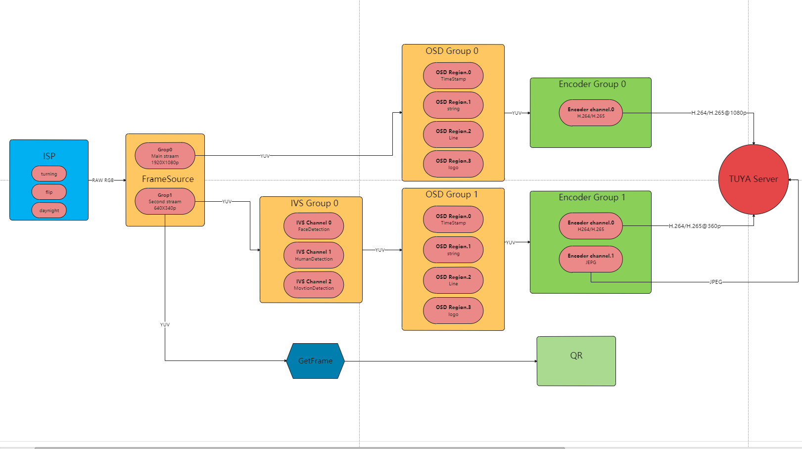
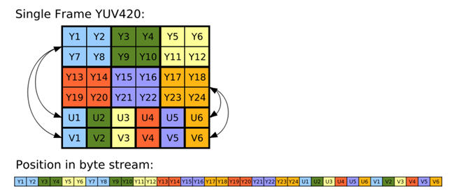
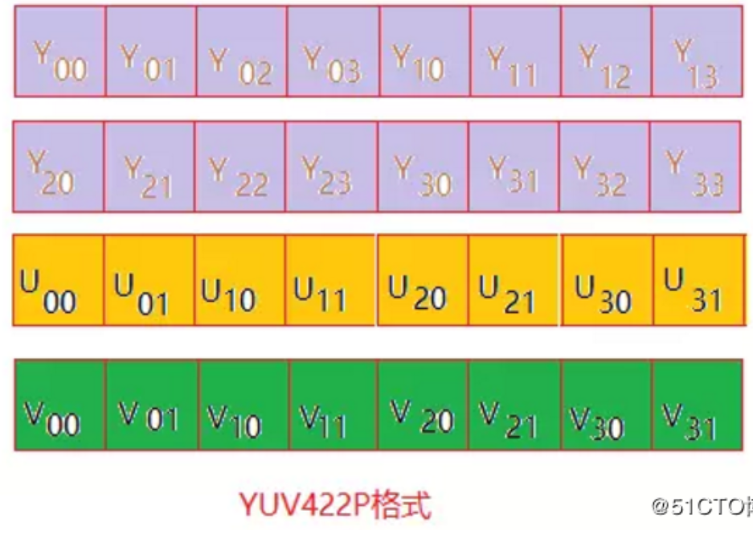
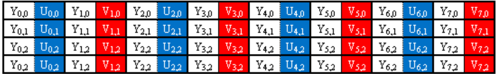
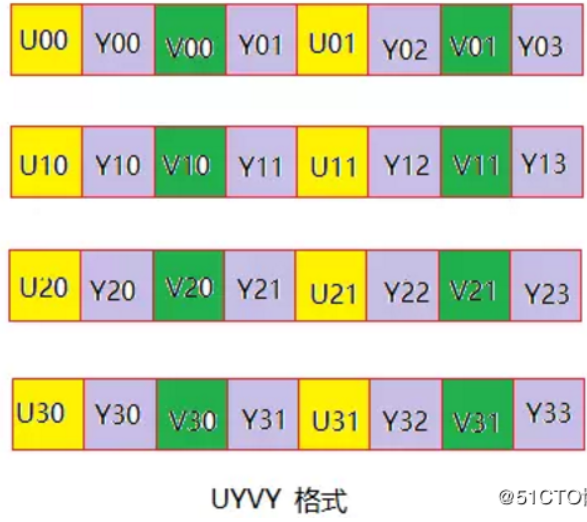
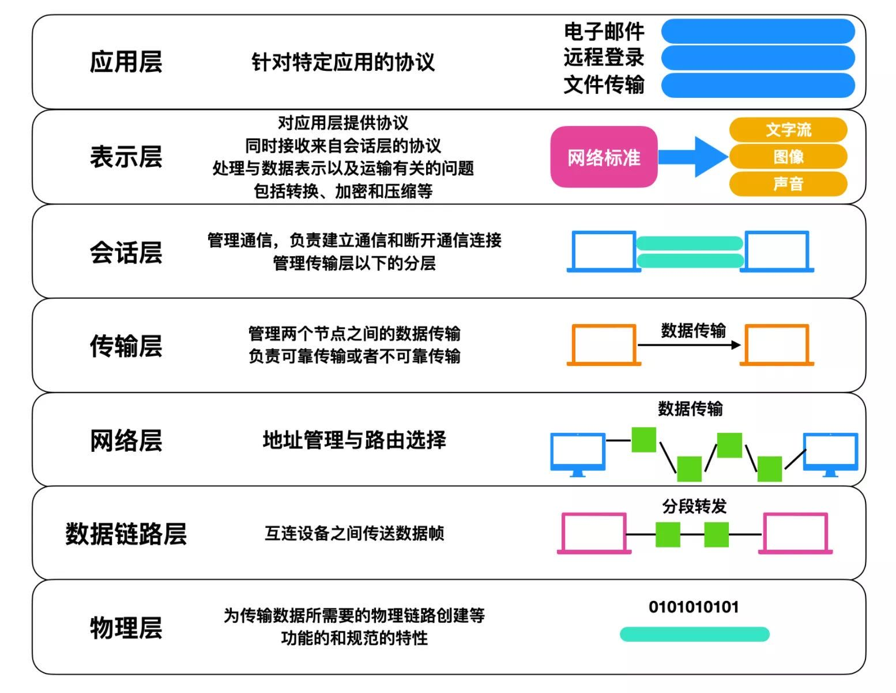

## 1.个人擅长领域

​		精通c语言，熟练掌握C++语言，熟悉音视频编封装（RTP/PS）、编解码原理及协议标准（H264/H265、G711U）；熟悉等流媒体传输协议（RTP/RTSP）；主导海思/君正平台智能摄像机的DSP媒体层应用程序开发，包括 抓取YUV图像用作二维码识图连接WIFI， ISP模块，framsource模块封装，IVS模块智能算法对接及应用 。


## 2.C语言必问知识

### 	2.1 static关键字

​	1  静态存储类型：

​	在函数内定义的静态局部变量，该变量存在内存的静态区，所以即使该函数运行结束，静态变量的值不会被销毁，函数下次运行时能仍用到这个值。在函数外定义的静态变量——静态全局变量，该变量的作用域只能在定义该变量的文件中，不能被其他文件通过*extern*引用。

* 2 内部链接属性

  静态函数只能在声明它的源文件中使用。

  

### 	2.2 什么是预编译？何时需要预编译？

​	预编译又称预处理，是整个编译过程最先做的工作，即程序执行前的一些预处理工作。主要处理*#*开头的指令。如拷贝*#include*包含的文件代码、替换*#define*定义的宏、条件编译*#if*等。


### 	2.3 #与##的作用？

​	*#*是把宏参数转化为字符串的运算符，*##*是把两个宏参数连接的运算符。

```c
#define STR(arg) #arg 则宏STR(hello)展开时为”hello”
#define NAME(y) name_y 则宏NAME(1)展开时仍为name_y
#define NAME(y) name_##y 则宏NAME(1)展开为name_1
#define DECLARE(name, type) typename##_##type##_type，
则宏DECLARE(val, int)展开为int val_int_type
```

### 	2.4 如何避免头文件被重复包含？

```c
#ifndef _MY_HEAD_H
#define _MY_HEAD_H /*空宏*/
/*其他语句*/
#endif
```


###   2.5 *volatile*关键字的作用？

​	*volatile*指定的关键字可能被系统、硬件、进程*/*线程改变，强制编译器每次从内存中取得该变量的值，而不是从被优化后的寄存器中读取。例子*:*硬件时钟*;*多线程中被多个任务共享的变量等。


### 2.6 extern关键字的作用？

​	1.用于修饰变量或函数，表明该变量或函数都是在别的文件中定义的，提示编译器在其他文件中寻找定义。


### 2.7 typedef 和#define的区别

#define是预处理指令，该指令将在编译器进行编译之前对源代码做单的字符串代换(原地扩展)，而typedef则不是原地扩展，它的新名字具有一定的封装性，以致于新命名的标识符具有更易定义变量的功能。


## 3.应用层编程知识

### 	3.1 进程与线程的区别

 	1.进程是系统进行资源分配和调度的一个基本单位，线程是CPU调度和分配的基本单位。

​		2.进程有自己的独立地址空间，线程是共享进程的内存空间的。

​		3.进程切换的开销大，线程切换开销小。

​		4.多线程程序只要有一个线程死掉，整个进程也跟着死掉了，多进程程序中的一个进程死掉并不会对另外一个进程造成影响。


### 	3.2 死循环有几种方式来写

```c
  for(;1;){}，while（1）{}，do {} while(1);
```

   

### 	3.3 左值和右值

​	左值可写，右值可读。通常，左值可以作为右值，但是右值不一定是左值。


### 	3.4 数组名和指针区别

 数组名对应的是一块内存的地址，指针是指向一块内存地址。数组名对应的内存地址不可以修改，指针指向的内存地址可以修改，更加灵活。数组存放的是数据内容，指针存 储的是地址。


### 	3.5bin文件和elf文件区别

​	elf（executable  and  link  format）文件里面包含了符号表，汇编，调试信息等，并不能直接运行。
​	BIN文件是将elf文件中的代码段，数据段，还有一些自定义的段抽取出来做成的一个内存的镜像。

### 3.6　线程属性

```c
typedef struct{

　　　　　　int                   detachstate;   //线程的分离状态
　　　　　　int                   schedpolicy;   //线程调度策略
　　　　　　struct sched_param     schedparam; //线程的调度参数
　　　　　　int                   inheritsched; //线程的继承性
　　　　　　int                   scope;        //线程的作用域W
　　　　　　size_t                 guardsize;    //线程栈末尾的警戒缓冲区大小
　　　　　　int                   stackaddr_set; //线程的栈设置
　　　　　　void*                 stackaddr;    //线程栈的位置（最低地址）
　　　　　　size_t                 stacksize;     //线程栈的大小

　　　　　　} pthread_attr_t; 
 主要结构体成员：
     1. 线程分离状态 detachstate
     2. 线程栈大小（默认平均分配）stacksize
     3. 线程栈警戒缓冲区大小（位于栈末尾）guardsize          参 APUE.12.3 线程属性
     4. 线程栈最低地址 stackaddr
属性设置:　　
　　 1.属性值不能直接设置，须使用相关函数进行操作，初始化的函数为pthread_attr_init，这个函数必须在pthread_create函数
　　   之前调用。之后须用pthread_attr_destroy函数来释放资源。
　　  2.线程属性主要包括如下属性：作用域（scope）、栈尺寸（stack size）、栈地址（stack address）、优先级（priority）、分离的状态（detached state）、调度策略和参数（scheduling policy and parameters）。
　　  默认的属性为非绑定、非分离、缺省的堆栈、与父进程同样级别的优先级。
```


## 4.项目概要和关键点

###    4.1 项目的难点

​	1.启动时间， 算法的灵敏度， 移动侦测， 开关灯，下雨天雨滴， 人形侦测， 不同的角度。

###    4.1 项目要点

#### 	4.1.1 海思平台各个模块功能

- VI：Video in，视频输入模块捕获视频图像，可以在后期对图像剪切、缩放，并输出多路不同分辨率图像数据。

- VPSS：Video Process Sub-System，视频处理子系统 接收VI和解码模块传送来的视频图像数据，进行图像去燥、增强、锐化处理，实现同源输出多路不同分辨率的图像数据用于编码、预览、抓拍。

- VENC：Video encode，视频编码（JPEG, H264, H265）模块，包含编码通道管理，编码参数设置等功能.

- VGS 是视频图形子系统，全称为 Video Graphics Sub-System。支持对一幅输入图像进行处理，如进行缩放、像素格式转换、视频存储格式转换、压缩/解压、打 COVER、打 OSD、画线、旋转、动态范围转换等  

- 

  #### 4.1.2 君正平台各个模块功能

  ISP：图像信号处理单元。主要包含图像效果设置、白天黑夜模式切换以及Sensor的注册添加删除等操作；

  FrameSource ：  视频源，是IMP系统的图像数据源，可设置图像的分辨率、裁减、缩放等属性，以及后端降噪功能；

  Encoder：视频编码（JPEG, H264, H265）模块，包含编码通道管理，编码参数设置等功能；

### 4.2项目介绍




## 5.码流基础概念

### 	5.1 编码原理

​	为什么巨大的原始视频可以编码成很小的视频呢?这其中的技术是什么呢?核心思想就是去除冗余信息：

​		1）空间冗余：图像相邻像素之间有较强的相关性;

​		2）时间冗余：视频序列的相邻图像之间内容相似;

​		3）编码冗余：不同像素值出现的概率不同

​		4）视觉冗余：人的视觉系统对某些细节不敏感

​		5）知识冗余：规律性的结构可由先验知识和背景知识得到

### 5.2 h.264编码相关的一些概念

​	(1)宏块 MB ： macroblock；多个像素组成的块，图像有些特点，在一部分区域有些颜色像素是非常相似的，我把一幅图片分成一块一块颜色相似的宏块。我们压缩不是以像素为单位而是以宏块为单位的。

​	(2)片 slice块： 比MB （宏块）大一个级别的，构成帧的一部分，一帧可能有一个slice或者多个slice；

​	(3)帧 frame ：以整张图像;

​	(4)I帧：没有参考的帧，相当于起始帧；

​		B帧、P帧：有参考的帧，图像的内容是参考前一帧做出来的，因为图像有冗余B、P就是用来压缩的。时间压缩；

​		P帧只参考前面的，不参考后面的帧；

​		B帧不仅参考前面的，还参考后面的帧； 

​	(5)帧率 fps 一秒钟有多少帧;

​	(6)像素->宏块->片->帧->序列->码流;

​	(7)H.264码流都是一个序列包含：1sps+1pps+1sei+1I帧+若干p帧;


### 5.3 NAL相关概念

​	(1)序列 sequence

​		视频码流很长，需要把码流分为一小段一小段来处理。每一个sequence都有一个I帧。如果我们很长的时间里都只参考最开始的I帧，如果当中坏了一帧，后面的帧数据就全坏了。其实我们每一秒中的最开始的那一帧就是I真，一秒钟就是一个sequence；

​	(2)分隔符  二进制 00000001 ； 表示有新的片，可能是sps、pps、I帧、P帧。如果数据里面不能出现连续000000 ，怕和分隔符重复。需要在最右边的0改成3为000003。

​	(3)sps  sequence parameter set 序列参数集 14Byte

​	(4)pps picture parameter set 图像参数集 4Byte

​	(5)sei supplemental enhancement information 补充增强信息5Byte

###  5.4 RTP 封装h264

#### **5.4.1网络抽象层单元类型** **(NALU):**

NALU头由一个字节组成,它的语法如下:

```c
   +---------------+
   |0|1|2|3|4|5|6|7|
   +-+-+-+-+-+-+-+-+
   |F|NRI|   Type  |
   +---------------+
 //F: 1个比特.
 forbidden_zero_bit. 在 H.264 规范中规定了这一位必须为 0.

//NRI: 2个比特.
 nal_ref_idc. 取00~11,似乎指示这个NALU的重要性,如00的NALU解码器可以丢弃它而不影响图像的回放. 

//Type: 5个比特.
  nal_unit_type. 这个NALU单元的类型.简述如下:

 0  没有定义
 1-23 NAL单元 单个 NAL 单元包
 24  STAP-A  单一时间的组合
 25  STAP-B 单一时间的组包 
 26  MTAP16  多个时间的合包
 27  MTPA24  多个事件组合包
 28  FU-A	 分片的单元
 29  FU-B    分片的单元 
 30-31  	 没有定义
h264仅用1-23,24以后的用在RTP H264负载类型头中
```


#### **5.4.2RTP头的结构**: 

```c
   0         1         2         3
   0 1 2 3 4 5 6 7 8 9 0 1 2 3 4 5 6 7 8 9 0 1 2 3 4 5 6 7 8 9 0 1
   +-+-+-+-+-+-+-+-+-+-+-+-+-+-+-+-+-+-+-+-+-+-+-+-+-+-+-+-+-+-+-+-+
   |V=2|P|X| CC |M|  PT   |   sequence number                      |
   +-+-+-+-+-+-+-+-+-+-+-+-+-+-+-+-+-+-+-+-+-+-+-+-+-+-+-+-+-+-+-+-+
   |             timestamp                                         |
   +-+-+-+-+-+-+-+-+-+-+-+-+-+-+-+-+-+-+-+-+-+-+-+-+-+-+-+-+-+-+-+-+
   |     synchronization source (SSRC) identifier                  |
   +=+=+=+=+=+=+=+=+=+=+=+=+=+=+=+=+=+=+=+=+=+=+=+=+=+=+=+=+=+=+=+=+
   |      contributing source (CSRC) identifiers                   |
   |                    ....                                       |
   +-+-+-+-+-+-+-+-+-+-+-+-+-+-+-+-+-+-+-+-+-+-+-+-+-+-+-+-+-+-+-+-+
```

RTP报文由两部分组成：报头和有效载荷。RTP报头格式如图6.7所示，其中：

```shell
#头详解
（1）版本(V)：2 比特，此域定义了 RTP 的版本。此协议定义的版本是 2。(值 1 被 RTP 草案版本使用,值 0 用在最初"vat"语音工具使用的协议中。)
（2）填充(P)：1 比特，若填料比特被设置,则此包包含一到多个附加在末端的填充比特,填充比特不算作负载的一部分。填充的最后一个字节指明可以忽略多少个填充比特。填充可能用于某些具有固定长度的加密算法，或者用于在底层数据单元中传输多个 RTP 包。
（3）扩展(X)：1 比特，若设置扩展比特,固定头(仅)后面跟随一个头扩展。
（4）CSRC 计数(CC)：4 比特，CSRC 计数包含了跟在固定头后面 CSRC 识别符的数目。
（5）标志(M)：1 比特，标志的解释由具体协议规定。它用来允许在比特流中标记重要的事件,如帧边界。
（6）负载类型(PT)：7 比特，此域定义了负载的格式，由具体应用决定其解释，协议可以规定负载类型码和负载格式之间一个默认的匹配。其他的负载类型码可以通过非 RTP 方法动态定义。RTP发送端在任意给定时间发出一个单独的 RTP 负载类型；此域不用来复用不同的媒体流。
（7）序列号(sequence number)：16 比特，每发送一个 RTP 数据包,序列号加 1，接收端可以据此检测丢包和重建包序列。序列号的初始值是随机的(不可预测),以使即便在源本身不加密时(有时包要通过翻译器,它会这样做)，对加密算法泛知的普通文本攻击也会更加困难。

（8）时间戳(timestamp) ：32 比特，时间戳反映了 RTP 数据包中第一个字节的采样时间。时钟频率依赖于负载数据格式,并在描述文件(profile)中进行描述。也可以通过 RTP 方法对负载格式动态描述。
   如果 RTP 包是周期性产生的，那么将使用由采样时钟决定的名义上的采样时刻，而不是读取系统时间。例如,对一个固定速率的音频，采样时钟将在每个周期内增加 1。如果一个音频从输入设备中读取含有 160 个采样周期的块，那么对每个块,时间戳的值增加 160。时间戳的初始值应当是随机的，就像序号一样。几个连续的 RTP 包如果是同时产生的。如:属于同一个视频帧的 RTP 包,将有相同的序列号。
不同媒体流的 RTP 时间戳可能以不同的速率增长。而且会有独立的随机偏移量。因此,虽然这些时间戳足以重构一个单独的流的时间，但直接比较不同的媒体流的时间戳不能进行同步。对于每一个媒体，我们把与采样时刻相关联的 RTP 时间戳与来自于参考时钟上的时间戳(NTP)相关联。因此参考时钟的时间戳就是数据的采样时间。(即:RTP 时间戳可用来实现不同媒体流的同步，NTP 时间戳解决了 RTP 时间戳有随机偏移量的问题。)参考时钟用于同步所有媒体的共同时间。这一时间戳对(RTP 时间戳和 NTP 时间戳)，用于判断 RTP 时间戳和 NTP 时间戳的对应关系,以进行媒体流的同步。它们不是在每一个数据包中都被发送，而在发送速率更低的 RTCP 的 SR(发送者报告)中。
如果传输的数据是存贮好的，而不是实时采样得到的,那么会使用从参考时钟得到的虚的表示时间线(virtual presentation timeline)。以确定存贮数据中的每个媒体下一帧或下一个单元应该呈现的时间。此种情况下 RTP 时间戳反映了每一个单元应当回放的时间。真正的回放将由接收者决定。
（9）SSRC：32 比特，用以识别同步源。标识符被随机生成，以使在同一个 RTP 会话期中没有任何两个同步源有相同的 SSRC 识别符。尽管多个源选择同一个 SSRC 识别符的概率很低，所有 RTP 实现工具都必须准备检测和解决冲突。若一个源改变本身的源传输地址，必须选择新的SSRC 识别符，以避免被当作一个环路源。
RTP 包流的源，用 RTP 报头中 32 位数值的SSRC 标识符进行标识，使其不依赖于网络地址。一个同步源的所有包构成了相同计时和序列号空间的一部分，这样接收方就可以把一个同步源的包放在一起，来进行重放。
举些同步源的例子，像来自同一信号源的包流的发送方，如麦克风、摄影机、RTP 混频器就是同步源。一个同步源可能随着时间变化而改变其数据格式，如音频编码。SSRC 标识符是一个随机选取的值，它在特定的 RTP 会话中是全局唯一(globally unique)的。参与者并不需要在一个多媒体会议的所有 RTP 会话中，使用相同的 SSRC 标识符；SSRC 标识符的绑定通过RTCP。如果参与者在一个 RTP 会话中生成了多个流，例如来自多个摄影机，则每个摄影机都必须标识成单独的同步源。
（10）CSRC 列表：0 到 15 项，每项 32 比特，CSRC 列表识别在此包中负载的所有贡献源。识别符的数目在 CC 域中给定。若有贡献源多于 15 个，仅识别 15 个。CSRC 识别符由混合器插入，并列出所有贡献源的 SSRC 识别符。例如语音包，混合产生新包的所有源的 SSRC 标识符都被列出，以在接收端处正确指示参与者。

若一个 RTP 包流的源，对由 RTP 混频器生成的组合流起了作用，则它就是一个作用源。对特定包的生成起作用的源，其 SSRC 标识符组成的列表，被混频器插入到包的 RTP 报头中。这个列表叫做 CSRC 表。相关应用的例子如，在音频会议中，混频器向所有的说话人(talker)指出，谁的话语(speech)将被组合到即将发出的包中，即便所有的包都包含在同一个(混频器的)SSRC 标识符中，也可让听者(接收者)可以清楚谁是当前说话人。

前 12 个字节出现在每个 RTP 包中，仅仅在被混合器插入时，才出现 CSRC 识别符列表。这 些域有以下意义：

#头:简易背诵版
1. V：RTP协议的版本号，占2位，当前协议版本号为2。
2. P：填充标志，占1位，如果P=1，则在该报文的尾部填充一个或多个额外的八位组，它们不是有效载荷的一部分。
3. X：扩展标志，占1位，如果X=1，则在RTP报头后跟有一个扩展报头。
4. CC：CSRC计数器，占4位，指示CSRC 标识符的个数。
5. M: 标记，占1位，不同的有效载荷有不同的含义，对于视频，标记一帧的结束；对于音频，标记会话的开始。
6. PT: 有效载荷类型，占7位，用于说明RTP报文中有效载荷的类型，如GSM音频、JPEM图像等,在流媒体中大部分是用来区分音频流和视频流的，这样便于客户端进行解析。
7. 序列号：占16位，用于标识发送者所发送的RTP报文的序列号，每发送一个报文，序列号增1。这个字段当下层的承载协议用UDP的时候，网络状况不好的时候可以用来检查丢包。同时出现网络抖动的情况可以用来对数据进行重新排序，在helix服务器中这个字段是从0开始的，同时音频包和视频包的sequence是分别记数的。
8. 时戳(Timestamp)：占32位，时戳反映了该RTP报文的第一个八位组的采样时刻。接收者使用时戳来计算延迟和延迟抖动，并进行同步控制。
9. 同步信源(SSRC)标识符：占32位，用于标识同步信源。该标识符是随机选择的，参加同一视频会议的两个同步信源不能有相同的SSRC。
10. 特约信源(CSRC)标识符：每个CSRC标识符占32位，可以有0～15个。每个CSRC标识了包含在该RTP报文有效载荷中的所有特约信源。

```

Rtp负载第一个字节的结构如下,它和H.264的NALU头结构一致，可以把它认为是**RTP h264**负载类型字节，完全是多增加的一个字节，不影响后面的NALU结构   

```shell
   +---------------+
   |0|1|2|3|4|5|6|7|
   +-+-+-+-+-+-+-+-+
   |F|NRI| 　Type 　|
   +---------------+v
#易搞混的几个TYPE：
• RTP 中的PT 负载类型 Payload type (PT) : 7 bits －－发送H264视频，此值固定设成 96
• NALU 中的TYPE 描述了NALU的属性，如：7指示顺序参数集，8指示图像参数集
• RTP之后的TYPE，即13 BYTE开始，单一打包的TYPE，与NALU中的TYPE一样；FU 分片打包方式，TYPE设成28,即分片模式；
```

这里的Type类型除1-23外还可取以下值：

 24  STAP-A  单一时间的组合
 25  STAP-B 单一时间的组包 
 26  MTAP16  多个时间的合包
 27  MTPA24  多个事件组合包
 28  FU-A	 分片的单元
 29  FU-B    分片的单元

如果使用1-23就是：单一NAL单元模式


#### **5.4.3封包介绍：**

**单一NAL单元模式**

 对于 NALU 的长度小于 MTU 大小的包, 一般采用单一 NAL 单元模式.
 对于一个原始的 H.264 NALU 单元常由 [Start Code] [NALU Header] [NALU Payload] 三部分组成, 其中 Start Code 用于标示这是一

NALU 单元的开始, 必须是 "00 00 00 01" 或 "00 00 01", NALU 头仅一个字节, 其后都是 NALU 单元内容.
 打包时去除 "00 00 01" 或 "00 00 00 01" 的开始码, 把其他数据封包的 RTP 包即可

　　

```shell
   0         1         2         3
   0 1 2 3 4 5 6 7 8 9 0 1 2 3 4 5 6 7 8 9 0 1 2 3 4 5 6 7 8 9 0 1
   +-+-+-+-+-+-+-+-+-+-+-+-+-+-+-+-+-+-+-+-+-+-+-+-+-+-+-+-+-+-+-+-+
   |F|NRI| type |                     　　　　　　　　　　　　　　　  |
   +-+-+-+-+-+-+-+-+                   　　　　　　　　　　　　　　   |
   |                              　　　　　　　　　　　　　　　　　　 |
   |       Bytes 2..n of a Single NAL unit      　　　　　　　　　　  |
   |                             　　　　　　　　　　　　　　　　　　  |
   |             　　　　　　　　　  +-+-+-+-+-+-+-+-+-+-+-+-+-+-+-+-+
   |               :...OPTIONAL RTP padding   　　　　　　　　　　　 |
   +-+-+-+-+-+-+-+-+-+-+-+-+-+-+-+-+-+-+-+-+-+-+-+-+-+-+-+-+-+-+-+-+


```

**例：**
 如有一个 H.264 的 NALU 是这样的:

 [00 00 00 01 67 42 A0 1E 23 56 0E 2F ... ]

 这是一个序列参数集 NAL 单元. [00 00 00 01] 是四个字节的开始码, 67 是 NALU 头, 42 开始的数据是 NALU 内容.

 封装成 RTP 包将如下:

 [ RTP Header ] [ 67 42 A0 1E 23 56 0E 2F ]

 即只要去掉 4 个字节的开始码就可以了.

 

**组合封包模式**

 其次, 当 NALU 的长度特别小时, 可以把几个 NALU 单元封在一个 RTP 包中.


```shell
      0                  1                  2                  3
      0 1 2 3 4 5 6 7 8 9 0 1 2 3 4 5 6 7 8 9 0 1 2 3 4 5 6 7 8 9 0 1
     +-+-+-+-+-+-+-+-+-+-+-+-+-+-+-+-+-+-+-+-+-+-+-+-+-+-+-+-+-+-+-+-+
     |                         RTP Header                         　 |
     +-+-+-+-+-+-+-+-+-+-+-+-+-+-+-+-+-+-+-+-+-+-+-+-+-+-+-+-+-+-+-+-+
     |STAP-A NAL HDR |        NALU 1 Size          | NALU 1 HDR  　　 |
     +-+-+-+-+-+-+-+-+-+-+-+-+-+-+-+-+-+-+-+-+-+-+-+-+-+-+-+-+-+-+-+-+
     |                        NALU 1 Data                          　|
     :                                                              :
     +              +-+-+-+-+-+-+-+-+-+-+-+-+-+-+-+-+-+-+-+-+-+-+-+-+
     |              | NALU 2 Size                  | NALU 2 HDR   　　|
     +-+-+-+-+-+-+-+-+-+-+-+-+-+-+-+-+-+-+-+-+-+-+-+-+-+-+-+-+-+-+-+-+
     |                        NALU 2 Data                         　 |
     :                                                              :
     |                              +-+-+-+-+-+-+-+-+-+-+-+-+-+-+-+-+
     |                              :...OPTIONAL RTP padding       　|
     +-+-+-+-+-+-+-+-+-+-+-+-+-+-+-+-+-+-+-+-+-+-+-+-+-+-+-+-+-+-+-+-+
```

这里只介绍STAP-A模式，如果是STAP-B的话会多加入一个DON域，另外还有MTAP16、MTAP24，具体不介绍，可以看rfc文档，文章尾贴一个链接可以去看。

转载的话注明一下作者：jwybobo2007 出处：http://blog.csdn.net/jwybobo2007/article/details/7054140

**例：**

如有一个 H.264 的 NALU 是这样的:

 [00 00 00 01 67 42 A0 1E 23 56 0E 2F ... ]

 [00 00 00 01 68 42 B0 12 58 6A D4 FF ... ]

 封装成 RTP 包将如下:

 [ RTP Header ] [78 (STAP-A头，占用1个字节)] [第一个NALU长度 (占用两个字节)] [ 67 42 A0 1E 23 56 0E 2F ] [第二个NALU长度 (占用两个字节)] [68 42 B0 12 58 6A D4 FF ... ]

 

**分片的单元：**

```shell

0                  1                  2                  3
      0 1 2 3 4 5 6 7 8 9 0 1 2 3 4 5 6 7 8 9 0 1 2 3 4 5 6 7 8 9 0 1
     +-+-+-+-+-+-+-+-+-+-+-+-+-+-+-+-+-+-+-+-+-+-+-+-+-+-+-+-+-+-+-+-+
     | FU indicator |   FU header  |                              |
     +-+-+-+-+-+-+-+-+-+-+-+-+-+-+-+-+                              |
     |                                                              |
     |                        FU payload                           |
     |                                                              |
     |                              +-+-+-+-+-+-+-+-+-+-+-+-+-+-+-+-+
     |                              :...OPTIONAL RTP padding       |
     +-+-+-+-+-+-+-+-+-+-+-+-+-+-+-+-+-+-+-+-+-+-+-+-+-+-+-+-+-+-+-+-+

     Figure 14.  RTP payload format for FU-A

  The FU indicator octet has the following format:

     +---------------+
     |0|1|2|3|4|5|6|7|
     +-+-+-+-+-+-+-+-+
     |F|NRI|  Type  |
     +---------------+

  别被名字吓到这个格式就是上面提到的RTP h264负载类型，Type为FU-A

  The FU header has the following format:

     +---------------+
     |0|1|2|3|4|5|6|7|
     +-+-+-+-+-+-+-+-+
     |S|E|R|  Type  |
     +---------------+

       S bit为1表示分片的NAL开始，当它为1时，E不能为1

  E bit为1表示结束，当它为1，S不能为1

  R bit保留位
　
  Type就是NALU头中的Type,取1-23的那个值
```

**[rtp h264注意点(FU-A分包方式说明)](http://blog.csdn.net/jwybobo2007/article/details/7235942)**

​	之前写过一篇文章，分析了h264使用rtp进行封包的格式介绍：[RTP封装h264](http://blog.csdn.net/jwybobo2007/article/details/7054140)。但里面好像没有把拆分以及一些需要注意的情况说清楚，因此这里做补充，也作为自己的备忘（自己记性好像不太好）。

1. 关于时间戳，需要注意的是h264的采样率为90000HZ，因此时间戳的单位为1(秒)/90000，因此如果当前视频帧率为25fps，那时间戳间隔或者说增量应该为3600，如果帧率为30fps，则增量为3000，以此类推。

2. 关于h264拆包，按照FU-A方式说明：
   1）第一个FU-A包的FU indicator：F应该为当前NALU头的F，而NRI应该为当前NALU头的NRI，Type则等于28，表明它是FU-A包。FU header生成方法：S = 1，E = 0，R = 0，Type则等于NALU头中的Type。
   2）后续的N个FU-A包的FU indicator和第一个是完全一样的，如果不是最后一个包，则FU header应该为：S = 0，E = 0，R = 0，Type等于NALU头中的Type。
   3）最后一个FU-A包FU header应该为：S = 0，E = 1，R = 0，Type等于NALU头中的Type。

   因此总结就是：同一个NALU分包厚的FU indicator头是完全一致的，FU header只有S以及E位有区别，分别标记开始和结束，它们的RTP分包的序列号应该是依次递增的，并且它们的时间戳必须一致，而负载数据为NALU包去掉1个字节的NALU头后对剩余数据的拆分，这点很关键，你可以认为NALU头被拆分成了FU indicator和FU header，所以不再需要1字节的NALU头了。

3. 关于SPS以及PPS，配置帧的传输我采用了先发SPS，再发送PPS，并使用同样的时间戳，或者按照正常时间戳增量再或者组包发送的形式处理貌似都可以，看播放器怎么解码了，另外提一下，如果我们使用vlc进行播放的话，可以在sdp文件中设置SPS以及PPS，这样就可以不用发送它们了。

4. 使用VLC播放时，sdp文件中的分包模式选项：packetization-mode=1，否则有问题。另外sdp里面设置的编码type必须和rtp包中的一致。

    

### 5.4  PS封装基本概念

**ES 、PES、 PS、  TS 的区别及概念**

**ES**

​	ES–Elementary Streams (原始流)是直接从编码器出来的数据流，可以是编码过的视频数据流(H.264,MJPEG等)，音频数据流（AAC），或其他编码数据流的统称。ES流经过PES打包器之后，被转换成PES包。
ES是只包含一种内容的数据流，如只含视频或只含音频等，打包之后的PES也是只含一种性质的ES,如只含视频ES的PES,只含音频ES的PES等。每个ES都由若干个存取单元（AU）组成，每个视频AU或音频AU都是由头部和编码数据两部分组成，1个AU相当于编码的1幅视频图像或1个音频帧，也可以说，每个AU实际上是编码数据流的显示单元，即相当于解码的1幅视频图像或1个音频帧的取样。

**PES**

​	PES–Packetized Elementary Streams (分组的ES)，ES形成的分组称为PES分组，是用来传递ES的一种数据结构。PES流是ES流经过PES打包器处理后形成的数据流，在这个过程中完成了将ES流分组、打包、加入包头信息等操作（对ES流的第一次打包）。PES流的基本单位是PES包。PES包由包头和payload组成。

**PTS、DTS**

​	PTS–PresentationTime Stamp（显示时间标记）表示显示单元出现在系统目标解码器（H.264、MJPEG等）的时间。
DTS–Decoding Time Stamp（解码时间标记）表示将存取单元全部字节从解码缓存器移走的时间。
PTS/DTS是打在PES包的包头里面的，这两个参数是解决音视频同步显示，防止解码器输入缓存上溢或下溢的关键。每一个I（关键帧）、P（预测帧）、B（双向预测 帧）帧的包头都有一个PTS和DTS，但PTS与DTS对于B帧不一样，无需标出B帧的DTS，对于I帧和P帧，显示前一定要存储于视频解码器的重新排序缓存器中，经过延迟（重新排序）后再显示，所以一定要分别标明PTS和DTS。

**PS**

​	PS–Program Stream(节目流)PS流由PS包组成，而一个PS包又由若干个PES包组成（到这里，ES经过了两层的封装）。PS包的包头中包含了同步信息与时钟恢复信息。一个PS包最多可包含具有同一时钟基准的16个视频PES包和32个音频PES包。

**TS**

​	TS–Transport Stream（传输流）由定长的TS包组成（188字节），而TS包是对PES包的一个重新封装（到这里，ES也经过了两层的封装）。PES包的包头信息依然存在于TS包中。
TS流与PS流的区别在于TS流的包结构是固定长度的,而PS流的包结构是可变长度的。PS包由于长度是变化的,一旦丢失某一PS包的同步信息,接收机就会进入失步状态,从而导致严重的信息丢失事件。而TS码流由于采用了固定长度的包结构,当传输误码破坏了某一TS包的同步信息时,接收机可在固定的位置检测它后面包中的同步信息,从而恢复同步,避免了信息丢失。因此在信道环境较为恶劣、传输误码较高时一般采用TS码流,而在信环境较好、传输误码较低时一般采用PS码流。


### 5.5RTP荷载PS流

​		针对H264 做如下PS 封装：每个IDR NALU 前一般都会包含SPS、PPS 等NALU，因此将SPS、PPS、IDR 的NALU 封装为一个PS 包。包括：

```shell
ps header， PS system header，PS system map，PES header+h264 raw data。
```

​	所以一个IDR NALU PS 包由外到内顺序是：

```c
PSheader| PS system header | PS system Map | PES header | h264 raw data。
```

​	对于其它非关键帧的PS 包，就简单多了，直接加上**PS头**和**PES 头**就可以了。 

​	顺序为：

```shell
PS header | PES header | h264raw data。
```

​	以上是对只有视频video 的情况，如果要把音频Audio也打包进PS 封装，也可以。当有音频数据时，将数据加上PES header 放到视频PES 后就可以了。顺序如下：PS 包=PS头|PES(video)|PES(audio)，再用RTP 封装发送就可以了。


### 5.6YUV格式分析详解

#### 5.6.1 YUV含义

   	YUV格式通常有两大类：打包（packed）格式和平面（planar）格式。前者将YUV分量存放在同一个数组中，通常是几个相邻的像素组成一个宏像素（macro-pixel）；而后者使用三个数组分开存放YUV三个分量，就像是一个三维平面一样。

​	 如果只有Y信号分量而没有U、V分量，那么这样表示的图像就是黑白灰度图像。因此用YUV格式由彩色转黑白信号相当简单. 在技术文档里，YUV经常有另外的名字, YCbCr ,其中Y与YUV 中的Y含义一致，Cb , Cr 同样都指色彩,，只是在表示方法上不同而已，Cb Cr 就是本来理论上的“分量/色差”的标识。C代表分量(是component的缩写)Cr、Cb分别对应r(红)、b(蓝)分量信号，Y除了g(绿)分量信号，还叠加了亮度信号。

​	 YUV的原理是把亮度与色度分离，研究证明,人眼对亮度的敏感超过色度。利用这个原理，可以把色度信息减少一点，人眼也无法查觉这一点。YUV三个字母中，其中"Y"表示明亮度（Lumina nce或Luma），也就是灰阶值；而"U"和"V"表示的则是色度（Chrominance或Chroma），作用是描述影像色彩及饱和度，用于指定像素的颜色。用这个三个字母好象就是通道命令。

​	使用YUV的优点有两个:
​	1,彩色YUV图像转黑白YUV图像转换非常简单，这一特性用在于电视信号上, 只需要丢掉UV分量即可。
​	2,YUV是数据总尺寸小于RGB格式。


#### 5.6.2YUV的采样类型

 	YUV码流的存储格式其实与其采样的方式密切相关，主流的采样方式有三种，YUV4:4:4，YUV4:2:2，YUV4:2:0，关于其详细原理，可以通过网上其它文章了解，这里我想强调的是如何根据其采样格式来从码流中还原每个像素点的YUV值，因为只有正确地还原了每个像素点的YUV值，才能通过YUV与RGB的转换公式提取出每个像素点的RGB值，然后显示出来。
 	
 	用三个图来直观地表示采集的方式吧，以黑点表示采样该像素点的Y分量，以空心圆圈表示采用该像素点的UV分量：

.jpg)

​	YUV三个信道的抽样率相同，因此在生成的图像里，每个象素的三个分量信息完整（每个分量通常8比特），经过8比特量化之后，未经压缩的每个像素占用3个字节。

**（1） YUV 4:4:4**

```shell
下面的四个像素为: [Y0 U0 V0] [Y1 U1 V1] [Y2 U2 V2] [Y3 U3 V3]
    存放的码流为: Y0 U0 V0 Y1 U1 V1 Y2 U2 V2 Y3 U3 V3  
```

**（2） YUV 4:2:2**

​	每个色差信道的抽样率是亮度信道的一半，所以**水平方向**的色度抽样率只是4:4:4的一半。对非压缩的8比特量化的图像来说，每个由两个水平方向相邻的像素组成的宏像素需要占用4字节内存（亮度2个字节,两个色度各1个字节）。

```shell
下面的四个像素为: [Y0 U0 V0] [Y1 U1 V1][Y2 U2 V2] [Y3 U3 V3]
    存放的码流为: Y0 U0 Y1 V1 Y2 U2 Y3 V3
   映射出像素点为:[Y0 U0 V1] [Y1 U0 V1] [Y2 U2 V3] [Y3 U2 V3]  # 意思是还原出来的像素点，格式是4:4:4的才可以用
```

**（3） YUV 4:1:1** 

​	4:1:1的色度抽样，是在**水平方向上对色度进行4:1抽样**。对于低端用户和消费类产品这仍然是可以接受的。对非压缩的8比特量化的视频来说，每个由4个水平方向相邻的像素组成的宏像素需要占用6字节内存**（亮度4个字节,两个色度各1个字节）。**

```shell
 下面的四个像素为: [Y0 U0 V0] [Y1 U1 V1] [Y2 U2 V2] [Y3 U3 V3]
	存放的码流为:  Y0 U0 Y1 Y2 V2 Y3
   映射出像素点为：[Y0 U0 V2] [Y1 U0 V2] [Y2 U0 V2] [Y3 U0 V2]
```

**（4）YUV4:2:0**

​	4:2:0并不意味着只有Y,Cb而没有Cr分量。**它指得是对每行扫描线来说，只有一种色度分量以2:1的抽样率存储。相邻的扫描行存储不同的色度分量**， 也就是说，如果一行是4:2:0的话，下一行就是4:0:2，再下一行是4:2:0...以此类推。对每个色度分量来说，水平方向和竖直方向的抽样率都是 2:1，所以可以说色度的抽样率是4:1。对非压缩的8比特量化的视频来说，每个由2x2个2行2列相邻的像素组成的宏像素需要占用6字节内存**（亮度4个字节,两个色度各1个字节）。**

```shell
    下面八个像素为: [Y0 U0 V0] [Y1 U1 V1] [Y2 U2 V2] [Y3 U3 V3]  # 第一行
    			  [Y5 U5 V5] [Y6 U6 V6] [Y7U7 V7] [Y8 U8 V8]   # 第二行
      存放的码流为：Y0 U0 Y1 Y2 U2 Y3                            # 第一行
                   Y5 V5 Y6 Y7 V7 Y8                            # 第二行
  映射出的像素点为: [Y0 U0 V5] [Y1 U0 V5] [Y2 U2 V7] [Y3 U2 V7]   # 第一行
                   [Y5 U0 V5] [Y6 U0 V5] [Y7U2 V7] [Y8 U2 V7]    # 第二行
```

(5)总结：先记住下面这段话，以后提取每个像素的YUV分量会用到：

​	**YUV 4:4:4采样，每一个Y对应一组UV分量。**

​	**YUV 4:2:2采样，每两个Y共用一组UV分量。**

​	**YUV 4:1:1采样，每四个Y共用一组UV分量。** 

​	**YUV 4:2:0采样，每四个Y共用一组UV分量。** 

​	YUV 4:1:1 和YUV 4:2:0 只是他们的扫描方式不同， 他们的压缩比是一样的。


#### 5.6.3存储方式：

​	**YU12/I420**

​	该格式属于4：2：0类型，存储方式上面已经说过，就是先存储把全部的Y分量存完，再存U分量，最后存V分量，从网上找了一张很形象的图：

​	

可以看到，第一行的Y1Y2和第二行的Y7Y8共同使用一组UV分量U1V1。

**YV１２**

​	该格式与YU12基本一样，唯一的区别是先存储V分量再存储U分量，对应到上图把第五行和第六行位置互换一下就是了。

​	以上两种格式我们可以看到都是4：2：0的，因为都是planar方式存储，简称420p。

#### **NV12**

该格式是先存储全部的Y分量，然后UV分量交叉存储，用图像表示下：


上面两种虽然也是4：2：0类型，但是并不是完全的planar格式，所以又称为420sp，与420p进行区分。

上面说的都是4：2：0类型的，下面说几个4：2：2类型较常见的。

#### YUV422p

名字中带P表示是planar格式存储，该格式存储方式与I420是一样的，唯一的区别是UV分量的数量不同，I420中四个Y共用一组UV，而该格式中两个Y共用一组UV，也就是说UV分量相对于I420在数量上多了一倍，从网上找了一张图，如下：



**YUYV/YUY2:**

该格式属于4：2：2类型，且是用packed形式存储的，上面也简单的说过，存储方式如下图：



可以看到，每两个Y分量共用一组UV分量，存储顺序是YUYV。

**YVYU:**

该格式与YUYV相似，只是存储时UV分量顺序不同而已，为YVYU。

**UYVY:**

该格式也是4：2：2类型，与上面两种方式并无大的不同，从网上找了一张图如下：



 可以看到存储时YUV分量的顺序如名字所示：UYVY。

#### 5.7 视频拖影解决

摄像机产生“拖影”、“重影”的原因：

1. 快门时间较短：对于25帧的视频，如果快门时间为1/12，自然两帧图像叠加在一起。

2. 降噪算法：使用3D降噪时，需要前后帧参与运算，可能导致此现象。

3. 增益过大：增大增益的同时必须辅佐增强降噪;所谓编码增益，就是在**高信噪比条件**下，相对于未编码系统的**BER性能**改善量。

   **关于视频[信噪比](https://baike.baidu.com/item/信噪比)**
   　　显示器上图像的雪花和灰斑是噪声,有很多种噪声源,它包括差劲的电路设计,热噪声,外部辐射,自动均衡,传输系统,如微波,红外,手机等.衡量噪声大小的重要指标是信噪比( the signal to noise ratio)。

   **BER性能**

   

4. 曝光时间过长：在曝光时，物体移动就会产生此现象。


## 6.网络知识

### 6.1OSI网络模型




### 6.2 TCP/IP 协议簇

​	TCP/IP 协议是我们程序员接触最多的协议，实际上，TCP/IP 又被称为 `TCP/IP 协议簇`，它并不特指单纯的 TCP 和 IP 协议，而是容纳了许许多多的网络协议。

​	OSI 模型共有七层，从下到上分别是物理层、数据链路层、网络层、运输层、会话层、表示层和应用层。但是这显然是有些复杂的，所以在TCP/IP协议中，它们被简化为了四个层次：


和 OSI 七层网络协议的主要区别如下：

- 应用层、表示层、会话层三个层次提供的服务相差不是很大，所以在 TCP/IP 协议中，它们被合并为应用层一个层次。

- 由于数据链路层和物理层的内容很相似，所以在 TCP/IP 协议中它们被归并在通信链路口层一个层次里。

  

  

  ### 6.3 TCP UDP FTP协议概念

  #### TCP 协议

  TCP 就是 `传输控制协议`，也就是 `Transmission Control Protocol`，它是一种面向连接的、可靠的、基于字节流的传输协议，TCP 协议位于传输层，TCP 协议是 TCP/IP 协议簇中的核心协议，它最大的特点就是提供可靠的数据交付。

  TCP 的主要特点有 **慢启动、拥塞控制、快速重传、可恢复**。

  #### UDP 协议

  UDP 协议就是 `用户数据报协议`，也就是 `User Datagram Protocol`，UDP 也是一种传输层的协议，与 TCP 相比，UDP 提供一种不可靠的数据交付，也就是说，UDP 协议不保证数据是否到达目标节点，当报文发送之后，是无法得知其是否安全完整到达的。UDP 是一种无连接的协议，传输数据之前源端和终端无需建立连接，不对数据报进行检查与修改，无须等待对方的应答，会出现分组丢失、重复、乱序等现象。但是 UDP 具有较好的实时性，工作效率较 TCP 协议高。

  #### FTP 协议

  FTP 协议是 `文件传输协议`，英文全称是 `File Transfer Protocol`，应用层协议之一，是 TCP/IP 协议的重要组成之一，FTP 协议分为服务器和客户端两部分，FTP 服务器用来存储文件，FTP 客户端用来访问 FTP 服务器上的文件，FTP 的传输效率比较高，所以一般使用 FTP 来传输大文件。

  

### 	6.3  RTSP、RTCP、RTP区别

​	rtp和rtsp协议是应用层的，tcp和udp是传输层的，所以只能说rtp over tcp/udp。而且一般情况下一个点播需要rtsp+rtp+rtcp三个协议共同来实现。RTP，RTCP数据和RTSP数据共享TCP数据通道，所以必须有一个标识来区别三种数据。RTP和RTCP数据会以$符号＋1个字节的通道编号＋4个字节的数据长度，共6个字节的前缀开始，RTSP数据是没有前缀数据的。RTP数据和RTCP数据的区别在于第二个字节的通道编号，据观察RTP通道编号是**偶数**，RTCP通道编号是**奇数**。

**1：RTSP实时流协议**
	作为一个应用层协议，RTSP提供了一个可供扩展的框架，它的意义在于使得实时流媒体数据的受控和点播变得可能。总的说来，RTSP是一个流媒体表示协议，主要用来控制具有实时特性的数据发送，但它本身并不传输数据，而是必须依赖于下层传输协议所提供的某些服务。RTSP可以对流媒体提供诸如**播放、暂停、快进等操作**，它负责定义具体的控制消息、操作方法、状态码等，此外还描述了与RTP间的交互操作（RFC2326）。

**2：RTCP控制协议**
	RTCP控制协议需要与RTP数据协议一起配合使用，当应用程序启动一个RTP会话时将同时占用两个端口，分别供RTP和RTCP使用。RTP本身并不能为按序传输数据包提供可靠的保证，也不提供**流量控制和拥塞控制，这些都由RTCP来负责完成**。通常RTCP会采用与RTP相同的分发机制，向会话中的所有成员周期性地发送控制信息，应用程序通过接收这些数据，从中获取会话参与者的相关资料，以及网络状况、分组丢失概率等反馈信息，从而能够对服务质量进行控制或者对网络状况进行诊断。

RTCP协议的功能是通过不同的RTCP数据报来实现的，主要有如下几种类型：
SR：发送端报告，所谓发送端是指发出RTP数据报的应用程序或者终端，发送端同时也可以是接收端。(SERVER定时间发送给CLIENT)。
RR：接收端报告，所谓接收端是指仅接收但不发送RTP数据报的应用程序或者终端。(SERVER接收CLIENT端发送过来的响应)。
SDES：源描述，主要功能是作为会话成员有关标识信息的载体，如用户名、邮件地址、电话号码等，此外还具有向会话成员传达会话控制信息的功能。
BYE：通知离开，主要功能是指示某一个或者几个源不再有效，即通知会话中的其他成员自己将退出会话。
APP：由应用程序自己定义，解决了RTCP的扩展性问题，并且为协议的实现者提供了很大的灵活性。

**3：RTP数据协议**

RTP数据协议负责对流媒体数据进行封包并实现媒体流的实时传输，每一个RTP数据报都由头部（Header）和负载（Payload）两个部分组成，其中头部前**12个字节**的含义是固定的，而负载则可以是音频或者视频数据。

RTP用到的地方就是 PLAY ，服务器往客户端传输数据用UDP协议，RTP是在传输数据的前面加了个12字节的头(描述信息)。

RTP载荷封装设计本文的网络传输是基于IP协议，所以最大传输单元(MTU)最大为1500字节，在使用IP／UDP／RTP的协议层次结构的时候，这其中包括至少**20字节的IP头**，**8字节的UDP头，以及12字节的RTP头**。这样，头信息至少要占用40个字节，那么RTP载荷的最大尺寸为**1460字节**。以H264 为例，如果一帧数据大于1460，则需要分片打包，然后到接收端再拆包，组合成一帧数据，进行解码播放。


### 6.4 **TCP协议流程详解**:

首先TCP/IP是一个协议簇，里面包括很多协议的。UDP只是其中的一个。之所以命名为TCP/IP协议， 因为TCP,IP协议是两个很重要的协议，就用他两命名了。

下面我们来讲解TCP协议和UDP协议的区别：

**TCP**（Transmission Control Protocol，传输控制协议）是面向连接的协议，即在收发数据钱 ，都需要与对面建立可靠的链接，这也是面试经常会问到的TCP的**三次握手**以及TCP的**四次挥手**！ **三次握手**： 建立一个TCP连接时，需要客户端和服务端总共发送3个包以确认连接的建立， 在Socket编程中，这一过程由客户端执行connect来触发，具体流程图如下：


- **第一次握手**：Client将标志位SYN置为1，随机产生一个值seq=J，并将该数据包发送给Server， Client进入SYN_SENT状态，等待Server确认。
- **第二次握手**：Server收到数据包后由标志位SYN=1知道Client请求建立连接，Server将标志位 SYN和ACK都置为1，ack=J+1，随机产生一个值seq=K，并将该数据包发送给Client以确认连接请求 ，Server进入SYN_RCVD状态。
- **第三次握手**：Client收到确认后，检查ack是否为J+1，ACK是否为1，如果正确则将标志位ACK 置为1，ack=K+1，并将该数据包发送给Server，Server检查ack是否为K+1，ACK是否为1，如果正确则 连接建立成功，Client和Server进入ESTABLISHED状态，完成三次握手，随后Client与Server之间可以 开始传输数据了。
- 注意: SYN 和ACK 是标志位, 占1个bit位,表示请求连接和回应; ack回应的序列码, 由 seq + 1 生成,  占32个bit位; 

**四次挥手**： 终止TCP连接，就是指断开一个TCP连接时，需要客户端和服务端总共发送4个包以确认连接的断开。 在Socket编程中，这一过程由客户端或服务端任一方执行close来触发，具体流程图如下：


- **第一次挥手**：Client发送一个FIN，用来关闭Client到Server的数据传送，Client进入 FIN_WAIT_1状态。
- **第二次挥手**：Server收到FIN后，发送一个ACK给Client，确认序号为收到序号+1（与SYN相同， 一个FIN占用一个序号），Server进入CLOSE_WAIT状态。
- **第三次挥手**：Server发送一个FIN，用来关闭Server到Client的数据传送，Server进入LAST_ACK 状态。
- **第四次挥手**：Client收到FIN后，Client进入TIME_WAIT状态，接着发送一个ACK给Server，确认序号为收到序号+1，Server进入CLOSED状态，完成四次挥手。 另外也可能是同时发起主动关闭的情况：


​	另外还可能有一个常见的问题就是：为什么建立连接是三次握手，而关闭连接却是四次挥手呢？ 答：因为服务端在LISTEN状态下，收到建立连接请求的SYN报文后，把ACK和SYN放在一个报文里 发送给客户端。而关闭连接时，当收到对方的FIN报文时，仅仅表示对方不再发送数据了但是还 能接收数据，己方也未必全部数据都发送给对方了，所以己方可以立即close，也可以发送一些 数据给对方后，再发送FIN报文给对方来表示同意现在关闭连接，因此，己方ACK和FIN一般都会 分开发送。


### 6.5UDP协议详解：

​	UDP(User Datagram Protocol)用户数据报协议，非连接的协议，传输数据之前源端和终端不 建立连接，当它想传送时就简单地去抓取来自应用程序的数据，并尽可能快地把它扔到网络上。 在发送端，UDP传送数据的速度仅仅是受应用程序生成数据的速度、计算机的能力和传输带宽 的限制；在接收端，UDP把每个消息段放在队列中，应用程序每次从队列中读一个消息段。 相比TCP就是无需建立链接，结构简单，无法保证正确性，容易丢包。


## 7.数据结构知识

### 	7.1.链表


### 	7.2.队列


### 	7.3.排序


### 	7.4.算法复杂度


